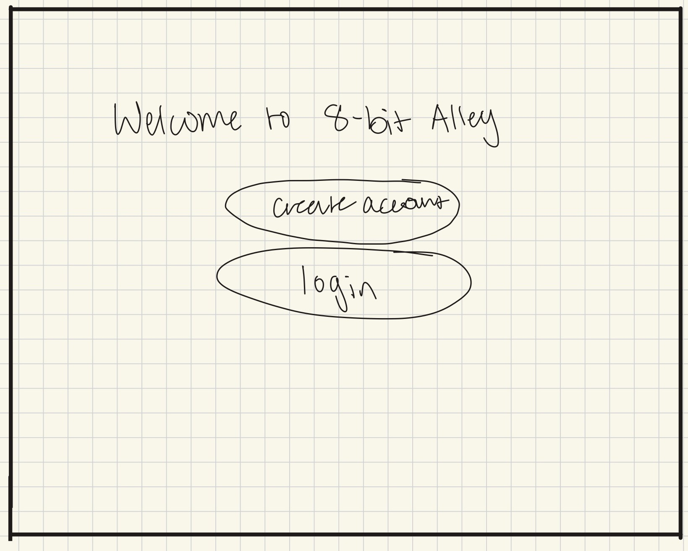
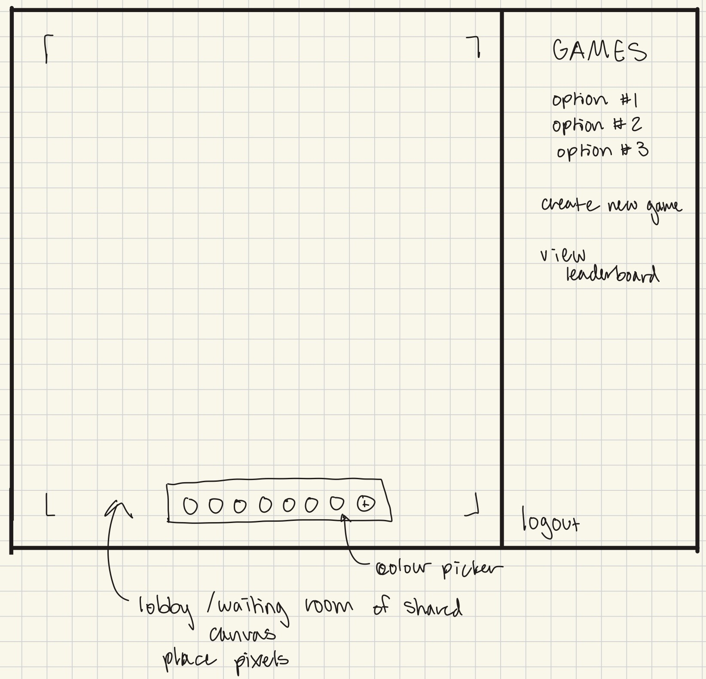
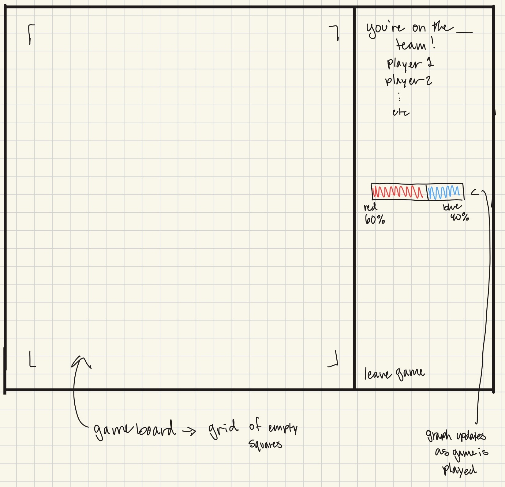
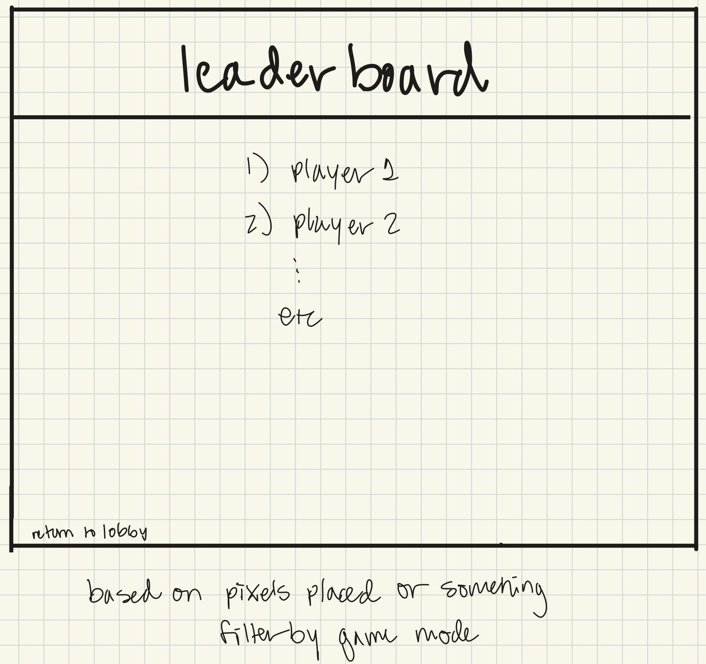

# 8-Bit Alley

[My Class Notes](notes.md)

8-Bit Alley is a pixel based arcade, where you can play pixel games with friends and contribute to the community canvas!

## 🚀 Specification Deliverable

### Elevator pitch

Ever wanted a simple way to draw with pixels with your friends? 8-Bit Alley is a real-time multiplayer pixel arcade! Players can create and join competetive games, or contribute to the community canvas! Pixel colours and canvas progress are updated live to everyone online. So come collaborate, compete, or just cause chaosin the 8-Bit Alley!

### Design

Landing page:

Lobby:

Gameplay:

Leaderboard:

### Key features

- Secure login and activity tracking
- Collaborative pixel canvases
- Create and join pixel mulitple arcade games
- Real-time multiplayer
- Leaderboards per game style

### Technologies

I am going to use the required technologies in the following ways.

- **HTML** - HTML will be used for the core structureand organisation by creating the pages for the login/sign up, lobby/collaborative canvas, gameplay pages, and the leaderboards.
- **CSS** - CSS will be used to style the pixel grids, UI panels, and controls. It will also be used to animate pixel changes and help with a responsive layout based on screen size.
- **React** - React will be used to break the UI into reusable compenents, manages the page connections, and handles reactive updates to pixel and gameplay.
- **Service** - Service will be used to handle authentication, endpoints for the current board state, accepts and validates pixels, and supplies leaderboard data. I will also use the [Colormind API](http://colormind.io/api-access/) to randomise the pixel colour for teams in game play. 
- **DB/Login** - The Database will store accounts and auth information, saves the pixel data for each board, and stores game boards and leaderboard stats.
- **WebSocket** - WebSocket will be used to update boards in real-time to other players when a pixel is changed, sends board resets and game state changes, and enables live multiplayer interactions.

## 🚀 AWS deliverable

Server deployed and accessible with custom domain name - [8bitalley.click](https://8bitalley.click).

## 🚀 HTML deliverable

I reviewed and deployed the Simon HTML code to my project - found at [simon.8bitalley.click](https://simon.8bitalley.click).

I've also deployed my HTML to my project - found at [startup.8bitalley.click](https://startup.8bitalley.click).

- **HTML pages** - So. far I have 5 HTML pages, [gameSelectionMenu](pages/gameSelectionMenu.html), [getStarted](pages/getStarted.html), [leaderboard](pages/leaderboard.html), [lobby](pages/lobby.html), [collaborativeCanvas](pages/collaborativeCanvas.html), [index](index.html), and an example for [gamePlayCanvas](pages/gamePlayCanvas.html).
- **Proper HTML element usage** - I'ved used proper HTML throughout all the HTML pages I've made to form the main structure of each page.
- **Links** - I've been using links and the anchor tag on every page in a nav element to get from page to page. There is also a link to this repo in the footer of all the pages. There is also a link to my github repo on every page.
- **Text** - I've used text as a placeholder for the leaderboard entries and the game options in the creating a game section. I plan to use it as placeholder data in the join a game section as well.
- **3rd party API placeholder** - On the [gamePlayCanvas](pages/gamePlayCanvas.html), there is a mock colour pallette. When I include the [Colormind API](http://colormind.io/api-access/), there will be a randomized colour pallette for each game when it is created.
- **Images** - I've put an svg image on the index page that I would like to have as the background of that main page, just much fainter than it is now.
- **Login placeholder** - There is a login and sign up placeholder on the [getStarted](pages/getStarted.html) page.
- **DB data placeholder** - There is text and form placeholders everywhere where the database will be called - login/register, create/join a game, collaborate and gameplay canvas, and the leaderboard.
- **WebSocket placeholder** - When I add WebSocket, it will be used on the gameplay canvases and the collaborative canvas to update the board in real time as players place pixels.

## 🚀 CSS deliverable
I reviewed and deployed the Simon CSS code to my project - found at [simon.8bitalley.click](https://simon.8bitalley.click).

I've also deployed my CSS to my project - found at [startup.8bitalley.click](https://startup.8bitalley.click).

The game play pages ([gamePlayCanvas](pages/gamePlayCanvas.html) and [collaborativeCanvas](pages/collaborativeCanvas.html)), look unfinished as I hardcoded a bunch of pixels onto the screen. I want to use JavaScript to fill those in later, but for now I filled in part of the screen to demonstrate the style.

- **Header, footer, and main content body** - Every page has a footer and main content body sections. Every page also has a header, with the exception of the two game play pages as their set up is very distinctly different from the rest of my application.
- **Navigation elements** - For most pages, the navigation elements live in the header. The exception to this is the game play pages, where buttons are on the side of the screen. I plan to add a toggle to that panel later on.
- **Framework** - I installed and used Tailwind to style some of the elements that didn't have repeating styles.
- **All visual elements styled with CSS** - I've used CSS and Tailwind to style the entire application.
- **Responsive to window resizing** - The pages are responsive to window resizes. 
- **Application elements** - I used all the different elements depending on how specific the styling needed to be. These are spread across two style sheets, one for most of the styles ([styles.css](/styles.css)) and one for the game play pages ([canvas.css](/pages/canvas.css)).
- **Application text content** - I have two imported fonts, Jersey 10 for the pixelated headers and Noto Sans Mono for everything else. These are imported from the Google Font library.

## 🚀 React part 1: Routing deliverable

I reviewed and deployed the Simon React part 1 code (by going through the instructions to change everything to react components) to my project - found at [simon.8bitalley.click](https://simon.8bitalley.click).

I've also reconfigured my startup to use React and Vite - found at [startup.8bitalley.click](https://startup.8bitalley.click/)

- **Bundled using Vite** - I've bundled my project with Vite.
- **Components** - Each page has it's own React component.
- **Router** - I useed React Router in my app.jsx file to handle page routing.

## 🚀 React part 2: Reactivity deliverable

I reviewed and deployed the Simon React part 2 code to my project - found at [simon.8bitalley.click](https://simon.8bitalley.click).

I've also implemented and mocked out functionality on my project - found at [startup.8bitalley.click](https://startup.8bitalley.click/)

- **All functionality implemented or mocked out** - All of my web app has been mocked out or works properly. To mock websocket, a random pixel is placed every second as a pretend opponent. All user information is stored in local storage.
- **Hooks** - I used useEffect all over the place to move stats from page to page, and to paint the pixels and display a progress bar.

For demonstration purposes, the game timer is only set to 30 seconds.

## 🚀 Service deliverable

I reviewed and deployed the Simon service code to my project - found at [simon.8bitalley.click](https://simon.8bitalley.click).

- [ ] **Node.js/Express HTTP service** - I did not complete this part of the deliverable.
- [ ] **Static middleware for frontend** - I did not complete this part of the deliverable.
- [ ] **Calls to third party endpoints** - I did not complete this part of the deliverable.
- [ ] **Backend service endpoints** - I did not complete this part of the deliverable.
- [ ] **Frontend calls service endpoints** - I did not complete this part of the deliverable.
- [ ] **Supports registration, login, logout, and restricted endpoint** - So far, my app supports registration, login, and logout.