 CS 260 Notes

A markdown file consisting of all my class notes for the winter 2026 semester.

[Example startup - Simon](https://simon.cs260.click)

[My startup - startup.8bitalley.click](https://startup.8bitalley.click)

- [Course instruction](https://github.com/webprogramming260)
- [Course Calendar](https://github.com/webprogramming260/webprogramming/blob/main/schedule/schedule.md)
- [Canvas](https://byu.instructure.com)

## Development Essentials

<details>
<summary>Git</summary>

### Git
Git was created by Linus Torvalds (also created Linux).

Checking the version of Git installed from the terminal:
```git --version```

Installation instructions found [here](https://git-scm.com/book/en/v2/Getting-Started-Installing-Git)

#### What is Git?
Main functions:
- lets you track versions of the files in a directory
- lets you clone these versions to a different location (computer)

You can track files in a directory by initialising Git for that directory.
- Create a directory: ```mkdir [directory name]```
- Change directories: ```cd [directory name]```
- Initialise Git: ```git init```

Once you initialise git and you list out your files, there should be a new hidden directory named ```.git```. This is where all the versions of your project get stored.

To list all files in a directory, including hidden files like the .git file:

- Lists all files in current directory + hidden files and directories: ```ls -a```
- Combines long format (```-l```) with all files (```-a```), providing more detailed information (includes permissions, owner, size, date) for all files: ```ls -la``` or ```ls -al```

With Git initialised and ready to go, you can use 'echo' to create new files and 'git status' to track what git is doing. 

- Write text to a new file (or overwrite the file if it already exists): ```echo [some text] > [sometextfile.txt]```
- Append text to the end of a file: ```echo [some text] >> [sometextfile.txt]```
- See what Git is doing: ```git status```

Here's an example:
```
➜ echo hello world > hello.txt
➜ git status

On branch master
No commits yet
Untracked files:
  (use "git add <file>..." to include in what will be committed)
 hello.txt

nothing added to commit but untracked files present (use "git add" to track)
```

In this example, ```git status``` found the new file we made with ```echo``` but isn't tracking it yet. You usually want to track all the files in your directory.

- Add a file for Git to track: ```git add .``` (the period is important)

Using ```git status``` now will show what changes have been made and are staged to be committed to the history. In this case, it lists that we have a new file.

We can use the ```commit``` command to commit change to the version history. You want to be detailed in your commit comments so you know how things change between versions.

- Commit changes and leave a comment: ```git commit -m "some meaningful comment"```

If you run ```git status``` now, you'll see that you have nothing to commit since you just did that.

```
➜  git commit -m "initial draft"
[master (root-commit) d43b07b] initial draft
 1 file changed, 1 insertion(+)
 create mode 100644 hello.txt

➜  git status
On branch master
nothing to commit, working tree clean
```

If you want to add all modified tracked files to the commit, you can use ```git commit -am "comment here"``` to skip the ```git add .``` step.

Once you have a couple of versions commited, you can use ```git log``` to see an overview of all the versions:

```
➜  git log

commit e65f9833ca8ee366d0d9c1676a91b1a977dab441 (HEAD -> master)
Author: Lee
Date:   Thu Dec 1 23:32:22 2022 -0700

    changed greeting to reflect the present mood

commit d43b07b8890f52defb31507211ba78785bf6dccf
Author: Lee
Date:   Thu Dec 1 23:29:11 2022 -0700

    initial draft
```

#### Commit SHA
Every git commit has a unique ID that's generated by hashing the file with the timestamp. This makes it easy to refer to a specific commit in your history. You can use the ```git checkout``` command to switch to a previous version.

For example:
```
➜  git checkout d43b07b8890f

Note: switching to 'd43b07b8890f'.
HEAD is now at d43b07b initial draft

➜  cat hello.txt
hello world
```
If you make commits at this point, you'll make a new branch that's not up with the latest code. Use ```checkout``` to switch back to the head of the working code. The default name for the main branch is ```master```.

```
➜  git checkout master
Previous HEAD position was d43b07b initial draft
Switched to branch 'master'

➜  cat hello.txt
goodbye world
```
A commit is a snapshot of everything that's been staged in your directory at that time. When you use the ```checkout``` command, you are essentially going back in time to when the commit was made for every file in your directory.

#### Diff
Usually you don't actually want to reverse to the previous commit - and instead you just want to compare the differences between the commits.

There are a few options:
- Specify two different SHAs for the commits you want to compare: ```git diff [SHA1] [SHA2]```
- Use the ```HEAD``` command (which always points to the current commit) and a SHA to compare: ```git diff HEAD [SHA1]```
- Or you can use ```~``` to specify the numerical distance before the current commit: ```git diff HEAD HEAD~1``` (compares the current and the commit right before. You can use any number here.)

Using ```dif``` on our example from earlier gives us:

```➜  git diff HEAD HEAD~1```
```
diff --git a/hello.txt b/hello.txt
index 3b18e51..eeee2af 100644
--- a/hello.txt
+++ b/hello.txt
@@ -1 +1 @@
-hello world
+goodbye world
```

#### Branches
Git branches allows you to work on different variations of the code while still progressing on the main branch.

For example:

You can work on a feature A without interrupting the master branch by using ```git branch A``` to create a new branch called A, then start working on that branch with ```git checkout A```. Now you can commit on either the master or the A branch without affecting the other branch. To combine the two branches, checkout the master branch and use the merge command ```git merge A``` from the master branch. If you want to abandon the work on the A branch, just never merge it over to master.

#### Commit Often
Committing often is super important for versioning control. For this class, you need at least 10 commits per deliverable to prove you've been working consistently on your startup. 

This [post](https://www.freecodecamp.org/news/how-to-write-better-git-commit-messages/) on freeCodeCamp explains how to write good messages so you always know what changes were made in each commit.

#### Binary Files
You can store any type of file with Git. But when storing large binary files like videos and images, you store a new copy of that file every time you make a change to it.

#### VS Code and Git
Using Git from the console is super important and a good skill to learn, but you can also use something like VS Code to hide all the hard command line bits and use a visual interface instead.

The GitLens extension on VS Code does the same thing we can do on the command line, but in a visual way that can make it easier for us to use. 
</details>

<details>
<summary>GitHub</summary>

### GitHub
While Git helps you track versions in your repository and gives you the ability to clone that repository to another location, it's much easier to manage these repositories on a cloud based service like GitHub.

GitHub was launched in 2008 and acquired by Microsoft in 2018 for $7.5 billion. GitHub start as an application for storing and cloning Git repositories and now has functionality for hosting websites, supporting community pull requests, tracking issues, hosting codespaces, running continuous deployment processes, managing projects, and AI code generation.

This class uses GitHub for three things:
1) Hosting all of the instruction. This makes it easy for us to make pull requests if you see something that needs to be improved.
2) Publicly hosting your project repositories. This allows you to make a backup of your code, shows your progress through commit history, lets you review your code, and makes it so you can collaborate with your peers. (And looks good on a resume!)
3) Lets you keep notes on what you learn and what you remember (this file ;))


Some required reading but also just useful GitHub specs:
- [GitHub create a repo](https://docs.github.com/en/get-started/quickstart/create-a-repo)
- [GitHub cloning a repo](https://docs.github.com/en/repositories/creating-and-managing-repositories/cloning-a-repository)
- [GitHub personal access tokens](https://docs.github.com/en/authentication/keeping-your-account-and-data-secure/creating-a-personal-access-token)

#### Creating & Cloing a Repository
You can create a repository in your dev environment, and later connect it to GitHub, but it is much easier to make the repository on GitHub and clone it to your dev environment. This way they are automatically linked and it takes less setting up. 

Every GitHut repository has a unique URL. If it's public, anyone with the URL can clone the repository to their own environment. A clone is an exact copy of the repository, and includes commits, comments, and SHAs. It also makes it so the clone knows the remote source so you an use Git commands to keep them both in sync. In this case, the remote source is the GitHub repository.

You can clone a repository using the unique URL and the  ```git clone``` command. If you're in your GitHub repository's main page, there is a green button with the word Code on it. Clicking that gives you the URL you can use to clone it. For example:
```
➜  git clone https://github.com/webprogramming260/startup-example.git

Cloning into 'startup-example'...
remote: Total 4 (delta 0), reused 0 (delta 0), pack-reused 0
Receiving objects: 100% (4/4), done.

➜  cd startup-example
```

#### Making Changes
Now you can make any changes to the code and commit them back to the repository. As you make commits and changes in the local repository, you have to remember to push those changes back to the source repository on GitHub so they're all in sync. When everything's been pushed, your peers can now pull those commits to their own local repository using the ```pull``` command. For example:

```
➜  printf "\nChange from my development environment!\n" >> test.md

➜  git add test.md

➜  git commit -am "update(notes) thoughts about startup applications"

➜  git push
```

This pattern below is something that should become second nature in your development process. You should commit frequently.
1) Pull the repository's latest changes from GitHub (```git pull```)
2) Make changes to the code
3) Commit the changes (```git commit```)
4) Push the changes to GitHub (```git push```)

If you use something like the GitHub Lens extension for VS Code, this process is made even easier as it's just a series of buttons to push.

The first time you try to push to a repository, Git will have you identify yourself with some sort of password to use with GitHub. Your password should be a [Personal Access Token](https://docs.github.com/en/authentication/keeping-your-account-and-data-secure/creating-a-personal-access-token). 

```
*** Please tell me who you are

Run
  git config --global user.email "you@example.com"
  git config --global user.name "Your name"
```

You want to make sure the email you provide is the same as the email you used for your GitHub account.

After everything's been pushed, you can view your code in GitHub with your browser, and even make changes to your files. If you make changes through GitHub and not in your local repository, you have to pull that new code to your local repository. You can use ```fetch``` to get the information, ```status``` to view the changes, and ```pull``` to pull those changes into your local repository.

```
➜  git fetch
➜  git status
Your branch is behind 'origin/main' by 1 commit, and can be fast-forwarded.
  (use "git pull" to update your local branch)

➜  git pull
Updating d13a9ce..cafe81a
Fast-forward
 test.md | 4 +++-
 1 file changed, 3 insertions(+), 1 deletion(-)
 ```

#### GitHub README.md

The README.md file that GitHub can include when you create a repository is super helpful for keeping track of what you learn and writing documentation for your project. You use [markdown](https://docs.github.com/en/get-started/writing-on-github/getting-started-with-writing-and-formatting-on-github/basic-writing-and-formatting-syntax) to write the content of the README.md file.

For this class, the README.md file should be used to record progress on the startup deliverables.

#### Forks
GitHub forks allow you to make a copy the repository. This makes it so the new remote source is your own personal copy, instead of pushing back to the original when you clone it. This is super helpful when you want to contribute to open source projects, as you can clone the fork and make changes to your version without affection the original. The fork still has a link to the original copy, so you can pull updates from the original to your fork, and allows you to create a pull request to merge your fork back in with the original.

#### Pull Requests
Pull requests are made when you make changes to a fork and push the changes back to the original. This tells the owner of the original repository that someone is requesting to make changes, and they can review the changes and decide if they want to commit them to the original. This is how open source communities manage their work with a group of developers volunteers.

Additional reading:
- [GitHub pull requests](https://docs.github.com/en/pull-requests/collaborating-with-pull-requests/proposing-changes-to-your-work-with-pull-requests/about-pull-requests)
- [GitHub pulls from forks](https://docs.github.com/en/pull-requests/collaborating-with-pull-requests/proposing-changes-to-your-work-with-pull-requests/creating-a-pull-request-from-a-fork)

#### Creating a History of Your Work
Consistently committing your changes and pushing to your repositories helps create a comprehensive history of your work. This has multiple benefits:
- Backup: If your computer dies, you can easily clone the repo to a new computer and save all your work.
- Portfolio: Your repositories are valuable artifacts you can show to employers to show your mastery through different projects.
- Proof of work: Demonstrate authorship of your code by consistently and frequently committing your work.
- Exploration: With branches, you can experiment with different ideas and methods without losing your main development. You can also try something, realise it doesn't work, and reset to your last commit.
- Experience: Git is the default versioning system. Learning how to use it is a super important skill.

A good habit to follow to make sure you commit often:
1) Verify you have the latest code (```git pull```)
2) Refactor, test, and/or implement a small portion of cohesive code (test code test)
3) Commit and push (```git commit``` ```git push```)
4) Repeat
</details>

<details>
<summary>The Console</summary>

### The Console

More reading: [MDN Command Line Crash Course](https://developer.mozilla.org/en-US/docs/Learn/Tools_and_testing/Understanding_client-side_tools/Command_line)

Before graphical user interfaces (GUI), all computer systems were console environments made of prompts for inputting a command and displaying the output of the command. All original programming tools ran as a console application. The console is still actively used by professional developers and most programming tools execute within a console window. The console is also known as the command line, shell, or terminal. 

The console window is an essential web development tool. It gives you access to the file system and lets you execute command line applications.

You choose any sort of console application. All operating systems have a default one (terminal on mac) but you can also install different applications. [Warp](https://app.warp.dev/referral/28JW4E) is one of these.

Consoles need to be [POSIX](https://en.wikipedia.org/wiki/POSIX) compliant to be used for web developing, meaning it supports a standard set of console commands. Mac and Linux both support POSIX.

#### Viewing the File System
Viewing the file system is one of the main uses of the console application. Computer files are organised in a tree structure of nodes called directories. At any given point, your console is located at one of these directories. You can see which one you're in now by using ```pwd```, the present working directory command.

```
➜  pwd

/Users/student/byu//webprogramming260
```

Use ```ls``` to list the files in the current directly. Most command line applications use parameters after the main command to get more specifics. Use ```ls -la``` to list ALL files, including hidden ones.

#### Executing Commands
The other main purpose for the console is to run commands. The console can do all sorts of operations.

| Command | Function |
|---------|-----------|
| `echo` | Output the parameters of the command |
| `cd` | Change directory |
| `mkdir` | Make directory |
| `rmdir` | Remove directory |
| `rm` | Remove file(s) |
| `mv` | Move file(s) |
| `cp` | Copy files |
| `ls` | List files |
| `curl` | Command line client URL browser |
| `grep` | Regular expression search |
| `find` | Find files |
| `top` | View running processes with CPU and memory usage |
| `df` | View running processes with CPU and memory usage |
| `cat` | Output the contents of a file |
| `less` | Interactively output the contents of a file |
| `wc` | Count the words in a file |
| `ps` | View the currently running processes |
| `kill` | Kill a currently running process |
| `sudo` | Execute a command as a super user (admin) |
| `ssh` | Create a secure shell on a remote computer |
| `scp` | Securely copy files to a remote computer |
| `history` | Show the history of commands |
| `ping` | Check if a website is up |
| `tracert` | Trace the connections to a website |
| `dig` | Show the DNS information for a domain |
| `man` | Look up a command in the manual |

You can use special characters to chain the input and output of commands.
- `|`: Takes the output from the command on the left and *pipe* (pass) it to the command on the right
- `>`: Redirects output to a file. Overwrites the file if it exists
- `>>`:Redirects output to a file. Appends if the file exists

For example: you can lust the files in a directory, pipe it into ```grep``` to search for files created in November, then pipe it into ```wc``` to count the number of files found with a date of November.

```ls -l | grep ' Nov ' | wc -l```

You can also use a few keyboard shortcuts that have specific meaning in the console:
- `CTRL-R`: Use type ahead to find previous commands
- `CTRL-C`: Kill the currently running command
</details>

<details>
<summary>Editors</summary>

### Editors

Code editors are where you do most of the actual coding. Learning an editor really well is a really useful skill that makes you efficient and flexible. 

Class reccomendations: VS Code and VI.

#### Visual Studio Code

Website: [VS Code](https://code.visualstudio.com/)

VS Code was created by Microsoft and is free and supported by a lot of open source developers. As of a [2021 Stack Overflow survey](https://insights.stackoverflow.com/survey/2021#section-most-popular-technologies-integrated-development-environment), VS Code is the number one most used IDE.

It's simple, flexible, and powerful. There are lots of extensions and features that can be used for all sorts of different projects.

#### Vim
VI (Vim) is one of the oldest console editors. It's available on every Linux server and can do anything that you will need. It does come with a bit of a learning curve though.

There are a lots of tutorials out there on learning to use vim, here are a few based on how you like to learn:

- [Textual](https://www.linuxfoundation.org/blog/blog/classic-sysadmin-vim-101-a-beginners-guide-to-vim)
- [Video](https://youtu.be/RZ4p-saaQkc)
- [Interactive](https://www.openvim.com/)
- [Game](https://vim-adventures.com/)
- `Console` - type `vimtutor` in your console

Here are some more basic instructions just in case:

Open vim through your console by cd-ing into the directory that holds the code you want to work on. For example, if you want to work on a file called `index.html`, type `vi index.html`.

Vim has no menu bar or navigation aides since it's run entirely on keyboard commands. There are two modes in vim, command mode and insert mode. Command mode is the default when you open vim. To edit a document, enter `i` to enter insert mode. Now type actually modifies the document. To exit insert mode, pres `ESC`. Type `:q` from cpmmand mode to quit vim when you're done.

|keystroke|meaning|
|---|---|
| `:h` | help |
| `i` | enter insert mode. This will allow you to type and delete text. Use ESC to exit insert mode. No other commands will work while in insert mode.|
| `u` | undo |
| `CRTL-r` | redo |
| `gg` | go to beginning of file |
| `G` | go to end of file |
| `/` | search for text that you type after `/` |
| `n` | next search match |
| `N` | previous search match |
| `v` | visually select text |
| `y` | yank or copy selected text to clipboard |
| `p` | paste clipboard |
| `CRTL-wv` | split window vertically |
| `CRTL-ww` | toggle windows |
| `CRTL-wq` | close current file |
| `:e` | open a file. type ahead available. if you open a directory you can navigate it in the window |
| `:w` | write file (save) |
| `:q` | quit. use `:q!` to exit without saving |

These commands work with a lot of POSIX console prgrams.

Here is a [cheat sheet](https://vim.rtorr.com/) on these commands.

</details>

<details>
<summary>History of the Web</summary>

### A Brief History of Web Programming

There are three distince phases to the history of web programming.
1. The formation of the internet that supports the communication of web applications.
2. The creation of HTML and HTTP that made it possible to share hyperlinked documents (Web 1.0).
3. The creation of CSS and JavaScript that enabled interactive web applications (Web 2.0).

#### The Internet

The first step in what is now called web programming was the formation of a global communications network that was reliable and publicly available. The US Department of Defense created the ARPANET to help with sharing information between universities doing defense related research.

ARPANET had the goal of withstanding nuclear attack. This means it was implemented by a graph of redundantly connected computing devices. This allowed for two computers to communicate by discovering a path to each other without the help of a single authority.

The National Science Foundation expanded the network in the 1980s and commercial enterprises started to contribute. The world went online in an explosion of consumer participation in the early 90s. This increased expontentially in the 2000s with the introduction of smart phones and appliances.

There are two major organizations that control the management of the internet. The Internet Engineering Task Force (IEFT) defines technical standards that specify how the physical network communicates. The Internet Corporation for Assigned Names and Numbers (ICANN) oversees the Internet Protocol ([IP](https://en.wikipedia.org/wiki/Internet_Protocol)) address space, and the Domain Name System ([DNS](https://en.wikipedia.org/wiki/Domain_Name_System)). These databases are the address book of the internet. The US government transitioned control of these bodies to a global community of non-profit stakeholders in 2016, which made the internet a worldwide asset free from political control.

#### Hypertext Markup Language (HTML)

Tim Berners-Lee invented the Hyper text markup language starting in the 1980s. Its a document format language based on the digital publishing industry's Standard Generalised Markup Language (SGML). One of the main ideas of HTML is that documents could be interconnected with 'hyperlinks' to allow access to other related documents. In 1990 he put them all together and built the world's firt web server on his desktop NeXT computer. 

Here's a reproduction of the first website: [infor.cern.ch](http://info.cern.ch/).

At the beginning, HTML only 18 elements/tags. The latest version has over 100. The initial growth was caused in part by browser vendors wanting to create differentiating functionality to gain market share. Since 1996, the HTML specification has been controlled by the [W3C](https://www.w3.org/).

Example of an HTML document:

```
<html>
  <body>
    <p>Hello world!</p>
  </body>
</html>
```

#### HTTP & URL

Berners-Lee hade a few other contributions to web history, including the definition of the HyperText Transfer Protocol ([HTTP](https://en.wikipedia.org/wiki/Hypertext_Transfer_Protocol)) and the Uniform Resource Locator ([URL](https://en.wikipedia.org/wiki/URL)). These specify how web documents are addressed and transmitted across the internt.

Example of a URL:
```http://info.cern.ch/hypertext/WWW/Helping.html```

Example of a HTTP request:
```
GET /hypertext/WWW/Helping.html HTTP/1.1
Host: info.cern.ch
Accept: text/html
```
 
#### Cascading Style Sheets (CSS)

[CSS](https://en.wikipedia.org/wiki/CSS) was first introduced in 1994 by Hakon Wium Lie, who worked with Berners-Lee at CERN. The idea was to give HTML documents visual styling independents of the content's structure. Before CSS, you had to hard code the visual appearance of the content with HTML elements. That would have made it so there was a single visual style for the entire web, completely defined by browser vendors.

CSS became a standard by 1996 and all major browsers implemented the funcionality. The first few years has a lot of issues that early HTML has, and a lot of work on version 2.1 was to remove errors and make all the features compatible.

Here's an example of CSS (defines the white spacing, colour, and shadow of paragraph text):
```
p {
  margin: 0;
  padding: 20px 0;
  color: #00539f;
  text-shadow: 3px 3px 1px black;
}
```

With modern CSS, a web programmer can import fonts, animate HTML, respond to user acctions, and dynamically alter the entire layouts of the page based on the size of a device and orientation.

#### JavaScript

JavaScript was initially implenteted by Netscape (Navigator) in 1995 with the goal of adding the ability to script web pages. This was originally led by Brendan Eich and named JavaScript. It turned the previously static web into an interactive experience, allowed a web page to change dynamically based on user interaction.

In 1996, Netscape gave control of JS to ECMA Internation to try and standardise the definition of the language. Then, JS officially became known as ECMAScript but is still referred to as JS.

Here is an example of a simple program (combines the variables and prints out the result):
```
const join = (...a) => {
  return a.reduce((accumulator, currentValue) => accumulator + currentValue);
};

console.log(join(1, 2));
console.log(join('hello', ' ', 'world', '!'));
```

The first decade was rough because every major browser vendors attempted to introduce new features to gain market share. In 2009, the major vendors agreed on the ECMAScript 5 standard and in 2015, the ECMAScript 6 was released as the last major update. Minor releases have used the year of their release as their version number.

##### JavaScript Outside the Browser

Ryan Dahl created Node.js in 2009 as the first successful application for deploying JS outside of a browser. This changed the mindset of JS from a purely browser tech to one that is leveraged across the whole tech stack.

Other important milestones include:
- 2013 -> standardization of the common object notation JSON
- 2012 -> a typed variant named TypeScript
- the introduction of a bunch of transpilers for converting other languages into compatible ECMAScript

</details>

## Web Server Setup

<details>
<summary>Technology Stack</summary> 

### Tehcnology Stack

The collection of technologies you use to create/deliver your web application is called a technology stack. It's called a stack because they usaully layer ontop of one another. The top of the stack generally holds your web framework (things like Angular, React, Vue, Svelte, etc). The web framework communicates with one or more services to provide authentication, business data, and storage. The web service then uses the backend services such as caching, databse, logging, and monitoring.


For this class, the stack is as follows:
- React for the web framework
- Caddy as the web server hosted on AWS
- Node.js running web services
- MongoDB as the database hosted on MongoDB Atlas

There is no one answer to the question of what technology to use where, and that answer continually evolves. Usually, you use what the company you work for has invested in. It is expensive and error prone to migrate to a new stack, so learning how to maximise your effectiveness regardless of the technology, makes you very valuable.

The more complex the stack, the more technologies are used to make the application work. You want to be very careful when you chose your technologies for a commerical stack. Focus on dependability, support, scalability, performance, and security. Also consider development productivity like documentation, ease of use, common acceptance, community support, build times, and testing integration.

</details>

<details>
<summary>The Internet</summary>

### The Internet

Deeper reading:
- [MDN How does the Internet work?](https://developer.mozilla.org/en-US/docs/Learn/Common_questions/How_does_the_Internet_work)
- [YouTube The Internet in 5 Minutes](https://youtu.be/7_LPdttKXPc)

The internet gloablly connects independed networks and computing devices. You can think of the internet as a massive redundant collection of wires that connect all the computers in the world. A lot of the wires are wireless (WiFi, satellite, cell) and not all of the computers in the world are connected, but that's the general idea. The better your mental model of the internet, the more effectively you will be able to create web apps.

#### Making Connections

Devices talk to each other using IP addresses. For example, `128.187.16.184` is BYU's address. Humans usually prefer a symbolic name over an IP address because they're easier to remember. These are called domain names. Domain names are converted to IP adresses by doing a lookip in the Domain Name System (DNS). You can look up the IP address for any domain name using the `dig` console utility.

```
➜  dig byu.edu

byu.edu.		5755	IN	A	128.187.16.184
```

Once you have the IP address, you can connect to the device it represents by first asking for a connection route to the device. This route consists of many hops across the network until the destination is dynamically discovered and the connection established. Once connected, the transport and application layers can start exchanging data.

#### Traceroute

Determine the hops in a connection using the `traceroute` console utility. Here's an example of using it to trace the routes between a home computer and BYU. The first address is `192.168.1.1` and ishte address of the network router the home computer is connected to. It goes through a few devices that don't identify themselves, and then hits the Google Fiber gateway. Google Fiber is the internet service provider (ISP) of the requesting device. Then it goes through more unidentified devices before getting to BYU at `128.187.16.184`.

```
➜  traceroute byu.edu

traceroute to byu.edu (128.187.16.184), 64 hops max, 52 byte packets
 1  192.168.1.1 (192.168.1.1)  10.942 ms  4.055 ms  4.694 ms
 2  * * *
 3  * * *
 4  192-119-18-212.mci.googlefiber.net (192.119.18.212)  5.369 ms  5.576 ms  6.456 ms
 5  216.21.171.197 (216.21.171.197)  6.283 ms  6.767 ms  5.532 ms
 6  * * *
 7  * * *
 8  * * *
 9  byu.com (128.187.16.184)  7.544 ms !X *  40.231 ms !X
```

If you run it again, you might see a slightly different route since every connection through the internet is dynamically calculated. This ability to discover a route makes the internet resilient when network devices fail or disappear from the network.

#### Network Internals

The actual sending of data across the internet used the TCP/IP model. It's a layered architecture that covers everything from the physical wires to the data that the web app sends. At the top is the application layer, representing user functionality (such as the web (HTTP), mail (SMTP), files (FTP), remote shell (SSH), chat (IRC)). Under that is the transport layer, which breaks the application layer's information into small pieces and sends the data. The actual connection is made through the internet layer, which finds the device you want to talk to and keeps the connection alive. The bottom of the model is the link layer that deals with the physical connections and hardware.

| Layer | Example | Purpose |
| --- | --- | --- |
| Application | HTTPS | Functionality like web browsing |
| Transport | TCP | Moving connection information packets |
| Internet | IP | Establishing connections |
| Link | Fiber, hardbware | Physical connections |

</details>

<details>
<summary>Amazon Web Services - EC2</summary>

### Amazon Web Services - EC2

Now you can rent your own web server. In theory, you could contact your ISP and lease an IP address that you would then associate with your laptop. This turns your laptop into a web server and has the downside of requiring your laptop to always be available, have enough bandwidth to support millions of fans, and creates a significant security risk. Instead, you want to use a cloud providor that can give you an inesxpensive small computer that you can experiment with and throw away any time that you would like. Many web companies do this with their core business.

When you rent a web server, it's physically located in a large data center in places like Virginia, Ohio, Dublin, or Tokyo. Data centers are very secure, climate controlled, warehouses that hold hundreds of thousands of computers sitting in massive racks.

Follow these instructions to set up AWS server instance:
- [cs260 instructions](https://github.com/webprogramming260/webprogramming/blob/main/instruction/webServers/amazonWebServicesEc2/amazonWebServicesEc2.md)

#### Common problems

| Symptom | Reason |
| --- | --- |
| You can SSH into the server, but you can't use HTTP | Check that your security group exposes SSH, HTTP, and HTTPS |
| Using the browser to hit my server using my IP was working but now it doesn't | Check that your IP address hasn't changed. Perhaps due to assigning an elastic IP address or stopping your server. |
| My server doesn't come up in the brower | Check that you are not trying to use `https` before you configure Caddy to use https. |

</details>

<details>
<summary>Domain Names</summary>

### Domain Names

- Deeper dive reading: [MDN What is a Domain Name](https://developer.mozilla.org/en-US/docs/Learn/Common_questions/What_is_a_domain_name)

An IP address can be referenced by a domain name. You can get the IP address for any domain using the `dig` console utility. In the following example, there are multuple IP addresses to the same domain, which allows for redundancy in case one of the IP addresses fails to successfully resolve a valid connection because the server listening at the IP address isn't responding.

```
➜  dig amazon.com

amazon.com.		126	IN	A	205.251.242.103
amazon.com.		126	IN	A	52.94.236.248
amazon.com.		126	IN	A	54.239.28.85
```

A domain name is simply a text string that follows specific naming conections and is listed in a special database called the domain name registry.

Domain names are broken up into a root domain with one or more possible subdomain prefixes. The root domain is represented by a secondary level domain and a top level domain. The top level domain (TLD) represents things like `com`, `edu`, or `click`. A root domain would look something like `byu.edu`, `google.com`, or `cs260.click`. The [possible list of TLDS](https://www.icann.org/resources/pages/tlds-2012-02-25-en) is controlled by ICANN, one of the governing boards of the internet.

The owner of a root domain can create any number of subdomains. Each subdomain may resolve to a different IP address. So the owner of `cs260.click` can have subdomains for travel (`travel.cs260.click`), finance (`finance.cs260.click`), or even a blog (`blog.cs260.click`). 

You can get information about a domain name from the domain name registry using the `whois` console utility.

```
➜  whois byu.edu

Domain Name: BYU.EDU

Registrant:
	Brigham Young University
	3009 ITB
	2027 ITB
	Provo, UT 84602
	USA

Administrative Contact:
	Mark Longhurst
	Brigham Young University
	Office of Information Technology
	1208 ITB
	Provo, UT 84602
	USA
	+1.8014220488
	markl@byu.edu

Technical Contact:
	Brent Goodman
	Brigham Young University
	Office of Information Technology
	1203J ITB
	Provo, UT 84602
	USA
	+1.8014227782
	dnsmaster@byu.edu

Domain record activated:    19-Jan-1987
Domain record last updated: 11-Jul-2022
Domain expires:             31-Jul-2025
```

This provies information such as a technical contact to talk to if there is a problem with a domain, and an admin contract to talk to if you want to buy a domain.

#### DNS

Once a domain is in the registry it can be listed with a domain name system (DNS) server and associated with an IP address. You have to lease the IP address before you can use it to uniquely identify a device on the internet. Every DNS server in the world references a dew special DNS servers that are considered the `authoritative name servers` for associating a domain name with an IP address.

DNS database records that facilitate the mapping of domain names to IP addresses come in several flavours. The main ones we are concerned with are the:
- `address (A)`
- `canonical name (CNAME)` 

An `A` record is a straight mapping from a domain name to the IP address. A `CNAME` record maps on domain name to another domain name that acts as a domain name alias. You would use a CNAME to do things like map `byu.com` to the same IP address as `byu.edu` so that either of them could be used.

When you search a domain name in your browser, the browser first checks to see if it has the name already in its cache of names. If npt, it contacts a DNS server to get the IP address. The DNS server also keeps a cache of names. If the domain name is not in the cache, it will request the name from an `authoritative name server`. If the authority doesn't know the name, you'll get an unknown domain name error. If the process resolves, then the browser makes the HTTP connection to the IP address.

There are a lot of of levels of name caching. This is done for performance reasons, but it can also be frustrating when you want to update the informatoin associated with your domain name. This is where `time to live` (`TTL`) settings come to play. You can make this something short like 5 minutes or as long as several days. The different caching layers should honour the TTL and clear their cache after the requested period has passed.

#### Leasing a Domain Name

You can pay to lease an unused domain name for a specific period of time. Before it expires, you have the right to extend the lease for an addition amount of time. The cost varies significatly. Buying (subleasing) a domain from a private party can be very expensive, and so you are better off buying something obscure. This is part of the reason why companies have strange names.

If you're interested in leasing a domain name, follow the [Route 53 instructions](https://github.com/webprogramming260/webprogramming/blob/main/instruction/webServers/amazonWebServicesRoute53/amazonWebServicesRoute53.md).

</details>

<details>
<summary>Amazon Web Services - Route 53</summary>

### Amazon Web Services - Route 53

IP addresses are fine for development, bit they're not great for most users. Plus, you want to create a secure (HTTPS) connection to your application, and that's not possible with just an IP address. Instead, you want to use a domain name to represent your application. This makes it easy to remember and secure. But to do that you need to buy a domain name, and then create DNS records with a DNS server.

`Route 53` is the AWS service that handles everything DNS-related. With Route 53, you can buy a domain name, host your domain on their DNS servers, and create DNS records. 

Here are the [Route 53 instructions](https://github.com/webprogramming260/webprogramming/blob/main/instruction/webServers/amazonWebServicesRoute53/amazonWebServicesRoute53.md).

#### Common problems

| Symptom | Reason |
| I leased my domain name and set up DNS, but I can't hit it with the browser	| Give it some time. Perhaps 10 minutes. Use `dig` or `nslookup` to see if the DNS records are publicly available. Check to see if the IP address is correct. Make sure the DNS records are correct. |
| The browser doesn't display my website | Check that you are not trying to use `https`. Check that the browser hasn't inserted a `www` subdomain prefix. Some browsers will hide this. You must actually click on the domain name in the address bar to see what it is really using |
| My root domain works, but not the `simon` or `startup` subdomains | Check your DNS records. Make sure you created a wildcard `*.yourdomain` record. |
| My `simon` or `startup` subdomains work, but not my root domain	 | Check your DNS records. Make sure you have a root record. |
| My domain name was working, but after 15 days it stopped.	 | Make sure you received and responded the the email from the registrar to verify your email address. Check your spam folder if you did not receive an email. If you open the Route 53 browser console and navigate to your Registered Domain information you can see if it thinks you are verified or not. |

</details>

<details>
<summary>Caddy</summary>

### Caddy

- Recommended reading: [Getting Started](https://caddyserver.com/docs/getting-started)

In 2020, Matt Holt combined the power of building an HTTP server using the [Go programming language](https://go.dev/) with the ease of generating TLS certificates with [LetsEncrypt](https://letsencrypt.org/).

Caddy is a web service that listens for incoming HTTP requests. It then either serves up the requested static files or routes the request to another web service. The ability to route requests is called a `gateway`, or `reverse proxy`, and allows you to expose multiple web services (i.e. your project services) as a single external web service (i.e. Caddy).

We use Caddy for these reasons:
- Caddy handles all of the creation and rotation of web certificates, which allows us to easily support HTTPS.
- Caddy serves up all your static HTML, CSS, and JS files. ALl your early application work will be hosted as static files.
- Caddy acts as a gateway for subdomain requests to your Simon and startup application services. For example, when a request is made to `simon.yourdomain`, Caddy will proxy the request to the Simon application running with node.js as an internal werb service.

#### Important Caddy Files
As part of the installation of Caddy, we created 2 links in the Ubuntu user's home directory that point to the key Caddy configuration files. These links are in the home directory so you don't have to hunt them down.

- Configuration file `~/Caddyfile`

This file contains the definitions for routing HTTP requests that Caddy receives. This is used to determine the location where static HTML files are loaded from, and proxy requests into the services you will create later. Other than when you configure the domain name of your server, you should never have to modify this file manually. It is still good to know how it works in case things go wrong. You can read about it in the [Caddy Server documentation](https://caddyserver.com/docs/caddyfile).

- HTML files `~public_html`

This is the directory of files that Caddy serves up when requests are made to the root or your web server. If you actually look at the Caddyfile, you will see that the static file server is mapped to `usr/share/caddy`. That's the location that the file link in the Ubuntu user's home directory, `~/public_html` is pointing to.

```
:80 {
      root * /usr/share/caddy
      file_server
}
```

According to this configuration, whenever Caddy receives an HTTP request for any domain name on port 80 it will use the path of the request to find a corresponding file in this directory.

#### Proxy Servers

A proxy server acts as an intermediary between a client and a server. It handles requests and responses, often providing benefits of security, anonymity, load balancing, and caching.

Two main types:

**Forward Proxy**
- sits in front of the client
- forwards client requests to external servers
- used for content filtering, hiding client identity, or bypassing restrictions

**Reverse Proxy**
- sits in front of the server
- handles incoming client requests and routes them to internal servers
- used for load balancing, SSL termination, caching, and hiding backend architecture

**Proxy comparison table**

| Feature | Forward Proxy | Reverse Proxy |
| --- | --- | --- |
| Placement | In front of clients | In front of servers |
| Who it hides | The client | The server |
| Common use | Anonymity, filtering | Load balancing, proectection |
| Awareness | Client knows it's using it | Client is unaware |
| Request direction | Client -> Proxy -> Server | Client -> Proxy -> Server |

Both proxies handle requests and responses, so the term "reverse" doesn't refer to data flow but to reversed roles.

</details>

<details>

<summary>HTTPS, TLS, and Web Certificates</summary>

### HTTPS, TLS, and Web Certificates

During the first decades of the web, it was common for websites to simply use HTTP (non-sceure hypertext transport protocol) since it was difficult, non-performant, and expensive to secure the connection. Plus, most websites just provided access to documents so it didn't need to protect user information. The only websites that really needed a secure connection were commerce. This changed when computers got faster and the web moved from simple document servers (Web 1.0) to full on web apps (Web 2.0) that accepted information from users and displayed that information within the app. Without a secure connection, anyone that had access to the network traffic at any point could easily capture all the data sent in either direction.

#### HTTPS and TLS

The secure version of HTTP is called Secure Hypertext Transport Protocol (`HTTPS`). It's basically HTTP with a negotiatied secure connection that happens before any data is exchanged. Having a secure connection means all the daya is encrypted using the [TLS Protocol](https://developer.mozilla.org/en-US/docs/Web/Security/Transport_Layer_Security). TLS is sometimes referred to by a now unsecure predecessor protocol named SSL. TLS works by negotiating a shared secret that is then used to encrypt data. You can see the negotiation that happens by using the console brower based application `curl`, along with the `-v` parameter to see the verbose HTTPS exchange. The `> /dev/null` redirection throws away the actual HTTP response, since we only care about the negotion, by redirecting the output to the null device.

```
➜  curl -v -s https://byu.edu > /dev/null

*   Trying 128.187.16.184:443...
* Connected to byu.edu (128.187.16.184) port 443 (#0)
* ALPN: offers h2
* ALPN: offers http/1.1
*  CAfile: /etc/ssl/cert.pem
*  CApath: none
* (304) (OUT), TLS handshake, Client hello (1):
} [312 bytes data]
* (304) (IN), TLS handshake, Server hello (2):
{ [122 bytes data]
* (304) (IN), TLS handshake, Unknown (8):
{ [25 bytes data]
* (304) (IN), TLS handshake, Certificate (11):
{ [3211 bytes data]
* (304) (IN), TLS handshake, CERT verify (15):
{ [520 bytes data]
* (304) (IN), TLS handshake, Finished (20):
{ [52 bytes data]
* (304) (OUT), TLS handshake, Finished (20):
} [52 bytes data]
* SSL connection using TLSv1.3 / AEAD-AES256-GCM-SHA384
* ALPN: server accepted http/1.1
* Server certificate:
*  subject: C=US; ST=Utah; L=Provo; O=Brigham Young University; CN=*.byu.edu
*  start date: Jan 24 00:00:00 2022 GMT
*  expire date: Jan 24 23:59:59 2023 GMT
*  subjectAltName: host "byu.edu" matched cert's "byu.edu"
*  issuer: C=US; O=DigiCert Inc; CN=DigiCert TLS RSA SHA256 2020 CA1
*  SSL certificate verify ok.
```

The negotiation is fairly complex because it involves multiple steps. A core pieve of the handshake is the exchange of a web certificate that identifies the domain name of the server creating the secure connection. The browser compares the certificate domain naim to the one represented in the URL and if they don't match, or the certificate invalid/out of date, it will display a massive warning.

#### Web Certificates

Web certificates are generated by a trusted 3rd party using public/private key encryption. The certificate issuer is responsible for verifying that the certificate owner actually owns the domain represented by the certificate. One you have a certificate, you can serve the application from your web server and then the browser can validate the certificate by using the public keys of the certificate issuer. 

Until around 2014, it cost hundreds of dollars a year to get a web certificate, and you needed a certificate for every domain and subdomain you owned. Even for a small company, this would cost thousands of dollars a year since they needed to be renewed in order to ensure that it still represented the owner of the domain name and to limit the impact of a stolen certificate.

This changed when Moxilla employees created a non-profit called `Let's Encrypt` with the goal of creating trusted web certificates for free. This broke the monopoly that the trusted web certificate issuers had on the industry. 

Using a service like `Let's Encrypt`, and the IETF standard [ACME protocol](https://en.wikipedia.org/wiki/Automatic_Certificate_Management_Environment), anyone who owns a domain name can dynamically generate a new certificate for free. This has made the web safer, and more reliable, for everyone.

Caddy uses Let's Encrypt to generate a web certificate every time an HTTPS request is made for a domain name that Caddy doesn't have a certificate for. When this happens, Caddy asks Let's Encrypt to verify that the domain for the requested certificate is actually owned by the requester. Let's Encrypt does this by telling the requester to return a specific digitally signed response for a temporary URL when an HTTP request to the domain is made. It then makes the HTTP request, and if successful, issues the certificate to the requester.

You can read more in the Let's Encrypt [documentation](https://letsencrypt.org/how-it-works/)

#### Enabling HTTPS

Modern browsers expect web servers to exclusively use HTTPS for all communications. The next version of HTTP (v3) only supports secure connections. Thus, you should always support HTTPS for any web app that you build.

You can obtain and renew a web certificate by enabling the ACME protocol for your web server and communication with Let's Encrypt to generate the necessary certificates. It's not that hard, and many languages like Rust, Node.js, or Go support this functionality by including an addition library.


#### Common Problems

| Symptom |	Reason |
| --- | ---  |
| The browser doesn't display by website | Check that the browser hasn't inserted a `www` subdomain prefix. Some browsers will hide this. You must actually click on the domain name in the address bar to see what it is really using |
| My root domain works, but not the simon or startup subdomains | Your Caddy file is not configured properly. Check for typos. Also make sure you removed the `:` from the start of the Caddy rule. |
| My simon or start up subdomains work, but not my root domain | Your Caddy file is not configured properly. Check for typos. |

</details>


## HTML

<details>
<summary>HTML Introduction</summary>

### HTML Introduction

Deeper dive reading:
- [MDN HTML](https://developer.mozilla.org/en-US/docs/Web/HTML)
- [W3C specification](https://html.spec.whatwg.org/multipage/) -> official specification is only for reference

HyperText Markup Language (HTML) provides foundational content structure that all web apps build on. HTML was originally designed to be a publishing format for web documents, or pages. From there, web programmers have morphed the `web page` concept into a `web app`. A page now represents either a `single page application` (SPA) or a large group of hyperlinked pages that form a `multi-page application` (MPA). HTML can do a lot by itself, but to create a full web app you need other technology to style (CSS) the pages and make them interactive (JavaScript).

Here is an example of a simple HTML document:

```HTML
Hello World
```

This looks like a simple text document. That's because text is valid HTML. To provide structure to our text we need to introduce `elements` and ther associated `tags`.

#### Elements and Tags

HTML `elements` are represented with enlosing `tags` that my enclose other elements or text. For example, the paragraph element and associated tag `p` designate the text as a structural paragraph of text. Tags refer to a delimited textual name that we use to designate the start and end of an HTML element as it appears in a document. Tags are delimited with `<` and `>`. A closing tag looks like `/>`

```HTML
<p>Hello World</p>
```

You can keep adding structure to the pages by adding more elements. Each element may contain other elements that provide structure to the web page. The `html` element represents the top leel page structure. The `head` element contains metadata about the page and the page title. The `body` element represents the content structure. The `main` element represents the main content structure. as opposed to things like headers, footers, asides, and navigation content. These additional elements result in the following HTML page.

```HTML
<html>
	<head>
		<title>My First Page</title>
	</head>
	<body>
		<main>
			<p>Hello world</p>
		</main>
	</body>
</html>
```

When we `render` the HTML in a browser, it looks the same as the original text example above. This is because HTML is almost completely about structure. The visual appearance of a web page won't really change until we start styling the page with CSS.

#### Attributes

Every HTML element may have attributes. Attributes describe the specific details of the element. For example, the `id` attribute gives a unique ID to the element so you can distinguish it from other elements. The `class` attribute is another common element attribute that designates the element as being classified into a named group of elements. Attributes are written inside the tag with a name followed by an optional value. You can use single quotes (`'`) or double quotes (`"`) to delimit attribute values.

```HTML
<p id='hello' class='greeting'>Hello world</p>
```

#### Hyperlinks

One of the core features that made the web successful was the ability to create hyperlinks that take you from one page to another with a click. A hyperlink in HTML is represented with an anchor (`a`) element that has an attribute containing the address of the hyperlink reference (`href`). A hyperlink to BYU's homepage looks like:

```HTML
<a href='https://byu.edu'>Go to the Y</a>
```

#### Complete Example

HTML defines a header (`<!DOCTYPE html>`) that tells the browser the type and version of the document. You should always include this at the top of the HTML file. We can now add the header, some attributes, and more content to our document for a full example.

```HTML
<!DOCTYPE html>
<html lang="en">
  <body>
    <main>
      <h1>Hello world</h1>
      <p class="introduction">
        HTML welcomes you to the amazing world of
        <span class="topic">web programming</span>.
      </p>
      <p class="question">What will this mean to you?</p>
      <p class="assignment">Learn more <a href="instruction.html">here</a>.</p>
    </main>
  </body>
</html>
```

The rendered document has almost no styling. This is because the entire purpose of HTML is to provide content and structure. The layout of the content is left almost entirely up to Cascading Stylesheets (CSS). When CSS introduced styling, all the HTML elements that defined style such as font, strinke, and plaintext were deprecated.

#### Common elements

Modern HTML has over 100 different elements. Here's a list of some of the most common ones.

| element | meaning |
|---|---|
| `html` | the page container |
| `head` | header information |
| `title` | title of the page |
| `meta` | metadata for the page such as character set or viewport settings |
| `script` | JavaScript reference. either external reference or inline |
| `include` | external content reference |
| `body` |  the entire content body of the page |
| `header` | header of the main content |
| `footer` | footer of the main content |
| `nav` | navigational inputs |
| `main` | main content of the page |
| `section` |  a section of the main content |
| `aside` |  aside content from the main content |
| `div` | a block division of the content |
| `span` | an inline span of content |
| `h<1-9>` | text heading. from h1, the highest level, to h9, the lowest level |
| `p` | a paragraph of text |
| `b` | bring attention |
| `table` | table |
| `tr` | table row |
| `th` | table header |
| `td` | table data |
| `ol, ul` | ordered or unordered list |
| `li` | list item |
| `a` | anchor the text to a hyperlink |
| `img` | graphical image reference |
| `dialog` |  interactive component such as confirmation |
| `form` | a collection of user input |
| `input` | user input field |
| `audio` | audio content |
| `video content` | video content |
| `svg` |  scalable vector graphic content |
| `iframe` | inline frame of another HTML page |


#### Comments

You can include comments in your HTML file by sandwiching your comment between `<!-->` and `-->`. Anything within a comment block will be completely ignored when the browser renders it.

```HTML
<!-- comment text -->
```

#### Special Characters

HTML uses several reserved characters for defining file format. If you want to use them in your content then you need to escape them using the `entity` syntax. For example, to disaply the less than symbol (`<`) you would instead use the less than entity (`&lt;`). You can also use the entity syntax to represent any unicode character.

| character | entity |
| --- | --- |
| `&` | `&amp;` |
| `<` | `&lt;` |
| `>` | `&gt;` |
| `"` | `&quot;`  |
| `'` | `&apos;` |
| 😀 | `&#12852;` |

#### HTML Versions

Understanding when different HTML features were introduced helps you know whats been around for a long time and is probably supported by all browsers, versus what is new and may not work everywhere. HTML is pretty stable, but it's still good to check a website like [MDN](https://developer.mozilla.org/en-US/docs/Web/HTML/Element/p#browser_compatibility) or [canIUse](https://caniuse.com/mdn-html_elements_p) to make sure.

| year | version | features |
| --- | --- | --- |
| 1990 | HTML1 | format tags |
| 1995 | HTML2 | tables, internalization |
| 1997 | HTML3 | MathML, CSS, frame tags |
| 1999 | HTML4 | external CSS |
| 2014 | HTML5 | email, password, media, and semantic tags|

#### index.html

By default, a web server will display the HTML file named `index.html` when a browser, like Google Chrome, makes a request without asking for a specific HTML file. For example, when you ask for `https://google.com` in your browser, you will actually get back the HTML for the file `https://google.com/index.html`. Because of this, it's very common to name the main HTML file for your web app `index.html`.

#### Rendering HTML

You can save any HTML file to your computer's disk and then open the file using your browser. You can also open the HTML file in VS Code and use the Live Server extension to display the HTML. Another easy way to play with HTML is in a sandbox like [CodePen](https://codepen.io/). However, when you use CodePen it is not necessary to supply the HTML DocType header or the root `html` element since CodePen already assumes you are providing HTML.

</details>

<details>
<summary>HTML Structure Elements</summary>

### HTML Structure Elements

The two major purposes of HTML is to provide structure and content to your web app. Some of the common HTML structural elements include `body`, `header`, `footer`, `main`, `section`, `aside`, `p`, `table`, `ol/ul`, `div`, and `span`. The following document is a good example of all of these in use. It has a top level content `body`. The body has three children, a `header`, `main`, and `footer`. Each of the body children have another structural element.

The `header` contains a `p` paragraph with a `span`, and a `nav` containing multiple `div` of sub-content.

The `main` contains multiple `section` that contain either an unordered list `ul` or a `table`. Main also contains an `aside` for content that doesn't fit with the content flow of the sections.

The `footer` has a content division with a single span.

```HTML
<body>
  <p>Body</p>
  <header>
    <p>Header - <span>Span</span></p>
    <nav>
      Navigation
      <div>Div</div>
      <div>Div</div>
    </nav>
  </header>

  <main>
    <section>
      <p>Section</p>
      <ul>
        <li>List</li>
        <li>List</li>
        <li>List</li>
      </ul>
    </section>
    <section>
      <p>Section</p>
      <table>
        <tr>
          <th>Table</th>
          <th>Table</th>
          <th>Table</th>
        </tr>
        <tr>
          <td>table</td>
          <td>table</td>
          <td>table</td>
        </tr>
      </table>
    </section>
    <aside>
      <p>Aside</p>
    </aside>
  </main>

  <footer>
    <div>Footer - <span>Span</span></div>
  </footer>
</body>
```

Properly representing the page structure using elemennts is important not only so it makes logical sense to a programmer, but so that automated tools like search indexing crawlers and accessibility screen readers can correctly interpret the document.

#### Block and Inline

There is a difference between structure elements that are block vs inline. A block element is meant to be a distinct block in the flow of the content structure, while an inline element is meant to be inline with the content flow of a block element. In other words, inline elements do not disrupt the flow of a block element's content. For example, the block element `div` (division) could have an inline element `b` in order to bring attention to a portion of its sub-text. Likewise a `p` (paragraph) element could have a `span` to mark the paragraph's sub-text as a person's name.

```HTML
<div>He said <b>don't</b> cross the beams.</div>

<p>Authors such as <span>ee cummings</span> often used unconventional structure.</p>
```

</details>

<details>
<summary>HTML Input Elements</summary>

### HTML Input Elements

Deeper reading: [MDN Input Element](https://developer.mozilla.org/en-US/docs/Web/HTML/Element/input)

From the early days of HTML, there were elements fro accepting the input of user data. Here are some of the elements:

| Element | Meaning | Example |
| --- | --- | --- |
| `form` | input container and submission | `<form action="form.html" method="post">` |
| `fieldset` | labeled input grouping | `<fieldset> ... </fieldset>` |
| `input` | multuple types of user input | `<input type="" />` |
| `select` | selection dropdown | `<select><option>1</option></select>` |
| `optgroup` | grouped selection dropdown | `<optgroup><option>1</option></optgroup>` |
| `option` | selection option | `<option selected>option2</option>` |
| `textarea` | multiline text input | `<textarea></textarea>` |
| `label` | individual input label | `<label for="range">Range: </label>` |
| `output` | output of input | `<output for="range">0</output>` |
| `meter` | display valye with a known range | `<meter min="0" max="100" value="50"></meter>` |

#### Form Element

The main purpose of the `form` element is to submit the values of the inputs it contains. Before JavaScript was introducted, the `form` element was essential because it was the only way for the browser to send the input data to a web server as part of a request to process the input and generate a new page displaying the result of the input. With JavaScript, we have way more control over input data and what is done with it. For example, in a single web page app the JavaScript will dynamically rebuild the HTML elements to reflect the results of the user interaction. With this ability, the data may not even be sent to the server. This reduces the need for the `form` element, but it is often still used simply as a container. It's not required to have a form element to use input elements.

Here is a simply example of a form that submits the value of a `textarea` element.

```HTML
<form action="submission.html" method="post">
  <label for="ta">TextArea: </label>
  <textarea id="ta" name="ta-id">
Some text
  </textarea>
  <button type="submit">Submit</button>
</form>
```

Pressing the submit button sends the follow data to the web server. The browser generates the data by combining the textarea's `name` attribute with the current value of the textarea.

```
ta-id=Some+text
```

#### Input Element

The input element represents many different input types. You set the type of input with the `type` attribute. There are several different types to choose from, including different flavours of textual, numeric, date, and colour inputs.

| Type | Meaning |
| --- | --- |
| `text` | single line textual value |
| `password` | obscured password |
| `email` | email address |
| `tel` | telephone number |
| `url` | URL address |
| `number` | numerical value |
| `checkbox` | inclusive selection |
| `radio` | exclusive selection |
| `range` | range limited number |
| `date` | year, month, day |
| `datetime-local` | date and time |
| `month` | year, month |
| `week` | week of year |
| `color` | colour |
| `file` | local file |
| `sibmit` | button to trigger form submission |

In order to create an input, you specify the desired `type` attribute along with any other attribute associated with that specific input. Here's an example of a checked radio button and its associated lable.

```HTML
<label for="checkbox1">Check me</label> <input type="checkbox" name="varCheckbox" value="checkbox1" checked />
```

Most inputs share some common attributes.

| Attribute | Meaning |
| --- | --- |
| `name` | the name of the input. this is submitted as the name of the input if used in a form |
| `disabled` | disables the ability for the user to interact with the input |
| `value` | the initial value of the input |
| `required` | signifies that the value is required in order to be valid |

#### Validating Input

Several of the input elements have validation built into them. This means they will not accept a value that is not, for example, a number, a URL, outside of a range, or an email address. You can also specify `required` on an input element to mark is as requiring a value before it can be submitted. The `pattern` attribute exists on `text`, `search`, `url`, `tel`, `email`, and `password` inputs. When present, the pattern attribute provides a regular expression that must match fpr the input to be considered valid. 

You should have validation built into your JavaScript that checks input data to ensure that everything is valid before it is submitted. All the input elements support functions for determining their validation state. There are also CSS style selectors for visualizing the validity of the input. In order to have a good user experience, it is critical that you provide sufficient user feedback early in the input process. A good design will give feedback as, or before, the user begins to input. Poor design keeps the user guessing as to why the data isn't being accepted, or if it even was accepted.

</details>

<details>
<summary>HTML Media Elements</summary>

### HTML Media Elements

The HTML elements that represent media include `img`, `audio`, `video`, `svg`, and `canvas`. The `img`, `audio`, and `video` elements are all referenes to external files, but `svg` and `canvas` both contain the code to render a visual image that can be animated.

#### External Media

The media tags that reference external media all take URLs as an attribute. The path represented by the URL can either be a relative path or a full path. A full path includes the protocol, domain name, and path to the file.

```https://images.pexels.com/photos/164170/pexels-photo-164170.jpeg```

A relative path references a file that's served from the same location as the HTML page rendering the element. You want to make the path as relative as possible so you can move your code around without having to actually adjust all of the external page references. For example, if your HTML page is located in a directory with a subdirectory named `images` that contains a file named `photo.jpg`, you would use a relative path as follows:

```images/photo.jpg```

##### Image

To include an image in your content you use the `img` element and specify the `src` attribute with the URL to the source image. You should also add an `alt` attribute that describes the image to support accessibility.

```HTML

```

##### Audio

To include an audio file, you use the `audio` element and specify the `src` attribute with the URL to the source audio file. You can include the `controls` attribute if you want the user to be able to control the audio playback. If you don't include the controls then there is no visual representation of the audio on the rendered page. The `autoplay` attribute starts the audio immediately and the `loop` attribute keeps it playing over and over.

```HTML
<audio controls src="testAudio.mp3"></audio>
```

Note: Automatically playing audio is discouraged unless you provide a way for the user to opt-in.

##### Video

To include a video in your content, you use the `video` element and specify the `src` attribute with the URL to the source video. Just like the audio element, you can include the `controls` or `autoplay` attributes.

```HTML
<video controls width="300" crossorigin="anonymous">
  <source src="https://commondatastorage.googleapis.com/gtv-videos-bucket/sample/BigBuckBunny.mp4" />
</video>
```

Note: You may need to include the `crossorigin-"anonymous"` attribute if you request files from a different domain than the one serving your content.

#### Internal Media

The internal media elements `svg` and `canvas` allow you to actually create images directly within your HTML.

##### Scalable Vector Graphics (SVG)

An SVG is a very powerful and widely supported way to render graphics inline in your HTML. Here's an example that draws a black border and a red circle.

```HTML
<svg viewBox="0 0 300 200" xmlns="http://www.w3.org/2000/svg" stroke="red" fill="red" style="border: 1px solid #000000">
	<circle cx="150" cy="100" r="50" />
</svg>
```

When combined with JavaScript and CSS, you can produce some amazing visualizations. Check out this [CodePen](https://codepen.io/leesjensen/pen/mdKjMLY) for an example.

You can also read the [MDN documentation](https://developer.mozilla.org/en-US/docs/Web/SVG) if you want to learn more about SVGs.

##### Canvas

The `canvas` element was introduced to HTML to help with 2D drawing and animation. The HTML for the canvas element is simple, but actually drawing on the canvas requires JavaScript support. Here is the red dot example again.

```HTML
<canvas id="canvasDemo" width="300" height="200" style="border: 1px solid #000000"></canvas>
<script>
  const ctx = document.getElementById('canvasDemo').getContext('2d');
  ctx.beginPath();
  ctx.arc(150, 100, 50, 0, 2 * Math.PI);
  ctx.fillStyle = 'red';
  ctx.strokeStyle = 'red';
  ctx.fill();
  ctx.stroke();
</script>
```

If you want to see some complex examples, check out these examples on CodePen.
- [Neon Hexagon](https://codepen.io/leesjensen/pen/QWxBMrE)
- [Particles](https://codepen.io/leesjensen/pen/vYraJRP)
- [Ribbons 2](https://codepen.io/leesjensen/pen/wvXxqja)

</details>

## CSS

<details>

<summary>Cascading Style Sheets</summary>

### Cascading Style Sheets

Deeper reading: [MDN CSS](https://developer.mozilla.org/en-US/docs/Web/CSS)

CSS converts the structure and content of HTML into responsive experiences. The initial purpose of CSS was to style the HTML based on the desires of the user, developer, and browser. In modern web apps, CSS styling focuses on helping the developer create complex renderings od dynamic content that is responsive to the actions of the user and the device the application is rendered on. With CSS, web programmers can animate pages, deploy custom fonts, respond to user actions, and dynamically alter the entire layout of a page based on the size of the device and its orientation.

CSS is primarily concerned with defining `rulesets`, (`rules`). A rule is comprised of a `selector` that selects the elements to apply the rule to, and one or more `declarations` that represent the `property` to style with the given `property rule`.

For example:
```CSS
p {
  font-family: sans-serif;
  font-size: 2em;
  color: navy;
  text-shadow: 3px 3px 1px #cccccc;
}
```

The selector `p` selects all the paragraph elements in the HTML document. The 4 specified declarations are: 1) change the font to use a sans-serif font, 2) increase the font size to be twice as big as default, 3) change the text colour to navy, 4) create a grey shadow for the text. Result:


#### Associating CSS with HTML

There are 3 ways to associate HTML with CSS.

1) Use the `style` attribute of an HTML element and explicitly assing one or more declarations.

```HTML
<p style="color:green">CSS</p>
```

2) Use the HTML `style` element to define CSS rules within the HTML document. The `style` element should appear in the `head` element of the document so that the rules apply to all the elements of the document.

```HTML
<head>
  <style>
    p {
      color: green;
    }
  </style>
</head>

<body>
  <p>CSS</p>
</body>
```

3) Use the HTML `link` element to create a hyperlink reference to an external file containing the CSS rules. The `link` element must appear in the `head` element of the document.

```HTML
<link rel="stylesheet" href="styles.css" />
```

**style.css**
```CSS
p {
  color: green;
}
```

All of the above are equivalent, but using the `link` element usually is the prefered way to define CSS.

#### Cascading Styles

Elements inherit the rules applied to their parents, so you often end up with the same declaration property applied to a single element multiple times. For example, we might set colour property for all `body` elements to be red, `paragraph` elements to be green, `span` elements to be blue, and then use a style element on a specific `span` to be black.

```HTML
<body>
  <p><span style="color:black">CSS</span></p>
<body>
```

```CSS
body {
  color: red;
}
p {
  color: green;
}
span {
  color: blue;
}
```

The rules cascade down from the highest nodes in the DOM tree to the lowest level. Any declaration property defined at a lower level will override the higher declaration. You can see this in the browser's debugger. In Chrome, right click on the element and select `inspect`. You can then click on each element in the debugger and see what the value of the colour property is. For the case above, you'll see that all the higher level declarations are crossed out until you get to the style explicitly defined on the element.

**Specificity (precedence)**

The rules for determining which declaration will apply to a specific element also depend on the type of declaration. The following defines the general rules of precendence from highest to lowest.

1. Inline styles: `style="color:black"`
2. ID selectors: `#myElement {color:blue;}`
3. Class selectors, attribute selectors, and psuedo-classes: `.myClass {color:green;}`
4. Element selectors and psuedo-elements: `p {color:red;}`
5. Universal selector (*) and inherited styles

#### The Box Model

CSS defines everything as boxes. When you apply styles, you apply them to a region of the display that is a rectangular box. Within an element's box are several internal boxes. The innermost box holds the content (where things like text or image of an element is displayed). Then it's padding (inherits things like the background colour). Then there's the border (properties like colour, thickness, and line style). The last box is the margin (external to the actual styling of the box and only represents whitespace). You need to understand all the boxes in order to apply CSS properly and achieve the desired visual result.

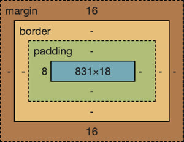

By default, the height and width of an element is defined by the height and width of the content box. You can change `box-sizing` CSS property from the default value of `content-box` to `border-box` in order to redefine the width and height to also inclde the padding and the border. This makes it easier to style elements when their visual size matches their actual size.

#### CSS Versions

CSS has evolved significantly over the years. 

| Year | Version | Features |
| --- | --- | --- |
| 1996 | CSS1 | selectors, font, colour, background, alignment, margin, border |
| 1998 | CSS2 | positioning, z-index, bidirectional text, shadows |
| 2011 | CSS2.1 | removed incompatible features |
| 1999-2021 | CSS3 | enhancements for media, box, background, borders, colour, template, multi-column, selectors |

Beginning with CSS3, the specification was divided into modules so they could be implemented at different levels of maturity. They ahven't decided if these will culminate in a CSS4.

</details>

<details>

<summary>CSS Selectors</summary>

### CSS Selectors

Deeper reading: [MDN CSS Selectors](https://developer.mozilla.org/en-US/docs/Web/CSS/CSS_Selectors)

The first step to using CSS is knowing how to select the element that a CSS rule applies to. The CSS rule selector takes many forms. Here's an example HTML page that we'll work with to show how this works.

```HTML
<body>
  <h1>Departments</h1>
  <p>welcome message</p>
  <section id="physics">
    <h2>Physics</h2>
    <p class="introduction">Introduction</p>
    <p>Text</p>
    <p class="summary">Summary</p>
  </section>
  <section id="chemistry">
    <h2>Chemistry</h2>
    <p class="introduction">Introduction</p>
    <p>Text</p>
    <p class="summary">Summary</p>
  </section>
</body>
```

By default, every browser defines a base set of styles that it applies to HTML when it renders it. This varies slightly between browsers, but for the most part the document above will render like this:


We want our document to look like this by the time we're done:

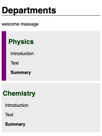

#### Element Type Selector

To start, we want all elements to use a sans-serif font. We do this by using an element name selector. By selecting the `body` element, we will cascade our declaration down to all the children of the body, which is the whole document.

```CSS
body {
  font-family: sans-serif;
}
```

We could also use the wildcard element name selector (`*`) to select all elements, but in this case the `body` element works fine.

We can also use the element name selectors to give a bottom border to the top level heading (`h1`), as well as modify the section elements to pop out with a grey background and some white space in the padding and margins.

```CSS
h1 {
  border-bottom: thin black solid;
}

section {
  background: #eeeeee;
  padding: 0.25em;
  margin-bottom: 0.5em;
}
```

#### Combinators

Next, we want to change the colour of the second level headings (`h2`), but only within the sections for each department. We can do this by providing a `descent combinator` that is defined with a space delimited list of values where each item in the list is a descendant of the previous one. In this case, our selector would be all the `h2` elements that are descendants of `section` elements.

```CSS
section h2 {
  color: #004400;
}
```

There are other types of combinators you can use.

| Combinator | Meaning | Example | Description |
| --- | --- | --- | --- |
| Descendent | a list of descendents | `body section` | any section that is a descendant of a body |
| Child | a list of direct children | `section > p` | any p that is a direct child of a section |
| General sibling | a list of siblings | `div ~ p` | any p that has a div sibling |
| Adjacent sibling | a list of adjacent siblings | `div + p` | any p that has an adjacent sibling |

We can use the general sibling combinator to increase the whitespace padding on the left of paragraphs that are siblings of a level two heading:

```CSS
h2 ~ p {
  padding-left: 0.5em;
}
```

#### Class Selectors

Any element can have zero or more classifications apploes to it. For example, our document has a class of `introduction` applied to the first paragraph, and a class of `summary` applies to the final paragraph of each section. I we want to bold the summary paragraphs, we would supply the class name summary prefixed with a period (`.summary`).

```CSS
.summary {
  font-weight: bold;
}
```

We can also combine the element name and class selectors to select all paragraphs with a class of summary:

```CSS
p.summary {
  font-weight: bold;
}
```

#### ID Selectors

ID selectors reference the ID of an element. All IDs should be unique within an HTML document so the CSS can target a specific element. To use the ID selector, you prefix the ID with the hash symbol (`#`). We would like to showcase our physics department by putting a thin purple border along the left side of the physics section.

```CSS
#physics {
  border-left: solid 1em purple;
}
```

#### Attribute Selectors

Attribute selectors let you select elements based on their attributes. You use an attribute selector to select any element with a give attribute (`a[href]`). You can also specify a required value for an attribute (`a[href="./fish.png"]`) in order for the selector to match. Attribute selectors also support wildcards such as the ability to selct attribute values containing specific text (`p[href*=https://"]`).

```CSS
p[class='summary'] {
  color: red;
}
```

[MDN](https://developer.mozilla.org/en-US/docs/Web/CSS/Attribute_selectors) has a full description of attribute selectors.

#### Psuedo Selector

CSS also defines a significant list of pseudo selectors which select based on positional relationships, mouse interactions, hyperlink visitation states, and attributes. Here is one example: suppose we want our purple highlight bar to appear only when the mouse hovers over the text. To accomplish this, we can change our ID selector to select whenever a section is hovered over.

```CSS
section:hover {
  border-left: solid 1em purple;
}
```

[MDN](https://developer.mozilla.org/en-US/docs/Web/CSS/Pseudo-classes) has more information on psuedo selectors.

#### Example Source

The example HTML and CSS for this section is on [CodePen](https://codepen.io/leesjensen/pen/NWzByav).

</details>

<details>

<summary>CSS Declarations</summary>

### CSS Declarations

Deeper reading: [MDN reference section on properties](https://developer.mozilla.org/en-US/docs/Web/CSS/Reference)

CSS rule declarations specify a property and value to assign when the rule selector matches one or more elements. There are a lot of potential properties defined for modifying the style of an HTML document. Here are some of the more commonly used ones.

| Property | Value | Example | Discussion |
| --- | --- | --- | --- |
| background-color | colour | `red` | Fill the background color |
| border | colour width style | `#fad solid medium` | Sets the border using shorthand where any or all of the values may be provided |
| border-radius | unit | `50%` | The size of the border radius |
| box-shadow | x-offset y-offset blu-radius colour | `2px 2px 2px gray` | Creates a shadow |
| columns | number | `3` | Number of textual columns |
| column-rule | colour width style | `solid thin black` | Sets the border used between columns using border shorthand |
| color | colour | `rgb(128, 0, 0)` | Sets the text color |
| cursor | type | `grab` | Sets the cursor to display when hovering over the element |
| display | type | `none` | Defines how to display the element and its children |
| filter | filter-function | `grayscale(30%)` | Applies a visual filter |
| float | direction | `right` | Places the element to the left or right in the flow |
| flex | | | Flex layout. Used for responsive design |
| font | family size style | `Arial 1.2em bold` | Defines the text font using shorthand |
| grid | | | Grid layout. Used for responsive design |
| height | unit | `.25em` | Sets the height of the box |
| margin | unit | `5px 5px 0 0` | Sets the margin spacing |
| max-\[width/height]| unit | `20%` | Restricts the width or height to no more than the unit |
| min-\[width/height]| unit | `10vh` | Restricts the width or height to no less than the unit |
| opacity | number | `.9` | Sets how opaque the element is |
| overflow | \[visible/hidden/scroll/auto] | `scroll` | Defines what happens when the content does not fix in its box |
| position | \[static/relative/absolute/sticky] | `absolute` | Defines what happens when the content does not fix in its box |
| padding | unit | `1em 2em` | Sets the padding spacing |
| left | unit | `10rem` | The horizontal value of a positioned element |
| text-align | \[start/end/center/justify] | `end` | Defines how the text is aligned in the element |
| top | unit | `50px` | The vertical value of a positioned element |
| transform | transform-function | `rotate(0.5turn)` | Applies a transformation to the element |
| width | unit | `25vmin` | Sets the width of the box |
| z-index | number | `100` | Controls the positioning of the element on the z axis |

#### Units

Deeper dive: [MDN Values and Units](https://developer.mozilla.org/en-US/docs/Learn/CSS/Building_blocks/Values_and_units)

You can use a variety of units when defining the size of a CSS property. For example, the width of an element can be defined using absolute units uch as the number of pixels (`px`) or inches (`in`). You can also use relative units such as a percentage of the parent element (`50%`), a percentage of a minimum viewpoint dimension (`25vmin`), or a multiplier of the size of the letter m (`1.5em`) as defined by thr root element.

```CSS
p {
  width: 25%;
  height: 30vh;
}
```

The following is a list of the most commonly used units. All the units are prefixed with a number when used as a property value.

| Unit | Description |
| --- | --- |
| `px` | the number of pixels |
| `pt` | the number of points (`1/72 of an inch`) |
| `in` | the number of inches |
| `cm` | the number of centimeters |
| `%` | a percentage of the parent element |
| `em` | a multiplier of the width of the letter `m` in the prent's font |
| `rem` | a multiplier of the width of the letter `m` in the root's font |
| `ex` | a multiplier of the height of the element's font |
| `vh` | a percentage of the viewport's width |
| `vh` | a percentage of the viewport's height |
| `vmin` | a percentage of the viewport's smaller dimension |
| `vmax` | a percentage of the viewport's larger dimension |

#### Colour

Deeper dive: [MDN Applying Colour](https://developer.mozilla.org/en-US/docs/Web/CSS/CSS_Colors/Applying_color)

CSS has multiple ways to describte colour, from representations that are known to programmers to ones familiar to layout designers and artists.

| Method | Example | Description |
| --- | --- | --- |
| keyword | `red` | A set of predefined colors (e.g. white, cornflowerblue, darkslateblue) |
| RBG hex | `#00FFAA22` or `#0FA2` | Red, green, and blue as a hexadecimal number, with an optional alpha opacity |
| RGB function | `rgb(128, 225,128, 0.5)` | Red, green, and blue as a percentage or number between 0 and 255, with an optional alpha opacity percentage |
| HSL | `hsl(180, 30% 90% 0.5)` | Hue, saturation, and light, with an optional opacity percentage. Hue is the position on the 365 degree color wheel (red is 0 and 255). Saturation is how gray the color is, and light is how bright the color is. |

#### Experiment

This [CodePen](https://codepen.io/leesjensen/pen/rNKrgKQ) demonstrates the use of many of the above declarations.

</details>

<details>

<summary>CSS Fonts</summary>

### CSS Fonts

Deeper dive: [MDN Web Fonts](https://developer.mozilla.org/en-US/docs/Learn/CSS/Styling_text/Web_fonts)

Choosing an appropriate font is an important web app design characteristic. The CSS `font-family` property defines what fonts should be used. The property value represents an ordered list of fonts. The first font in the list that is available will be used. The ability to select from a list of fonts is important because different operating systems have different default fonts and your first choice may not be available.

#### Font Families

There are four major font families:
- `serif`
- `sans-serif`
- `fixed`
- `symbol`

A serif is a small stroke attached to the ends of a major character's minor strokes. Serif fonts have extra strokes, while sans-serif fonts don't. Fixed fonts characters are all the same size, which is useful for lining up text when doing things like coding or displaying tabular data. Symbol fonts represent non-langauge characters like arrows and emojis.

#### Importing Fonts

Another way to pick a font is to specify a font that you provide with your application. The way your app is guaranteed to always look the same. To make the browser load a font you use the `@font-face` rule and provide the font name and source location.

```CSS
@font-face {
  font-family: 'Quicksand';
  src: url('https://cs260.click/fonts/quicksand.ttf');
}

p {
  font-family: Quicksand;
}
```

If you don't want to host font files on your server, then you can load them from a font provider. Google provides a large selection of [open source fonts](https://fonts.google.com/) that you can use without paying any royalties. The easiest way to use these is to use a CSS import statement to reference the Google Font Service. This automatically generates the CSS for importing the font.

```CSS
@import url('https://fonts.googleapis.com/css2?family=Rubik Microbe&display=swap');

p {
  font-family: 'Rubik Microbe';
}
```

Check out this [CopePen](https://codepen.io/leesjensen/pen/zYaLgVW) for an example on importing fonts.

</details>

<details>

<summary>CSS Animation</summary>

### CSS Animation

Deeper dive: [MDN Animation](https://developer.mozilla.org/en-US/docs/Web/CSS/CSS_Animations/Using_CSS_animations)

You can use CSS to animate your components for an easy way to make your app feel alive and interactive. You create CSS animations using the `animation` proeprties and defining `keyframes` for what the element should look like at different times in the animation.

The following is an example.

We have a paragraph of centered text and we want it to zoom in until its size is 20% of the view height.

```CSS
p {
  text-align: center;
  font-size: 20vh;
}
```

To make this happen, we specify that we are animating the selected elements by adding `animation-name` property with the value of demo. The name refers to the name of the `keyframes` that we will sepcify in a minute. The keyframes tells what CSS properties should be applied at different key points in the animation sequence. We also add `animation-duration` property in order to specify that the animation should last for 3 seconds.

```CSS
p {
  text-align: center;
  font-size: 20vh;

  animation-name: demo;
  animation-duration: 3s;
}
```

Now we can create keyframes. We don't have to define what happens at every millisecond. Instead, we only need to define the key points, and CSS will generate a smooth transition to move from one keyframe to another. Here, we want to start with text that is invisible and have it zoom into the full final size. We do this with two frames that are designated with the keywords `to` and `from`.

```CSS
@keyframes demo {
  from {
    font-size: 0vh;
  }

  to {
    font-size: 20vh;
  }
}
```

That's all we need to do. But we can make it look better making the paragraph bounce out a little bit bigger than its final size at the end. We can do this by adding another keyframe that happens 95% through the animation.

```CSS
@keyframes demo {
  from {
    font-size: 0vh;
  }

  95% {
    font-size: 21vh;
  }

  to {
    font-size: 20vh;
  }
}
```

This example is demonstrated in this [CodePen](https://codepen.io/leesjensen/pen/LYrJEwX).

But you can do a lot more with CSS than just pushing buttons and making text float. Here's an example of [animating a watch](https://codepen.io/leesjensen/pen/MWBjXNq) using only HTML and CSS.

There are a lot of CSS animation examples on CodePen. Here's one with [floating clouds](https://codepen.io/leesjensen/pen/wvXEaRq).

</details>

<details>

<summary>Debugging CSS</summary>

### Debugging CSS

Deeper dive: [MDN Debugging CSS](https://developer.mozilla.org/en-US/docs/Learn/CSS/Building_blocks/Debugging_CSS)

CSS is very powerful, but it is very frustrating to figure out why your page is not rendering the way you expect it to. To help you understand why it's rendering as it it, you can use the browser's developer tool to inspect the CSS properties and visualize the HTML layout. Using the Chrome debugger let's you access the developer tools by right clicking on the HTML page element that you want to debug and selecting the `inspect` option.

In the debugger window, if you use the `Elements` tab, you can move your cursor over the different elements and see a visual representation of the padding, borders, and margins. The `Styles` pane shows all of the CSS properties applied to the currently selected element. If you scroll down to the bottom of the styles pane, you will see the CSS box.By moving the cursor over different parts of the box, it will highlight the different box parts in the browser window.

You can change and add properties right in the debugger. This lets you see how each property is contributing and change them to see how that impacts the rendering. 

#### Extra Help With Debugging

This [video](https://youtu.be/NKyVgzYnYoU) shows you how to use the "inspect" tool to debug your CSS.

</details>

<details>

<summary>Responsive Design</summary>

### Responsive Design

Deeper reading: [MDN Respsonsive Design](https://developer.mozilla.org/en-US/docs/Learn/CSS/CSS_layout/Responsive_Design)

Modern web apps are expected to run well on a large variety of computers. This includes everything from desktops, to phones, to shopping kiosks, to car dashboards. This ability to recongifure the interface so the app accomodates and takes advantage of the screen's size and orientation is called `responsive design`.

Much of HTML and CSS is fluid due to the fact that it responds to the browser window being resized. For example, a paragraph element will resize when the browser window is resized. However, the following features can completely change the layout of the app based on the device's size and orientation.

#### Display

Deeper dive: [MDN Display](https://developer.mozilla.org/en-US/docs/Web/CSS/display)

The CSS display property lets you change how and HTML element is displayed in the browser. Here are some common options.

| Value | Meaning |
| --- | --- |
| none | Don't display this element. The element still exists, but the browser will not render it. |
| block | Display this element with a width that fills its parent element. A `p` or `div` element has block display by default. |
| inline | Display this element with a width that is only as big as its content. A `b` or `span` element has inline display by default. |
| flex | Display this element's children in a flexible orientation. |
| grid| Display this element's children in a grid orientation. |

We can demonstrate the different CSS property values with the following HTML with a bunch of `div` elements. By default, the `div` elements have a display property value of `block`.

```HTML
<div class="none">None</div>
<div class="block">Block</div>
<div class="inline">Inline1</div>
<div class="inline">Inline2</div>
<div class="flex">
  <div>FlexA</div>
  <div>FlexB</div>
  <div>FlexC</div>
  <div>FlexD</div>
</div>
<div class="grid">
  <div>GridA</div>
  <div>GridB</div>
  <div>GridC</div>
  <div>GridD</div>
</div>
```

With the default of `block`, the above HTML should look like this.

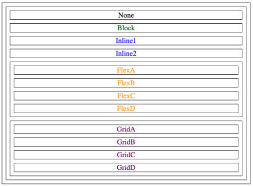

If we modify the display property associated with each element with the following CSS, we get a different rendering.

```CSS
.none {
  display: none;
}

.block {
  display: block;
}

.inline {
  display: inline;
}

.flex {
  display: flex;
  flex-direction: row;
}

.grid {
  display: grid;
  grid-template-columns: 1fr 1fr;
}
```

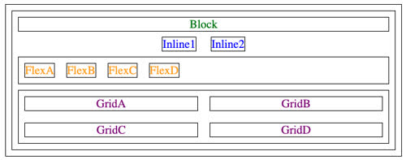

You can mess with different display property values in this [CodePen](https://codepen.io/leesjensen/pen/RwBOPjv).

#### Viewport Meta Tag

When mobile smartphones began to gain popularity, they began to be used to view websites. But websites were optimised for desktop displays and not the tiny mobile screens. To solve this, mobile browsers automatically started scaling the website so that it looked better on a small screen. Unfortunately, as web apps became responsive to screen size, the mobile browser's scaling got in the way. The solution was to include a meta tag in the `head` element of all the HTML pages of an app. This tells the broswer not to scale the page.

```HTML
<meta name="viewport" content="width=device-width,initial-scale=1">
```

#### Float

The float property moves an element to the left or right of its container element and allows inline elements to wrap around it. For example, if we had an `aside` element followed by a large paragraph of text, we could create the following CSS rule to cause the text to wrap around the aside.

```CSS
aside {
  float: right;
  padding: 3em;
  margin: 0.5em;
  border: black solid thin;
}
```

When the browser resizes, the text will flow around the floating element. Use this [CodePen](https://codepen.io/leesjensen/pen/MWBRWPP) to experiement with `float`. Change the descriptor value to `none` or `left` and see what happens.

#### Media Queries

One of the main CSS features for creating responsive apps is the `@media` selector. This dynamically detects the size and orientation of the device and applies CSS rules to represent the structure of the HTML in a way that accommodates the change.

We can use the `@media` selector to tell us which side of the screen (viewport) is the longest. The query takes one or more predicates separated by boolean operatora. In our case, we simply want to know if the screen is oriented in portrait mode (short side on top) or not. If it is, we transform all of our div elements by rotating them 270 degrees.

```CSS
@media (orientation: portrait) {
  div {
    transform: rotate(270deg);
  }
}
```

We can demonstrate this by using the brwoser's debugger and switching into phone and responsive mode. You can also use this [CodePen](https://codepen.io/leesjensen/pen/rNKZOva) and test it by resizing the browser window.

We can also use media queries to make entire pieces of your app disappear, or move to a different location. For example, if we had an aside that was helpful when the screen is wide, but took of too much space when the screen got narrow, we could use the following media query to make it disappear:

```CSS
@media (orientation: portrait) {
  aside {
    display: none;
  }
}
```

Here is the [CodePen](https://codepen.io/leesjensen/pen/NWzLGmJ) for this example.

#### Grid and Flexbox

The final two responsive technologies are Grid and Flexbox. These are CSS display modes that automatically respond to screen size to position and resize their child elements.

</details>

<details>

<summary>CSS Grid</summary>

### CSS Grid

Deeper reading:
- [MDN Grid](https://developer.mozilla.org/en-US/docs/Web/CSS/CSS_Grid_Layout/Basic_Concepts_of_Grid_Layout)
- [Grid by example](https://gridbyexample.com/)

The `grid` display layout is useful when you want to display a group of child elements in a responsive grid. We start with a container element that has a bunch of child elements.

```HTML
<div class="container">
  <div class="card"></div>
  <div class="card"></div>
  <div class="card"></div>
  <div class="card"></div>
  <div class="card"></div>
  <div class="card"></div>
  <div class="card"></div>
  <div class="card"></div>
  <div class="card"></div>
</div>
```

We can turn this into a responsive grid by including the CSS `display` property with the value of `grid` on the container element. This tells the browser that all the children of this element should be displayed in a grid flow. The `grid-template-columns` property specifies the layout of the grid columns. We set this to repeatedly define each column to auto-fill the parent element's width with children that are resized to a minimumn of 300 pixels and a maximum of one equal fractional unit (`1fr`) of the parents total width. A fractional unit is dynamically computed by splitting up the parent element's width into equal parts. Next, we fix the height of the rows to be exactly 300 pixels by specifying the `grid-auto-rows` property. Finally, we finish off the grid configuration by setting the `grid-gap` property to have a gap of at least `1 em` between each item in the grid.

```CSS
.container {
  display: grid;
  grid-template-columns: repeat(auto-fill, minmax(300px, 1fr));
  grid-auto-rows: 300px;
  grid-gap: 1em;
}
```

You can experiment with the source on [CodePen](https://codepen.io/leesjensen/pen/GRGXoWP).

</details>

<details>

<summary>CSS Flexbox</summary>

### CSS Flexbox

Deeper reading:
- [MDN Flexbox](https://developer.mozilla.org/en-US/docs/Web/CSS/CSS_Flexible_Box_Layout/Basic_Concepts_of_Flexbox)
- [CSS Tricks Flexbox](https://css-tricks.com/snippets/css/a-guide-to-flexbox/)
- [Flexbox Froggy](https://flexboxfroggy.com/)

The `flex` display layout is useful when you want to partition your app into areas that responsively move around as the window resizes or the orientation changes. To demonstrate this, we'll build an app with a header, footer, and a main content area split into two sections, with controls on the left and content on the right.

For visualising:

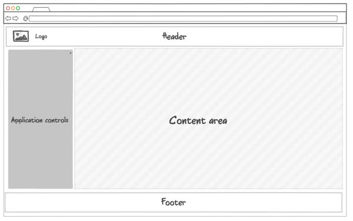

The structural HTML to match the design:

```HTML
<body>
  <header>
    <h1>CSS flex &amp; media query</h1>
  </header>
  <main>
    <section>
      <h2>Controls</h2>
    </section>
    <section>
      <h2>Content</h2>
    </section>
  </main>
  <footer>
    <h2>Footer</h2>
  </footer>
</body>
```

Now we can use Flexbox to make it all come together. We make the body element into a responsive flexbox by including the CSS `display` property with the value `flex`. This tells the browser that all the children of this element are to be displayed in a flex flow. To make the top level children be column oriented, we add the `flex-direction` property with a value of `column`. We then add some other simple declarations to zero out the margin and fill the entire viewport with our app frame.

```CSS
body {
  display: flex;
  flex-direction: column;
  margin: 0;
  height: 100vh;
}
```

To get the division of space for the flexbox children correct, we add the following flex properties to each child:
- header - `flex: 0 80px` - zero means it will not grow and 80px means it has a starting basis height of 80 pixels. This creates a fixed size box.
- footer - `flex: 0 30px` - like the header it won't grow and has a height of 30 pixels.
- main - `flex: 1` - one means it will get one fractional unit of growth, and since it is the only child with a non-zero growth value, it will get all the remaining space. Main also gets some additional properties because we want it to also be a flexbox conainer for the controls and content area. So we set its display to be `flex` and specify the `flex-direction` to be row so that the children are oriented side by side.

```CSS
header {
  flex: 0 80px;
  background: hsl(223, 57%, 38%);
}

footer {
  flex: 0 30px;
  background: hsl(180, 10%, 10%);
}

main {
  flex: 1;
  display: flex;
  flex-direction: row;
}
```

Now, we need to add the CSS to the control and content areas represented by the two child section elements. We want the controls to have 25% of the space and content to have the rest. So we set the `flex` property value to 1 and 3 respectively. That means the controls get one unit of space and the content gets three units of space. No matter how we resize things, the ratio will remain the same.

```CSS
section:nth-child(1) {
  flex: 1;
  background-color: hsl(180, 10%, 80%);
}
section:nth-child(2) {
  flex: 3;
  background-color: white;
}
```

#### Media Query

While the above completes the original design, we also want it to be able to handle smaller screen sizes. To do this, we need to add some media queries that drop the header and the footer if the viewport gets too short, and orient the main sections as rows it it gets too narror.

For the narrow screen (portrait mode), we include a media query that detects when we are in portrait orientation and sets the `flex-direction` of the main element to be column instead of row. This causes the children to be stacked on top of each other instead of side by side.

To handle making the header and footer disappear when the screen is too short, we use a media query that triggers when our viewport height has a max value of 700 pixels. When that is true, we change the `display` property for both the header and the footer to `none` so they are both hidden. When that happens, the main element becomes the only child. Since it has a flex value of 1, it takes over everything.

```CSS
@media (orientation: portrait) {
  main {
    flex-direction: column;
  }
}

@media (max-height: 700px) {
  header {
    display: none;
  }
  footer {
    display: none;
  }
}
```

You can experiment with this on [CodePen](https://codepen.io/leesjensen/pen/MWOVYpZ)

</details>

<details>

<summary>CSS Frameworks</summary>

### CSS Frameworks

CSS framweorks provide functions and components that commonly appear in web apps. As web developers built more and more web apps, they started to use the same patterns. They combined these patterns into a shared package of code and contributed it to the world as open source repos. This helped decrease the development time, and also created a common user experience for the web in general.

There are a lot of open source CSS frameworks to choose from. Many contain the same types of functionality, but they all bring something a little bit different.

#### Tailwind

- [Tailwind CSS](https://tailwindcss.com/)
- Component library: [Tailwind UI](https://tailwindui.com/)

According to the 2022 StateOfCSS poll, Taiwling gained 46% of general usage with a retention rating of 78%.

Tailwind approaches CSS a bit differntly than the traditional framworks. Instead of large, rich, CSS rulesets, it uses smaller definitions applied specifically to individual HTML elements. This moves much of the CSS representation out of the CSS file and into the HTML.

#### Bootstrap

- [Getting started with Bootstrap](https://getbootstrap.com/docs/5.2/getting-started/introduction/)

[Bootstrap](https://getbootstrap.com/) is the reigning champion of the CSS frameworks. It's been supported by an active community for over a decade, and contains many lessons learned from real world applications. The biggest downfall of Bootstrap is its success. Because it's so popular, it defines the de facto look and feel of websites. This is great for user experience continuity, but it makes it difficult for a website to grab the attention of new users.

##### Getting Bootstrap

You can integrate Bootstrap into your web app by referencing the Bootstrap CSS files from their [content delivery network](https://getbootstrap.com/docs/5.2/getting-started/introduction/#cdn-links) (CDN). You then add it to the HTML in your head element with a link element.

```HTML
<!DOCTYPE html>
<html lang="en">
  <head>
    <meta name="viewport" content="width=device-width, initial-scale=1" />
    <link href="https://cdn.jsdelivr.net/npm/bootstrap@5.3.3/dist/css/bootstrap.min.css" rel="stylesheet" integrity="sha384-rbsA2VBKQhggwzxH7pPCaAqO46MgnOM80zW1RWuH61DGLwZJEdK2Kadq2F9CUG65" crossorigin="anonymous" />
  </head>
  <body>
    ...
  </body>
</html>
```

If you're using components that require JavaScript (like carousel, buttons, etc), then you also need to include the JavaScript module. You add this by putting it in the end of your HTML body element.

```HTML
<body>
  ...

  <script src="https://cdn.jsdelivr.net/npm/bootstrap@5.3.3/dist/js/bootstrap.bundle.min.js" integrity="sha384-kenU1KFdBIe4zVF0s0G1M5b4hcpxyD9F7jL+jjXkk+Q2h455rYXK/7HAuoJl+0I4" crossorigin="anonymous"></script>
</body>
```

You can use the Node Package Manager (npm) to download Bootstrap and include it in your source code. This way you don't have to rely on someone else's server to provude you with a vital piece of your app. Use the following command in your console to install Bootstrap with npm:

```
npm install bootstrap@5.3.3
```

Word of caution: this command is specifically for version 5. You want to use the latest version when you install it.

##### Using Bootstrap

Once you have Bootstrap in your HTML, you can begin to use the components it provides. 

For example, we'll talk about a button. When we use the Bootstrap `btn` CSS class, the button gets a ncie rounded appearance. The Bootstrap `btn-primary` CSS class shades the button with the current primary colour for the app, which is blue by default. Here's a demonstration of the Bootstrap vs the regular HTML button. They work the same, but the Bootstrap one looks better.

```HTML
<!-- Bootstrap styled button -->
<button type="button" class="btn btn-primary">Bootstrap</button>

<!-- Default browser styled button -->
<button type="button">Plain</button>
```

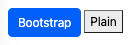

Here's a [CodePen](https://codepen.io/leesjensen/pen/JjZavjW) that demonstrates all the major Bootstrap components.
 
</details>

<details>

<summary>Tailwind</summary>

### Tailwind

Deeper reading:
- [Tailwind website](https://tailwindcss.com/)
- [Getting started using Vite](https://tailwindcss.com/docs/installation/using-vite)

Tailwind is a CSS framwork that appraches it differently than other framworks. Instead of importing a bunch of predefined components, Tailwind provides low-level utility classes that you apply to your HTML.

#### History

- Created by Adam Wathan, Steve Shoger, Jonathon Reinink, David Hemphill
- Initially released in November 2017
- Motivation: The team wanted a way to build UIs faster and more flexibly without constantly switching between HTML and CSS files or overriding styles from traditional frameworks
- Success: It's grown to become one of the most popular CSS frameworks due to its developer-first philosophy and modern tooling ecosystm

#### Tailwind Philosophy

When you use Tailwind, you add standard Tailwind class names to your HTML elements. Then you run the HTML through a tool chain process, like Vite, and it will dynamically build your CSS files from the classes that you explicitly reference.

Advantages
- Reduces CSS bloat
- Puts your styling directly in the HTML where it is used
- Increases performance because you only include styling that you actually use
- Closer to CSS, so if you're familiar with CSS you can quickly style your HTML with a simplified style syntax

Tailwind works well with web component frameworks because it encourages you to build reusable components in a framework like React so you avoid creating similar components with slightly different Tailwind class references.

Example of a Tailwind button:

```HTML
<button className="bg-blue-400 text-white px-4 py-2 rounded shadow hover:bg-blue-700 transition-colors m-4">Get Started</button>
```

#### Comparison to Bootstrap

The exmpample here shows the same HTML styled with Boostrap and then with Tailwind.

**Bootstrap**

With Bootstrap, you use the card, card-body, card-tile, and card-text component classes. The HTML references a large static stylesheet to apply the CSS rules for the classes.

```HTML
<div class="card" style="width: 18rem;">
  
  <div class="card-body">
    <h5 class="card-title">Card Title</h5>
    <p class="card-text">Some quick example text.</p>
  </div>
</div>
```

**Tailwind**

With Tailwind, there are no component level definitions. You work with class names that are similar to primitive CSS directives. Then you apply the class names in the HTML and not through CSS files.

```HTML
<div class="max-w-sm rounded overflow-hidden
<div className="max-w-sm rounded bg-white overflow-hidden shadow-lg m-4 p-2">
  
  <div className="px-2 py-4">
    <div className="font-bold text-xl mb-2">Card Title</div>
    <p className="text-gray-700 text-base">Some quick example text.</p>
  </div>
</div>
```

The result is visually similar in both cases, but because Bootstrap uses predefined component level classes, you will need to download the entire Bootstrap CSS framework file in order to render the card. With Tailwind, a custom CSS file is created dynamically for you that only contains the styling that you used.

**Feature Comparison**

| Feature | Tailwind CSS | Bootstrap |
| --- | --- | --- |
| Philosophy | utility-first (build from primitives) | component-based (prebuilt UI components) |
| Customization| highly customizable via config (`tailwind.config.js`) | customaizable but more rigid without overrides |
| Design freedom | full control of spacing, colour, layout | limited to pre-defined component styling |
| File size | smaller | larger due to bundled components and styles |
| Learning curve | steep at first as you learn native CSS | easy to get started |
| JS dependency | no JS (expect if using plugins) | depends on jQuery (Bootstrap <= 4) or native JS (bootstrap 5) |

#### Adding Tailwind to your Project

If you're already using Vite as the tool chain processor for your react application, it's easy to configure Vite to support Tailwind. You need to install Tailwind, configure Vite to execute Tailwind as part of the tool chain, add a reference to the resulting CSS, and start adding Tailwind class names to your HTML elements.

1. Start with the [Hello World React](https://github.com/webprogramming260/webprogramming/blob/main/instruction/webFrameworks/react/introduction/introduction.md#react-hello-world) application.

2. Install Tailwing CSS
```npm install tailwindcss @tailwindcss/vite```

3. Configure the Vite plugin to use Tailwind to compile CSS by modifying/creating `vite.config.js`
```JavaScript
import { defineConfig } from 'vite';
import tailwindcss from '@tailwindcss/vite';
export default defineConfig({
  plugins: [tailwindcss()],
});
```

4. Create a `index.css` file and import tailwindcss. This brings the dynamically generated Tailwind file.
```CSS
@import 'tailwindcss';
```

5. Modify the `index.html` head element to reference the placeholder CSS file.
```HTML
<link href="/src/style.css" rel="stylesheet" />
```

6. Modify the `index.jsx` file to use Tailwind classes.
```jsx
import React from 'react';
import ReactDOM from 'react-dom/client';

function App() {
  const [bgColor, setBgColor] = React.useState('bg-white');

  const handleClick = () => {
    setBgColor(bgColor === 'bg-white' ? 'bg-yellow-200' : 'bg-white');
  };

  return (
    <div onClick={handleClick} className={`h-screen font-bold text-8xl flex items-center justify-center ${bgColor}`}>
      <div> Hello React </div>
    </div>
  );
}

const root = ReactDOM.createRoot(document.getElementById('root'));
root.render(<App />);
```

</details>

## JavaScript and Web Frameworks

### Part 1: HTML/CSS Components and Routing

<details>

<summary>JavaScript Introduction</summary>

#### JavaScript Introduction

Deeper reading:
- [MDN JavaScript](https://developer.mozilla.org/en-US/docs/Web/JavaScript)
- [ECMA Specification](https://tc39.es/ecma262/) -> Official specification is only for reference

JavaScript (officialy known as ECMAScript), is a weakly typed language based on concepts in C, Java, and Scheme. It's the most used programming langauge in the world. It runs on every web browser, and is commonly used as a web server langauge and for creating servless functions.

The more effectively you understand JavaScript, the better web programmer you will be.

Typically, JS is executed using an interpreter at runtime instead of compiling it into a machine specific binary at build time. This has the advantage of making JS very portable, but also allows for many errors like using an undefined variable. These errors commonly only get discovered when the program crashes during execution.

##### JavaScript Versions

It's important to be aware of JavaScript versions as browser compatability is always a issue when developing a web app. When considering a JS feature, consult websites like [MDN](https://developer.mozilla.org/en-US/docs/Mozilla/Add-ons/WebExtensions/Browser_support_for_JavaScript_APIs) of [CanIUse](https://caniuse.com/) to see how well the feature is supported.

| Year | Version | Features |
| --- | --- | --- |
| 1997 | ES1 | types, functions |
| 1999 | ES3 | regex, exceptions, switch |
| 2009 | ES5 | json, array, iteration |
| 2015 | ES6 | let/const, default params, classes, template literals, destructuring, generators, promises, modules, internationalization |
| 2016 | ES2016 | array.includes |
| 2017 | ES2017 | async/await |
| 2018 | ES2018 | rest/spread, promise.finally |
| 2019 | ES2019 | string.trim |
| 2020 | ES2020 | ?? operator |

##### Getting Started

We'll start with a basic example. The following JS will concatenate three strings together and then throw away the result. 

``` JavaScript
'Hello' + ' ' + 'world';
```

Slightly more complex is to call a function with the result of our concatenated string. In this case, we'll use the JS runtime's built in function `console.log` to output the string to the debugger console.

```JavaScript
console.log('Hello' + ' ' + 'world');
// OUTPUT: Hello world
```

You can also write your own functions:

```JavaScript
function join(a, b) {
  return a + ' ' + b;
}

console.log(join('Hello', 'world'));
// OUTPUT: Hello world
```

##### Comments

You can comment your JS with line or block comments.

```JavaScript
// Line comment

/*
Block comment
*/
```

##### Code Delimiters

These aren't technically required in most cases, but it is considered good form to end JS statements with a semicolon (`;`). Code blocks, and their scope, are defined with curly braces (`{ }`).

##### Playgrounds

To practise JavaScript, you need a way to write and run JS yourself. Here are two easy ways to do this.

1. Use an online sandbox like [CodePen](https://codepen.io/). With CodePen, you can write whatever JS you want and immediately see the results. Make sure you display the CodePen's console window if your JS is using the `console.log` function.

2. Use your browser's debugger. For example, if you open chrome and press `F12`, the debugger will display. Select the `Console` menu option. This will display a JS interpreter where you can write and execute your code.

##### Examples

You can see examples of all the JS we will talk about by using this [HTML page](https://htmlpreview.github.io/?https://github.com/webprogramming260/webprogramming/blob/main/instruction/javascript/introduction/jsDemo.html).

</details>

<details>

<summary>Adding JavaScript to HTML</summary>

#### Adding JavaScript to HTML

There are three ways to add JS into HTML.

1. **Script block**: Directly including it in the HTML within the content of a `<script>` element.
2. **External code**: Using the `src` attribute of the script element to reference an external JavaScript file.
3. **Inline event attribute**: Putting JavaScript directly inline as part of an event attribute handler.

**index.js**

```JavaScript
function sayHello() {
  alert("Hello");
}
```

**index.html**

```HTML
<!-- external script -->
<head>
  <script src="index.js"></script>
</head>
<body>
  <button onclick="sayHello()">Say Hello</button>
  <button onclick="sayGoodbye()">Say Goodbye</button>

  <!-- internal script block -->
  <script>
    function sayGoodbye() {
      alert("Goodbye");
    }
  </script>

  <!-- inline attribute handler -->
  <script>
    let i = 1;
  </script>
  <button onclick="alert(`i = ${i++}`)">counter</button>
</body>
```

Notice how we call the `sayHello` and `sayGoodbye` JS functions from the HTML in the `onclick` attribute of the button element. Special attributes like `onclick` automatically create event listeners for different DOM events that call the code contained in the attribute's value. The code specified by the attribute value can be a simple call to a function or any JS code.

</details>

<details>

<summary>Node.js</summary>

#### Node.js

Node.js was created in 2009 by Ryan Dahl. It was the first successful application for deploying JavaScript outside of a browser. Now, JS is not just a browser technology, but one that can run on the server as well. This means that JS can power your entire tech stack. Node.js is often referred to as Node, and is currently maintained by the [Open.js Foundation](https://openjsf.org/).

Browsers run JS using a JS interpreter and execution engine. For example, Chromium based. browsers all use the [V8](https://v8.dev/) engine created by Google. Node.js took the V8 engine and ran it inside of a console application. When you run a JS program in Chrome of Node.js, it's the V8 that reads your code and executes it. The result is the same regardless of which program wraps V8.

##### Installing Node.js

Your production environment web server comes with Node.js installed. However, you need to install Node.js in your development enviroment also. The easiest way to install Node.js is to use the official download found on [nodejs.org](https://nodejs.org/en/download/package-manager).

You can pick the method, but it's recommended to use the Prebuilt Installer for your operating system and computer processor. Make sure that you select the Long Term Support version (TLS) to get the most stabel version.

##### Checking that Node is Installed

The node.js console app is simply called `node`. You can check if Node is working correctly by running `node` with the `-v` paramter.

```
% node -v
v24.13.0
```

##### Running Programs

You can run a line of JS with Node.js from your console with the `-e` parameter.

```
➜  node -e "console.log(1+1)"
2
```

You can also run `node` in interpretive mode by executing it without any parameters and then typing your JS code directly into the interpreter.

```
➜ node
Welcome to Node.js v16.15.1.
> 1+1
2
> console.log('hello')
hello
```

But to do real work, you need to execute an entire project composed of dozens or even hundreds of JS files. You can do this by making a starting JS file, called something like `index.js`, that references the code found in the rest of your project. You can then execute your code by running `node` with `index.js` as a parameter. For example, the following JS saved to a file named `index.js`.

``` JavaScript
function countdown() {
  let i = 0;
  while (i++ < 5) {
    console.log(`Counting ... ${i}`);
  }
}

countdown();
```

We can execute the JS by passing the file to `node`, and receive the following.

```
➜  node index.js
Counting ... 1
Counting ... 2
Counting ... 3
Counting ... 4
Counting ... 5
```

##### Node Package Manager

It's always helpful to use preexisting packages of JS for implementing common tasks. To load a package using Node.js, there are two steps you have to take. First, install the package locally on your machine using the Node Package Manager (NPM) and include a `require` statement in your code that references the package name. NPM is automatically installed when you install Node.js.

NPM can access a huge repository if preexisting packages. You can search these packages on the [NPM website](https://www.npmjs.com/). However, before you can start using NPM to install packages, you need to initilize your code to use NPM. This is done by creating a directory that will contain your JS and then running `npm init`. NPM will step you through a series of questions about the project you're making. You can press the return key for each question if you want the default settings. If you are always going to accept all the defaults, just use `npm init -y` to skip the questions.

```
➜  mkdir npmtest
➜  cd npmtest
➜  npm init -y
```

##### Package.json

If you list the files in your directory, you'll see a new one called `package.json`. This file contains 3 main things: (1) Metadata about your project like its name and the default entry JS file, (2) commands (scripts) that you can execute to do things like run, test, or distribute your code, and (3) packages that the project depend on. The following is what it should look like at the start, with default metadata and a simple placeholder script that runs the echo command when you execute `npm run test` from the console.

```JSON
{
  "name": "npmtest",
  "version": "1.0.0",
  "description": "",
  "main": "index.js",
  "keywords": [],
  "author": "",
  "license": "ISC",
  "scripts": {
    "test": "echo \"Error: no test specified\" && exit 1"
  }
}
```

With NPM initialised, you can use it to install a node package. In this example, we'll install a package that knows how to tell jokes, called `give-me-a-joke`. You can search for it on the [NPM website](https://www.npmjs.com/), and see how many times it's been installed, examine the source code, and learn about who created it. Install the package using `npm install` followed by the name of the package.

```
➜  npm install give-me-a-joke
```

Now, if you look at the `package.json` file, you will see a reference to the new package dependency. If you don't want the package dependency anymore, you can remove it with `npm uninstall <package name>` in the console.

With the dependency added, the unnecessary metadata removed, the addition of a useful script, and also adding a description, the `package.json` file should look like this:

```JSON
{
  "name": "npmtest",
  "version": "1.0.0",
  "description": "Simple Node.js demo",
  "main": "index.js",
  "license": "MIT",
  "scripts": {
    "dev": "node index.js"
  },
  "dependencies": {
    "give-me-a-joke": "^0.5.1"
  }
}
```

Note: When you install dependencies, NPM creates an additional file called `package-lock.json` and a directory named `node_modules` in your project directory. The `node_modules` directory contains the actual JS files for the package and all the dependent packages. As you start installing several packages, this directory gets really big. You don't want it on your source control system because it can be very large and can be rebuilt from the info in the `package.json` and `package-lock.json` files, so include `node_modules` in your `.gitignore` file.

Whenever you clone your code from GitHub to a new location, you should always run `npm install` in the project directory. This causes NPM to download all the previously installed packages and recreate the `node_modules` directory.

The `package-lock.json` file tracks the version of the package that you installed. That way if you rebuild your `node_modules` directory, you will have the version of the package you initially install and not the latest available one, which might not be compatible with your code.

With NPM and the joke package installed, you can now use the joke package in a JS file by referencing the package name as a parameter to the `require` function. This is followed by a call to the joke object's `getRandomDadJoke` function to actually generate a joke. Create a file named `index.js` and paste the following.

```JavaScript
const giveMeAJoke = require('give-me-a-joke');
giveMeAJoke.getRandomDadJoke((joke) => {
  console.log(joke);
});
```

If you run this with `node.js`, you should get a random joke.

```
➜  node index.js
What do you call a fish with no eyes? A fsh.
```

This may seem like a lot of work, but it starts to feel natural. Here are the main steps.

1) Create your project directory
2) Initilize it for use with NPM by running `npm init -y`
3) Make sure `.gitignore` file contains `node_modules`
4) Install any desired packages with `npm install <package name>`
5) Add `require('<package name>')` to your apps JS
6) Use the code package provider in your jS
7) Run your code with `node index.js`

##### Deno and Bun

Ryan created a successor to Node.js called [`Deno`](https://deno.land/). This version is more compliant with advances in ECMAScript and has significant performance advantages. There are also competitor server JS applications, like [`Bun`](https://bun.sh/).

</details>

<details>

<summary>Debugging JavaScript</summary>

#### Debugging JavaScript

Deeper reading: [MDN Console](https://developer.mozilla.org/en-US/docs/Learn/Common_questions/What_are_browser_developer_tools)

You will have bugs in your code at some point. They may happen when you're authoring it, working on other code that changes assumed dependencies, or while enhancing the code with new functionality. 

Learning how to quickly find and fix bugs will greatly increase your value as a web developer. Additionally, debugging skills can also be used during the development process. By following a pattern of writing code and then stepping through and debugging it, you gain confidence that the block is working as desired.

##### Console Debugging

Deeper reading: [MDN Console](https://developer.mozilla.org/en-US/docs/Learn/Common_questions/What_are_browser_developer_tools)

One of the simplest ways to debug JS code is to insert `console.log` functions that output the state of the code it executes. For example, you can create a simple web app that has an HTML and JS file that demonstrates the difference between `let` and `var`. By insterting `console.log` statements into the code, we can see what the value of each variable is as the code executes.

**index.html**

```HTML
<body>
  <h1>Debugging</h1>
  <script src="index.js"></script>
</body>
```

**index.js**

```JavaScript
var varCount = 20;
let letCount = 20;

console.log('Initial - var: %d, let: %d', varCount, letCount);

for (var varCount = 1; varCount < 2; varCount++) {
  for (let letCount = 1; letCount < 2; letCount++) {
    console.log('Loop - var: %d, let: %d', varCount, letCount);
  }
}

const h1El = document.querySelector('h1');
h1El.textContent = `Result - var:${varCount}, let:${letCount}`;
console.log('Final - var: %d, let: %d', varCount, letCount);
```

Take the following steaps to see the result of the console debugging.
1) Create the above files in a test directory named testConsole
2) Open the testConsole directory in VS Code
3) Run `index.html` using the VS Code live Server extension
4) Open the Chrome browser debugger (press `F12` or right click on the screen and select inspect)
5) Select the `Console` tab
6) Refresh the browser

You can use the debugger console window to inspect variables without using the `console.log` functions from your code. For example, if you type varCount in the console window, it will print out the current value of varCount. You can also execute JS directly in the console window. For example, if you type `varCount = 50` and press `Enter`, it will change the current value of varCount.

##### Browser Debugging

`console.log` debugging is great for times when you just need to quickly see what is going on in your code. But if you really want to understand the code as it exeutes, you want to use the full capability of the browser's debugger.

Open up Chrome's brower debugger with the same setup used before, but this time select the source tab. This will display the source files that comprise the currenly rendered content.

You can either select `index.js` from the source view or press `CTRL-P` on Windows and `⌘-P` on Mac select `index.js` from the list that pops up. Set a breakpoint on line 4 by clicking on the line number on the left of the displayed code. This pauses the debugger when that line is exevuted. Refreshing the browser will reload `index.js` and pause on the breakpoint.

With the browser paused, you can move your cursor over a variable to see its value, see what variabels are in scope, set watches on variables, or use the console to interact with the code.

This gives you complete control to inspect what the JS code is doing and experiment with possible alternative directions for the code.

</details>

<details>

<summary>Debugging Node.js</summary>

#### Debugging Node.js

Deeper reading: 
- [Debugging a Node.js application](https://youtu.be/B0le_Z_2TQY)
- [Node.js debugging in VS Code](https://code.visualstudio.com/docs/nodejs/nodejs-debugging)

Now that you are writing JS that runs with Node.js, you need a way to launch and debug your code that runs outside of the browser. One way to do that is to use the debugging tools built into VS Code. To debug JS in VSCode, you forst need some JS to debug. Create a file called `main.js` and pasted the following.

```JavaScript
let x = 1 + 1;

console.log(x);

function double(x) {
  return x * 2;
}

x = double(x);

console.log(x);let x = 1 + 1;

console.log(x);

function double(x) {
  return x * 2;
}

x = double(x);

console.log(x);
```

Now, you can debug `main.js` in VS Code by executing the `Start Debugging` command by pressing `F5`. This first time you run this, VS Code will ask you what debugger you want to use. Pick Node.js.

The code will run and the debug console window will automatically open to show you the debugger output where you can see the results of the two `console.log` statements found in the code.

You can pause the code by adding a breakpoint. Do this by hovering over the numbers on the left and clicking when the red dot appears.

Now you can restart the debugger by pressing `F5` again. This time it will stop at the breakpoint. You can see the values of variables by looking at the variable window on the left, or by hovering your mouse over the variable you'd like to inspect.

You can continue the execution of the code by pressing `F10` to step to the next line, `F11` to step into a function call, or `F5` to continue running from the current line. When the last line of code runs, the debugger will exit and you need to press `F5` to run it again. You can stop debugging at any point by pressing `SHIFT-F5`.

##### Node --watch

Once you start writing complex apps, you'll find yourself making changes in the middle of debugging sessions. You want `node` to restart automatically and updte the browsers as changes are saved. 

To accomplish this, you can start Node with the `watch` option. This causes Node to watch all your source code files and automatically reloud itself if anything changes.

Test it out by starting node with the `--watch` parameter.

```
node --watch main.js
```

With VS Code, you can create a launch configuration that specifies the watch parameter when you debug with VS Code. In VS Code, press `CTRL-SHIT-P` on Windows or `⌘-SHIFT-P` on Mac and type the command `Debug: Add configuration`. Select the `Node.js` option. This will create a launch configuration named `.vscode/launch.json`. Modify the configuration so that it includes the `--watch` parameter. 

```JSON
{
  "version": "0.2.0",
  "configurations": [
    {
      "type": "node",
      "request": "launch",
      "name": "Launch Program",
      "skipFiles": ["<node_internals>/**"],
      "runtimeArgs": ["--watch"],
      "program": "${workspaceFolder}/main.js"
    }
  ]
}
```

Now, when you press `F5` to start debugging, VS Code will start up `main.js` and automatically restart node every time you modify your code.

</details>

<details>

<summary>Web Frameworks</summary>

#### Web Frameworks

Deeper reading: [MDN Introduction to client-side frameworks](https://developer.mozilla.org/en-US/docs/Learn/Tools_and_testing/Client-side_JavaScript_frameworks/Introduction)

Web frameworks make the job of writing web apps easier by providing tools for completing common application tasks. This includes things like modularizing code, creating single page apps, simplifying reactivity, and supporting diverse hardware devices.

Some frameworks take things beyong the standard web technologies (HTML, CSS, JS) and create hybrid file formats that combine things like HTML and JS into a single file. Examples includes React JSX, Vue SFC, and Svelte files. Abstracting away the core web file formats puts the focus on functional components rather than files.

There are a lot of web frameworks to choose from. You can view latest popularity at [StateOfJS](https://stateofjs.com/).

Each framework has advantages and disadvantages. Some are very prescriptive (opinionated) about how to do things. Some have major institutional backing while others are open source. Other facts you want to consider is how easy it is to learn, how it impacts productivity, how performant it is, how long it takes to build, and how actively the framework is evolving.

##### Hello World Examples

We'll use React in class, but here are some examples.

###### Vue

[Vue](https://vuejs.org/) combines HTML, CSS, and JS in a single file. HTML is represented by a `template` element that can be aggregated into other templates.

**SFC**

```
<script>
  export default {
    data() {
      return {
        name: 'world',
      };
    },
  };
</script>

<style>
  p {
    color: green;
  }
</style>

<template>
  <p>Hello {{ name }}!</p>
</template>
```

###### Svelte

Like Vue, [Svelte](https://svelte.dev/) combines HTML, CSS, and JS into a single file. The different is that Svelte requires a transpiler to generate browser-ready code insted of a runtime virtual DOM.

**Svelte file**

```
<script>
  let name = 'world';
</script>

<style>
  p {
    color: green;
  }
</style>

<p>Hello {name}!</p>
```

###### React

React combines JS and HTML into component format. CSS must be declared outside the JSX file. The component itself leverages the functionality of JS and can be represented as a function or class.

**JSX**

``` JSX
import 'hello.css';

const Hello = () => {
  let name = 'world';

  return <p>Hello {name}</p>;
};
```

**CSS**

``` CSS
p {
  color: green;
}
```

###### Anguler Component

An Angular component defines what JS, HTML, and CSS are combined together. This keeps a fairly strong separation of files that are usually grouped together in a directory rather than using the single file representation.

**JS**

```JavaScript
@Component({
  selector: 'app-hello-world',
  templateUrl: './hello-world.component.html',
  styleUrls: ['./hello-world.component.css'],
})
export class HelloWorldComponent {
  name: string;
  constructor() {
    this.name = 'world';
  }
}
```

**HTML**

``` HTML
<p>hello {{name}}</p>
```

**CSS**

``` CSS
p {
  color: green;
}
```

</details>

<details>

<summary>Toolchains</summary>

#### Toolchains

As web programming becomes more complex, it becomes necessary to abstract away some of that complexity with a series of tools. Some common functional pieces in a web app tool chain include:

- **Code repository** - stores code in a shared, versioned location
- **Linter** - removes, or warns of, non-idiomatic code usage
- **Prettier** - formats code according to a shared standard
- **Transpiler** - compiles code into a different format. For example, from JSX to JS, TypeScript to JS, or SCSS to CSS
- **Polyfill** - generates backward compatible code for supporting old browser versions that do not support the latest standards
- **Bundler** - packages code into bundles for delivery to the browser. This enables compatibility (for example with ES6 module support) or performance (with lazy loading)
- **Minifier** - removes whitespace and renames variables in order to make code smaller and more efficient to deploy
- **Testing** - automated tests at multiple levels to ensure correctness
- **Deployment** - automated packaging and deliver of code from the development environment to the production environment

The toolchain we use for our project includes [GitHub](https://github.com/) as the code repository, [Vite](https://vitejs.dev/) for JSX, TS, development and debugging support, [ESBuild](https://esbuild.github.io/) for converting to ES6 modules and transpiling (with [Babel](https://babeljs.io/docs/en/) underneath), [Rollup](https://rollupjs.org/) for bundling and tree shaking, [PostCSS](https://github.com/webprogramming260/webprogramming/blob/main/instruction/webFrameworks/react/toolChains) for CSS transpiling, and a simple bash script for deployment.

</details>

<details>

<summary>Vite</summary>

#### Vite

Deeper reading: [Vite](https://vitejs.dev/guide/)

In order to use most web frameworks, you need to include a full web framework toolchain that allows us to use JSX, minification, polyfills, and bundling for our simon and startup apps. One common way for configuring your project to take advantage of these technologies is to use a Command Line Interface (CLI) to initially set up a web app. Using a CLI save you the trouble of configuring the toolchain parameters and gets you quickly started with a default app.

We're going to use [Vite](https://vitejs.dev/). Vite bundles quickly, has great debugging support, and allows you to support JSX, TypeScript, and different CSS flavours. 

To start with Vite, we can first start with a simple web app. Later we'll convert Simon to React using Vite. 

We can use Vite to build our first React-based web app. Open your command console and run the following commands:

```
npm create vite@latest demovite -- --template react
cd demovite
npm install
npm run dev
```

This creates a new web app in the `demoVite` directory, download the required 3rd party packages, and start up the application using a local HTTP debugging server. You can Vite to open your browser to the URL that is hosting your app by pressing `o`, or press `h` to see all the Vite CLI options.

One you played aroudn with the app in your browser, you can return to your console and stop Vite from hosting the app by pressing `q`.

##### Generated Project

Here are the files found in the directory Vite created. From the console, use VS Code `code .` to open the project directory.

| Directory | File | Purpose |
| --- | --- | --- |
| `./` |||
|| `index.js` | primary page for the app. this is the starting point to load all the JSX components `main.jsx` |
|| `package.json` | NPM definition for package dependencies and script commands. This is what maps `npm run dev` to actually start up Vite. |
|| `package-lock.json` | Version constraints for included packages (do not edit this). |
|| `vite.config.js` | Configuration setting for Vite. Specifically this sets up React for development. |
| `./public` |||
|| `vite.svg` | Vite logo for use as favicon and for display in the app. |
| `/src` |||
|| `main.jsx` | Entry point for code execution. This simply loads the App component found in `App.jsx`. |
|| `index.css` | CSS for the entire application. |
|| `App.jsx` | JSX for top level application component. This displays the logs and implements the click counter. |
|| `App.css` | CSS for the top level application component. |
| `./src/assets` |||
|| `react.svg` | React logo for display in the app. |

The main files are `index.html`, `main.jsx`, and `App.jsx`. The browser loads `index.html` which provides the HTML element (`#root`) that the React application will be injected into. It also includes the script element to load `main.jsx`.

`main.jsx` creates the React app by associating with the `#root` element with the `App` component found in `App.jsx`. This causes all the component render functions to execute and the generated HTML, CSS, and JS to be executed in `index.html`.

##### JSX vs JS

The `Vite` CLI uses the `.jsx` extension for JSX files instead of the JS `.js` extension. The Babel transpiler will work with either one, but some editor tools will work differently based on the extension. For this reason, you should prefer `.jsx` for files that contain JSX. 

Interesting [conversation](https://github.com/webprogramming260/webprogramming/blob/main/instruction/webFrameworks/react/vite/vite.md#:~:text=had%20an%20interesting-,conversation,-on%20this%20topic) with AirBNB.

##### Building a Production Release

When you execute `npm run dev` you are bundling the code to a temporary directory that the Vite debug HTTP server loads from. When you want to bundle your app so that you can deploy to a production environment, you need to run `npm run build`. This executes the `build` script found in your `package.json` and invokes the `Vite` CLI. `vite build` transpiles, minifies, injects the proper JS, then outputs everything to deployment ready version contained in a distribution subdirectory named `dist`.

```
➜  npm run build

> demovite@0.0.0 build
> vite build

vite v4.3.7 building for production...
✓ 34 modules transformed.
dist/index.html                   0.45 kB │ gzip:  0.30 kB
dist/assets/react-35ef61ed.svg    4.13 kB │ gzip:  2.14 kB
dist/assets/index-51439b3f.css    1.42 kB │ gzip:  0.74 kB
dist/assets/index-58d24859.js   143.42 kB │ gzip: 46.13 kB
✓ built in 382ms
```

##### Deploying a Production Release

The deployment script for Simon React (`deployReact.sh`) creates a production distribution by calling `npm run build` and copying the resulting `dist` directory to your production server.

</details>

<details>

<summary>React</summary>

#### React

Deeper reading: 
- [MDN React Introduction Tutorial](https://developer.mozilla.org/en-US/docs/Learn/Tools_and_testing/Client-side_JavaScript_frameworks/React_getting_started)
- [React Quick Start](https://react.dev/learn#components)

React and the associated projects provides a powerful web programming framework. The name comes from its focus on making reactive web page components that automatically update based on user interactions or changes in underlying data.

Jordan Walke created React for Facebook in 2011. It was first used with Facebook's news feed and then as the main facework for Instagram. After that, Facebook open sourced the framework and it was quickly adopted by a lot of popular web apps.

React abstracts HTML into a JS variant called [JSX](). JSX is converted into valid HTML with JS using a preprocessors such as [Vite]() of [Babel](). For example, the following JSX file. Notice it mixes both HTML and JS into a single representation.

``` JSX
const i = 3;
const list = (
  <ol class='big'>
    <li>Item {i}</li>
    <li>Item {3 + i}</li>
  </ol>
);
```

The preprocessor will convert the JSX into valid JS that looks really complex to a human, but the browser renders easily.

``` JSX
const i = 3;
const list = React.createElement('ol', { class: 'big' }, React.createElement('li', null, 'Item ', i), React.createElement('li', null, 'Item ', 3 + i));
```

When the JS interpreter running in the browser executes the `React.createElement` functions, it will generate HTML elements are displayed to the user.

``` JSX
<ol class="big">
  <li>Item 3</li>
  <li>Item 6</li>
</ol>
```

##### React Hello World

We'll make a simple React application for an example.

The first step to set up a project that can convert JSX into JS that the browser can render. After installing Node.js, open up your command console and execute the following commands. This will create a directory named `reactDemo` that is configured to build a React app.

```
mkdir reactDemo && cd reactDemo
npm init -y
npm install vite@latest -D
npm install react react-dom
```

The `npm init` command created a default `package.json` file that defines the project. the `npm install` commands installed the React dependencies into the project. You can see the package source code that was installed if you inspect the `node_modules` directory.

Next you need to create the single HTML file, named `index.html`, that will contain the entire React app.

**index.html**

``` HTML 
<!DOCTYPE html>
<html lang="en">
  <head>
    <title>React Demo</title>
  </head>
  <body>
    <noscript>You need to enable JavaScript to run this app.</noscript>
    <div id="root"></div>
    <script type="module" src="/index.jsx"></script>
  </body>
</html>
```

When the browser loads the HTML, it will execute the JSX code represented by the `script` tag. This means you create a file named `index.jsx`, which renders the JSX returned by the `App` component function. The JSX element looks a lot like and HTML element, but that's only because we haven't fully explored what JSX can do. It alls works when you connect the HTML `div` to the React rendering code by telling React to render the `App` component in place of the rot element's contents.

**index.jsx**

``` JSX 
import React from 'react';
import ReactDOM from 'react-dom/client';

function App() {
  return <div>Hello React</div>;
}

const root = ReactDOM.createRoot(document.getElementById('root'));
root.render(<App />);
```

Now you need to compile the JSX into JS using Vite and have Vite host a hot reloading HTTP server so that you can see the result in the browser. So this by running a varient of the NPM command called NPX. NPX directly executes a node package without referencing the package.json file. This is useful for running JS code that is meant to run as a command line programm (CLI) like vite.

```
npx vite
```

This displays something like the following that tells you that Vite has successfully bundled the app and it's ready to be viewed in the browser with the URL `http://localhost:5173`.

```
  VITE v6.0.4  ready in 72 ms

  ➜  Local:   http://localhost:5173/
  ➜  Network: use --host to expose
  ➜  press h + enter to show help
```

You can have Vite open the browser for you by pressing `o ⏎`.

This might feel like a lot of work to display something that could've been shown with one line of HTML. Let's finish the tutorial by making our simple app interactive.

``` JSX
import React from 'react';
import ReactDOM from 'react-dom/client';

function App() {
  const [bgColor, setBgColor] = React.useState('white');

  const handleClick = () => {
    setBgColor(bgColor === 'white' ? 'yellow' : 'white');
  };

  return (
    <div onClick={handleClick} style={{ backgroundColor: bgColor, height: '100vh', font: 'bold 20vh Arial', display: 'flex', alignItems: 'center', justifyContent: 'center' }}>
      <div> Hello React </div>
    </div>
  );
}

const root = ReactDOM.createRoot(document.getElementById('root'));
root.render(<App />);
```

First, we introduce the concept of event handlers. All HTML elements can generate events that JS code can respond to. In this case, we are registering an event handler that will call the **handleClick** function whenever the **div** is clicked on. This function will toggle the background colour of the element. Because the CSS backgroundColor rule is set to a variable, it will reactively change whenever the variable is changed.

Now the background will toggle every time you cick on the page.

This example demonstrates several important concepts of React.
1) Creating componentized representations of HTML and JS
2) Storing component state as component variables
3) Reacting to the user by altering the component's state

</details>

<details>

<summary>Components</summary>

#### Components

Deeper reading: [React.dev - Your First Component](https://react.dev/learn/your-first-component)

React components let you modularize the functionality of your app. This allows the underlying code to directly represent the components that a user interacts with. It also enables code reuse as common app components often show up repeatedly.

##### Rendering JSX

One of the primary purposes of a component is the make the user interface. This is done with the JSX returned by a component. Whatever is returned can be inserted into the component HTML element.

For example, a JSX file containing a React component element named `Demo` would cause React to load `Demo` component, get the JSX returned, and insert it into the place of the `Demo` element.

**JSX**

``` JSX
<div>
  Component: <Demo />
</div>
```

`Demo` is not a valid HTML element. The transpiler replaces this tag with the rendered HTML.

**React Component**

``` JSX
function Demo() {
  const who = 'world';
  return <b>Hello {who}</b>;
}
```

**Resulting HTML**

``` HTML
<div>Component: <b>Hello world</b></div>
```

You can use JSX without a function. A simple variable representing JSX will work anywhere you would otherwise provide a component.

``` JSX
const hello = <div>Hello</div>;
const root = ReactDOM.createRoot(document.getElementById('root'));
root.render(hello);
```

**Resulting HTML**

``` HTML
<div>Hello</div>
```

##### Styling Components

If you don't want to directly style your components with inline CSS, you can reference an external CSS file and then reference the rules in your JSX just like you would with HTML. For example, if you had a CSS file named `index.css` with the following:

``` CSS
div {
  font-family: sans-serif;
}

.code {
  color: green;
}
```

You could apply the style rules by importing the CSS. They stles apply as they would normally, with the exception that you need to use `className` attribute instead of `class` because class is a keyword in JS.

``` JSX
import React from 'react';
import ReactDOM from 'react-dom/client';
import './index.css';

function App() {
  return (
    <div>
      <pre className='code'>console.log(1+1);</pre>
      <p>Simple math</p>
    </div>
  );
}

const root = ReactDOM.createRoot(document.getElementById('root'));
root.render(<App />);
```

This results in:

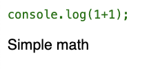

##### Child Components

The JSX that a component returns may reference other components. This allows you to build up a complex tree of interrelated components. The following is an example of an app that has a header with nav elements, main content, and a footer. The App component is the parent of all the other components.

**index.js**

``` JSX
import React from 'react';
import ReactDOM from 'react-dom/client';
import './index.css';

function Header() {
  return (
    <nav className='app-bar'>
      <Link label='home' />
      <Link label='users' />
      <Link label='about' />
    </nav>
  );
}

function Link(label) {
  return <div>{label.label}</div>;
}

function Content() {
  return <div className='content'>Here is the content</div>;
}

function Footer() {
  return <div className='app-bar'>Footer</div>;
}

function App() {
  return (
    <div className='app'>
      <Header />

      <Content />

      <Footer />
    </div>
  );
}

const root = ReactDOM.createRoot(document.getElementById('root'));
root.render(<App />);
```

**index.css**

``` CSS
.app {
  font-family: sans-serif;
}

.app-bar {
  display: flex;
  align-items: center;
  justify-content: center;
  background: #ddd;
}

.app-bar div {
  padding: 0.25em;
}

.content {
  margin: 1em;
}
```

This results in:

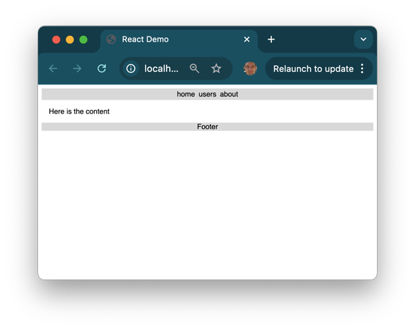

##### Properties

React components also let you pass info to them in the form of element properties. The component receives the properties in its constructor and then displays them when it renders.

**JSX**

``` JSX
<div>Component: <Demo who="Walke" /><div>
```

**React Component**

``` JSX
function Demo(props) {
  return <b>Hello {props.who}</b>;
}
```

##### State

A component can also have an internal state. Component state is created by calling the `React.useState` hook function. The `useState` function returns a variable that contains the current state and a function to update the state. This next example creates a state variable called `clicked` that toggles the click state in the `updateClick` function that gets called when the paragraph text is clicked.

``` JSX
function App() {
  const [clicked, updateClicked] = React.useState(false);

  function onClicked() {
    updateClicked(!clicked);
  }

  return <p onClick={onClicked}>clicked: {`${clicked}`}</p>;
}

const root = ReactDOM.createRoot(document.getElementById('root'));
root.render(<App />);
```

##### Reactivity

A component's properties and state are used by React to determine the reactivity of the interface. Reactivity controls how a component reacts to actions taken by the user or events that happen within the app. When a component's state or properties change, the `render` function for the component and all of its dependent component `render` functions are called.

</details>

<details>

<summary>Router</summary>

#### Router

Reading: [React Router DOM Tutorial](https://blog.webdevsimplified.com/2022-07/react-router/)

A web framework router provides essential functionality for single-page apps that otherwise would be handled by rendering multiple HTML pages. With a multiple webpage app, the headers, footers, nav, and common components must be either duplicated in each HTML page, or injected before the server sends the page to the browser.

With a single page app, the browser only loads one HTML page. Then, HS us used to manipulate the DOM and give it the appearance of multiple pages. The router defines the routes a user can take through the app, and automatically manipulates the DOM to display the appropriate framework components. The advantages of this are being able to store state as the user interacts with the page and not ahving to continually go to the server to get new HTML pages.

React doesn't have a standard router package. There are many that you can choose from, however. We;'ll use [react-router-dom](https://www.npmjs.com/package/react-router-dom) for this class. The simplified routing functionality of React-router-dom comes from the project [react-router](https://www.npmjs.com/package/react-router) for its core functionality. Don't confuse the two when reading the tutorials and documentation.

A basic example of the router consists of a `BrowserRouter` component that surrounds the whole app and controls the routing action. The `Link`, or `NavLink`, component captures user navigation events and modifies what is rendered by the `Routes` component by matching up the `to` and `path` attributes. This example contains two components. The **App** component with the router and a **Page** component that is routed to when a link is pressed.

``` JSX
function Page({ color }) {
  return (
    <div className="page" style={{ backgroundColor: color }}>
      <h1>{color}</h1>
    </div>
  );
}

function App() {
  return (
    <BrowserRouter>
      <div className="app">
        <nav>
          <NavLink to="/">Red</NavLink>
          <NavLink to="/green">Green</NavLink>
          <NavLink to="/blue">Blue</NavLink>
        </nav>

        <main>
          <Routes>
            <Route path="/" element={<Page color="red" />} exact />
            <Route path="/green" element={<Page color="green" />} />
            <Route path="/blue" element={<Page color="blue" />} />
          </Routes>
        </main>
      </div>
    </BrowserRouter>
  );
}

const root = ReactDOM.createRoot(document.getElementById('root'));
root.render(<App />);
```

##### Router Example

You can enhanve the [Hello World React](https://github.com/webprogramming260/webprogramming/blob/main/instruction/webFrameworks/react/introduction/introduction.md#react-hello-world) app that we built in early lessons to include a router by first installing the React Router DOM dependency.

```
npm install react-router-dom
```

Now, you can replace the JSX for the app found in `index.jsx` with the router code above. You'll need to add the reference route dom import as well as the CSS that is used to make things pretty.

``` JSX
import { BrowserRouter, Routes, Route, NavLink } from 'react-router-dom';

import './styles.css';
```

Put the CSS in a file named `styles.css`

``` CSS
* {
  margin: 0;
  font-family: sans-serif;
}

.app {
  display: flex;
  flex-direction: column;
  justify-content: center;
  align-items: center;
  height: 100vh;
}

nav {
  display: flex;
  justify-content: center;
  align-items: center;
  width: 100%;
  height: 10vh;
  font-size: 1em;
  background-color: #f1f1f1;
}

a {
  margin: 0 10px;
  color: rgb(76, 146, 171);
  text-decoration: none;
  border: 1px solid rgb(76, 146, 171);
  padding: 10px;
}

a:hover {
  background-color: rgb(76, 146, 171);
  color: #f1f1f1;
}

main {
  height: 100%;
  width: 100%;
}

.page {
  color: #eee;
  display: flex;
  justify-content: center;
  align-items: center;
  width: 100%;
  height: 100%;
  font-size: 10vw;
  background-color: #f9f9f9;
}
```

Now you can run the app by running `npm run dev` and opening the app in your browser. 

As you click the different nav links, the URL to the app changes to match the route. This happens because the Routes component plugs into the browser's location API and modifies the displayed path so it gives the appearance that a different resource is being displayed, when it's really just the DOM that's being modified to display a different component.

</details>

### Part 2: Reactivity

<details>

<summary>JavaScript Console</summary>

#### JavaScript Console

Deeper reading: [MDN JavaScript Console](https://developer.mozilla.org/en-US/docs/Web/API/console)

The JS console onject provides interaction with the JS runtime debugger console. This isn't the same as the operating system console (terminal or command line). The console provides functionality for outputting the value of texts and obkects, running timers, and counting iterations. These are very usefule for debugging when you can actually execute your code in an interactive debugger like VS Code.

##### Log

The basic usage of the console is to output a log message.

```JavaScript
console.log('hello');
// OUTPUT: hello
```

You can format your messages in the log parameter.

```JavaScript
console.log('hello %s', 'world');
// OUTPUT: hello world
```

You can also specify CSS declarations to style the log output.

```JavaScript
console.log('%c JavaScript Demo', 'font-size:1.5em; color:green;');
// OUTPUT: JavaScript Demo //in large green text
```

##### Timers

If you're trying to see how long a piece of code is running, you can wrap it with the `time` and `timeEnd` calls. This makes it output the duration between `time` and `timeEnd`.

```JavaScript
console.time('demo time');
for (let i = 0; i < 10000000; i++) {}
// ... some code that takes a long time.
console.timeEnd('demo time');
// OUTPUT: demo time: 12.74 ms
```

##### Count

To see how many times a block of code is called, you can use the `count` function.

```JavaScript
console.count('a');
// OUTPUT: a: 1
console.count('a');
// OUTPUT: a: 2
console.count('b');
// OUTPUT: b: 1
```

</details>

<details>

<summary>Functions</summary>

#### Functions

Deeper reading: [MDN Functions](https://developer.mozilla.org/en-US/docs/Web/JavaScript/Reference/Functions)

In JS, functions are first class objects. This means they can be assigned a name, passed as a parameter, returned as a result, and references from an object or array just like any other variable.

The syntax for a function begins with the `function` keyword followed by zero or more parameters, and a body that may contain zero or more return statements. The return statement may return a single value. There are no type declarations, because the type is always inferred by the assignment of the value to the parameter.

```JavaScript
function hello(who) {
  return 'hello ' + who;
}

console.log(hello('world'));
// OUTPUT: hello world
```

A function without a return value usually exists to produce some side effect like modifying a parameter or interacting with an external program. In the next example, the side effect is to output text to the debugger console.

```JavaScript
function hello(who) {
  who.count++;
  console.log('hello ' + who.name);
}

hello({ name: 'world', count: 0 });
// OUTPUT: hello world
```

##### Function Parameters

When a function is called, the caller may choose what parameters to provide. If no parameters are provided, the value of the parameter is `undefined` when the function executes.

In addition to explicitly passing the value of a parameter to a function, the function can define a default value. This is done by assigning a value to the parameter in the function declaration.

```JavaScript
function labeler(value, title = 'title') {
  console.log(`${title}=${value}`);
}

labeler();
// OUTPUT: title=undefined

labeler('fish');
// OUTPUT: title=fish

labeler('fish', 'animal');
// OUTPUT: animal=fish
```

##### Anonymous Functions

Functions in JS are commonly assigned to a variable so they can be passed as a parameter to another function or to be stored as an object property. To support this common use, you can define a function anonymously and assign it to a variable.

```JavaScript
// Function that takes a function as a parameter
function doMath(operation, a, b) {
  return operation(a, b);
}

// Anonymous function assigned to a variable
const add = function (a, b) {
  return a + b;
};

console.log(doMath(add, 5, 3));
// OUTPUT: 8

// Anonymous function assigned to a parameter
console.log(
  doMath(
    function (a, b) {
      return a - b;
    },
    5,
    3
  )
);
// OUTPUT: 2
```

You can also use the abbreviated arrow syntax to write an anonymous function. The next example is the equivalent to the one above.

```JavaScript
console.log(doMath((a, b) => a - b, 5, 3));
```

##### Creating, Passing, and Returning Functions

Here's an example of assigning functions to variables, and using functions as parameters and return values.

```JavaScript
// Anonymous declaration of the function that is later assigned to a variable
const add = function (a, b) {
  return a + b;
};

// Function that logs as a side effect of its execution
function labeler(label, value) {
  console.log(label + '=' + value);
}

// Function that takes a function as a parameter and then executes the function as a side effect
function addAndLabel(labeler, label, adder, a, b) {
  labeler(label, adder(a, b));
}

// Passing a function to a function
addAndLabel(labeler, 'a+b', add, 1, 3);
// OUTPUT: a+b=4

// Function that returns a function
function labelMaker(label) {
  return function (value) {
    console.log(label + '=' + value);
  };
}

// Assign a function from the return value of the function
const nameLabeler = labelMaker('name');

// Calling the returned function
nameLabeler('value');
// OUTPUT: name=value
```

##### Inner Functions

Functions can be declared inside other functions. This lets you modularize your code without exposing private details.

```JavaScript
function labeler(value) {
  function stringLabeler(value) {
    console.log('string=' + value);
  }
  function numberLabeler(value) {
    console.log('number=' + value);
  }

  if (typeof value == 'string') {
    stringLabeler(value);
  } else if (typeof value == 'number') {
    numberLabeler(value);
  }
}

labeler(5);
// OUTPUT: number=5

labeler('fish');
// OUTPUT: string=fish
```

</details>

<details>

<summary>Arrow Functions</summary>

#### Arrow Functions

Since functions are first order objects, they can be declared anywhere an be passed as parameters. This causes there to be a lot of anonymous functions just hanging out and cluttering the code. The `arrow` syntax was created to make the code more compact. This replaces the need for `function` keywords with `=>` placed after the parameter declaration. The curly braces are also optional. 

The follpowing function is in arrow syntax. It takes no parameters and always returns 3.

```JavaScript
() => 3;
```

The next to functions are sort of equivalent.

```JavaScript
const a = [1, 2, 3, 4];

// standard function syntax
a.sort(function (v1, v2) {
  return v1 - v2;
});

// arrow function syntax
a.sort((v1, v2) => v1 - v2);
```

Besides being compact, `arrow` function syntax has some semantic differences from the standard function syntax. This includes how a return value is specified and the scope of variables that an arrow function can access.

##### Return Values

Arrow functions have special rules for the `return` keyword. It's optional if no curley braces are provided for the function and it contains a single expression. In that case, the result of the expression is automatically returned. If there are curly braces, the arrow function behaves just like a standard function.

```JavaScript
() => 3;
// RETURNS: 3

() => {
  3;
};
// RETURNS: undefined

() => {
  return 3;
};
// RETURNS: 3
```

##### Closure

Arrow functions inherit the `this` pointer from the scope in which they are created. This is known as a `closure`. A closure lets a function continue to reference its creation scope, even after it has passed out of the scope. Remember that a closure includes a function and its created scope.

The function `makeClosure` returns an anonymous function using arrow syntax. The function creates a variable from an initialization parameter. Both the parameter and the locally scoped variables are included in closure for the returned funtion.

```JavaScript
function makeClosure(init) {
  let closureValue = init;
  return () => {
    return `closure ${++closureValue}`;
  };
}
```

When we call the `createClosure` function, it returns the arrow function that includes the closure of the variable that existed when it was created. That's why the closure function can reference a variable that is declared outside the scope tht it executes in. This is demonstrated by calling the closure function multiple times to result in different values.

```JavaScript
const closure = makeClosure(0);

console.log(closure());
// OUTPUT: closure 1

console.log(closure());
// OUTPUT: closure 2
```

Closures are important when we do things like execute JS within the scope of an HTML page. This is because it remembers the values of varaibels that were in scope when the function was created.

##### Using Arrow Functions with React

React components are helpful for learning arrow functions. The following example is a simple React app that increments and decrements a counter when the appropriate buttons are pressed. It uses standard JS functions.

```JSX
function App() {
  const [count, setCount] = React.useState(0);

  function Increment() {
    setCount(count + 1);
  }

  function Decrement() {
    setCount(count - 1);
  }

  return (
    <div>
      <h1>Count: {count}</h1>
      <button onClick={Increment}>n++</button>
      <button onClick={Decrement}>n--</button>
    </div>
  );
}
```

By using arrow functions, the counter logic is moved directly into the JSX. This makes the code more concise and clarifies what the buttons are doing.

```JSX
function App() {
  const [count, setCount] = React.useState(0);

  return (
    <div>
      <h1>Count: {count}</h1>
      <button onClick={() => setCount(count + 1)}>n++</button>
      <button onClick={() => setCount(count - 1)}>n--</button>
    </div>
  );
}
```

There is a problem here. Setting state with the function provided by the React useState function is asynchronous. This means you don't know if other concurrently running code has changed the value of `count` between when you read it and when you set it. This can cause the counter to be incremented multiple time in some cases or not at all in others. To dix this, we supply an arrow funtion to the `selfCount` function that sets the state instead of simply supplying the desired value. Here's a comparison.

```JavaScript
// may corrupt value
setCount(count + 1);

// safe
setCount((prevCount) => prevCount + 1);
```

This works because React can control when the state variable is updated instead of allowing your code to do the read operation. Our counter app now looks like:

```JavaScript
function App() {
  const [count, setCount] = React.useState(0);

  return (
    <div>
      <h1>Count: {count}</h1>
      <button onClick={() => setCount((prevCount) => prevCount + 1)}>n++</button>
      <button onClick={() => setCount((prevCount) => prevCount - 1)}>n--</button>
    </div>
  );
}
```

But now it looks clunkly because we put more duplicated inline logic for the `onClick` handler. We fix this by moving the creation of the arrow function out of the JSX and into the component body. We can also reduce the duplication of code caused by the different counter operations and make it easy to add new operations by using the factory pattern to create our operations. We use closure to reference the operation that is used by the arrow function that is returned from the factory.

```JavaScript
function App() {
  const [count, setCount] = React.useState(0);

  function counterOpFactory(op) {
    return () => setCount((prevCount) => op(prevCount));
  }

  const incOp = counterOpFactory((c) => c + 1);
  const decOp = counterOpFactory((c) => c - 1);
  const tenXOp = counterOpFactory((c) => c * 10);

  return (
    <div>
      <h1>Count: {count}</h1>
      <button onClick={incOp}>n++</button>
      <button onClick={decOp}>n--</button>
      <button onClick={tenXOp}>n*10</button>
    </div>
  );
}
```

##### An Advanced Example

This example creates a `debounce` function. It includes the use of functions, arrow functions, parameters, a function as a parameter (callback), closures, and browser event listeners.

The point of the debounce function i to only execute the specified function once within a given time window. Any requests to run the function more frequently than this will cause the time window to reset. This is important for cases where a user can trigger expensive events thousands of times per second. With a debounce function, the performance of your application can greatly suffer.

The example below calls the browser's `window.addEventListener` function to add a callback function that is invoked whenever the user scrolls the web page. The first parameter to `addEventListener` tells us that it wants to listen for `scroll` events. The second parameter gives the function to call when a scroll event happens. In this case, we call it `debounce`. 

The debounce function takes two parameters, the time window for executing the window function, and the window function to call within that limit. In this case, we will execute the arrow function at most every 500 milliseconds.

```JavaScript
window.addEventListener(
  'scroll',
  debounce(500, () => {
    console.log('Executed an expensive calculation');
  })
);
```

The debounce function implements the execution of the windowFunc within the restricted time window by creating a closure that contains the current timeout and returning a function that will reset the timeout every time it's called. The returned function is called with the scroll event - whenever the user scrolls the page. However, instead of directly executing the `windowFunc`, it sets a timer based on the value of `windowMs`. If the debounce function is called again before the window times out, it resets the timeout.

```JavaScript
function debounce(windowMs, windowFunc) {
  let timeout;
  return function () {
    console.log('scroll event');
    clearTimeout(timeout);
    timeout = setTimeout(() => windowFunc(), windowMs);
  };
}
```

You can see and experiment with this on [CodePen](https://codepen.io/leesjensen/pen/XWxVBRx). The example shows the background colour changing as long as the user is scrolling, which reverts back to white when they stop.

</details>

<details>

<summary>JavaScript Array</summary>

#### JavaScript Array

Deeper reading: [MDN Array](https://developer.mozilla.org/en-US/docs/Web/JavaScript/Reference/Global_Objects/Array)

The JS array object represents a sequence of other objects and primatives. You can reference the members of the array using a zero based index. You can create an array with the array constructor or using the array literal notation below.

```JavaScript
const a = [1, 2, 3];
console.log(a[1]);
// OUTPUT: 2

console.log(a.length);
// OUTPUT: 3
```

##### Array Functions

There are several interesting static functions associated with the array object.

| Function | Meaning | Example |
| --- | --- | --- |
| push | add an item to the end of an array | `a.push(4)` |
| pop | remove and item from the end of the array | `x = a.pop()` |
| slice | return a sub-array | `a.slice(1,-1)` |
| sort | run a function to sort an array in place | `a.sort((a,b) => b-a)` |
| values | creates an iterator for use with a `for of` loop | `for (i of a.values()) {...}` |
| find | find the first item satisfied by a test function | `a.find(i => i < 2)` |
| forEach | run a function on each array item | `a.forEach(console.log)` |
| reduce | run a function to reduce each array item to a single item | `a.reduce((a,c) => a + c)` |
| map | run a function to map an array to a new array | `a.map(i => i+i)` |
| filter | run a function to remove items | `a.filter(i => i%2)` |
| every | run a function to test if all items match | `a.every(i => i < 3)` |
| some | run a function to test if any items match | `a.some(i => i < 1)` |

```JavaScript
const a = [1, 2, 3];

console.log(a.map((i) => i + i));
// OUTPUT: [2,4,6]
console.log(a.reduce((v1, v2) => v1 + v2));
// OUTPUT: 6
console.log(a.sort((v1, v2) => v2 - v1));
// OUTPUT: [3,2,1]

a.push(4);
console.log(a.length);
// OUTPUT: 4
```

</details>

<details>

<summary>Objects and Classes</summary>

#### Objects and Classes

A JS object represents a collection of name value pairs referred to as properties. The property name must be a type String or Symbol, but the value can be any type. Objects also have common object-oriented functionality such as constructors, a `this` pointer, a static proeprties and functions, and inhertiance.

Object can be created with the new operator. This causes the object's constructor to be called. Once declared, you can add properties to the object by simply referencing the property name in an assignment. Any type of variable can be assigned to a property. This includes sub-object, array, or function. The properties of an object can be referenced either with dot (`obj.prop`) or bracket notation (`obj['prop']`).

```JavaScript
const obj = new Object({ a: 3 });
obj['b'] = 'fish';
obj.c = [1, 2, 3];
obj.hello = function () {
  console.log('hello');
};

console.log(obj);
// OUTPUT: {a: 3, b: 'fish', c: [1,2,3], hello: func}
```

The ability to dynamically modify an object is useful when manipulating data with indeterminate structure.

There are different uses of the term `object`. It refers to the standard JS objects (like `Promise, Map, Object, Function, Date, ...`), it can refer specifically to the JS Object object (`new Object()`), or it can refer to any JS object your create (`{a:'a', b:2}`). This can be confusing.

##### Object Literals

You can declare a variable of object type with the `object-literal` syntax. This lets you provide the initial composition of the object.

```JavaScript
const obj = {
  a: 3,
  b: 'fish',
  c: [1, true, 'dog'],
  d: { e: false },
  f: function () {
    return 'hello';
  },
};
```

##### Object Functions

Object have several interesting functions.

| Function | Meaning |
| --- | --- |
| entries | returns an array of key value pairs |
| keys | returns an array of keys |
| values | returns an array of values |

```JavaScript
const obj = {
  a: 3,
  b: 'fish',
};

console.log(Object.entries(obj));
// OUTPUT: [['a', 3], ['b', 'fish']]
console.log(Object.keys(obj));
// OUTPUT: ['a', 'b']
console.log(Object.values(obj));
// OUTPUT: [3, 'fish']
```

##### Constructor

Any function that returns an object is considered a `constructor` and can be invoked with the `new` operator.

```JavaScript
function Person(name) {
  return {
    name: name,
  };
}

const p = new Person('Eich');
console.log(p);
// OUTPUT: {name: 'Eich'}
```

Since objects can have any type of property value, you can create methods on the object as part of its encaspulation.

```JavaScript
function Person(name) {
  return {
    name: name,
    log: function () {
      console.log('My name is ' + this.name);
    },
  };
}

const p = new Person('Eich');
p.log();
// OUTPUT: My name is Eich
```

##### This Pointer

In the last example, we used the keyword `this` when we referred to the name property (`this.name`). The meaning of `this` depends upon the scope of where it is used, but in the context of an object it refers to a pointer to the object. 

##### Classes

You can use classes to define objects. Using a class clarified the intent to create a reusable component instead of a one-off object. Class declarations look similar to declaring an object, but class have an explicit constructor and assumed function declarations. The person object from above would look like the following after being converted to a class:

```JavaScript
class Person {
  constructor(name) {
    this.name = name;
  }

  log() {
    console.log('My name is ' + this.name);
  }
}

const p = new Person('Eich');
p.log();
// OUTPUT: My name is Eich
```

You can make properties and funcitons of classes private by add the `#` prefix.

```JavaScript
class Person {
  #name;

  constructor(name) {
    this.#name = name;
  }
}

const p = new Person('Eich');
p.#name = 'Lie';
// OUTPUT: Uncaught SyntaxError: Private field '#name' must be declared in an enclosing class
```

##### Inheritance

Classes can be entended by using the `extends` keyword to define inheritance. Parameters that need to be passed to the parent class are delivered using the `super` function. Any functions defined on the child that have the same name as the parent override the parent's implementation. A parent's function can be explicitly accessed using the `super` keyword.

```JavaScript
class Person {
  constructor(name) {
    this.name = name;
  }

  print() {
    return 'My name is ' + this.name;
  }
}

class Employee extends Person {
  constructor(name, position) {
    super(name);
    this.position = position;
  }

  print() {
    return super.print() + '. I am a ' + this.position;
  }
}

const e = new Employee('Eich', 'programmer');
console.log(e.print());
// OUTPUT: My name is Eich. I am a programmer
```

</details>

<details>

<summary>Destructuring</summary>

#### Destructuring

Deeper reading: [MDN Destructuring](https://developer.mozilla.org/en-US/docs/Web/JavaScript/Reference/Operators/Destructuring_assignment)

Destructuring (not the same as object destruction) is the process of pulling individual items out of an existing one -> removing structure. You can do this with arrays or objects. This is helpful when you only care about a few items in the original structure. Destructuring is used a lot in React.

Here's an example:
```JavaScript
const a = [1, 2, 4, 5];

// destructure the first two items from a, into the new variables b and c
const [b, c] = a;

console.log(b, c);
// OUTPUT: 1, 2
```

Even though it looks like you are declaring an array with the syntax on the left side of the expression, it's only specifying that you want to destructure those values out of the array.

You can also combine multiple items from the original object using rest syntax.

```JavaScript
const [b, c, ...others] = a;

console.log(b, c, others);
// OUTPUT: 1, 2, [4,5]
```

This works similarily for objects, except the assignment of the associated value was assumed by the positions in the two arrays. When destructuring objects, you explicitly specify the properties you want to pull from the source object.

```JavaScript
const o = { a: 1, b: 'animals', c: ['fish', 'cats'] };

const { a, c } = o;

console.log(a, c);
// OUTPUT 1, ['fish', 'cats']
```

You can also map the names to new variables instead of just using the original property names.

```JavaScript
const o = { a: 1, b: 'animals', c: ['fish', 'cats'] };

const { a: count, b: type } = o;

console.log(count, type);
// OUTPUT 1, animals
```

Default values can be provided for missing ones.

```JavaScript
const { a, b = 22 } = {};
const [c = 44] = [];

console.log(a, b, c);
// OUTPUT: undefined, 22, 44
```

##### Destructuring in React

React makes extensive use of destructuring when you pass parameters to components and create state. In the next example, React passes all the parameters to the component as an object, but the object is destructured to just the `initialCount` parameter. Likewise, the return value from `React.useState` destructures the array to just the variable and the update function.

```JavaScript
function Clicker({ initialCount }) {
  const [count, updateCount] = React.useState(initialCount);
  return <div onClick={() => updateCount(count + 1)}>Click count: {count}</div>;
}

const root = ReactDOM.createRoot(document.getElementById('root'));
root.render(<Clicker initialCount={3} />);
```

</details>

<details>

<summary>Timeout and Interval</summary>

#### Timeout and Interval

##### setTimeout

It's common to want to delay the execution of something until after a certain period has expired. JS supports this with the `setTimeout` function. **setTimeout** takes a function that will be called once the given milliseconds delay has passed. In the next example, the message is sent to the console log after waiting 2000 milliseconds.

```JavaScript
setTimeout(() => console.log('time is up'), 2000);

console.log('timeout will happen later');
```

It's important to know that the jS code continues to execute after the setTimeout is called. Then, once the delay has expired, the JS runtime will stop whatever JS code is currently executing, run the setTimeout callback function, and then return to the code that was halted previously. That's why the phrase **timeout will happen later** is printed before the timeout phrase is printed.

##### setInterval

Sometimes you need to execute a block of code periodically at a given time interval. **setInterval** works similarily to **setTimeout**, but it will continually call the function every time the delay has passed.

```JavaScript
setInterval(() => console.log('do something'), 1000);
```

You can cancel the setInterval request by capturing the result of the setInterval call and passing that result to the `clearInterval` function. In the example we set an interval to print a message every second and then after five seconds, clearing the interval.

```JavaScript
const interval = setInterval(() => console.log('do something'), 1000);

setTimeout(() => clearInterval(interval), 5000);
```

</details>

<details>

<summary>React Hooks</summary>

#### React Hooks

Deeper reading: [Reactjs.org - Hooks Overview](https://reactjs.org/docs/hooks-overview.html)

React hooks let React functions style components to be able to do everything that a class style component can do, and more. Plus, as new features are added to React, they add them as hooks. This makes function style components the preferred way of doing things in React. You've already seen one use of hooks to declare and update state in a function component with the `useState` hook.

```JSX
function Clicker({ initialCount }) {
  const [count, updateCount] = React.useState(initialCount);
  return <div onClick={() => updateCount(count + 1)}>Click count: {count}</div>;
}

const root = ReactDOM.createRoot(document.getElementById('root'));
root.render(<Clicker initialCount={3} />);
```

##### useEffect Hook

The `useEffect` hook lets you represent lifecycle events. For example, if you want to run a function every time the component completes rendering, you can do this:

```JSX
function UseEffectHookDemo() {
  React.useEffect(() => {
    console.log('rendered');
  });

  return <div>useEffectExample</div>;
}

const root = ReactDOM.createRoot(document.getElementById('root'));
root.render(<UseEffectHookDemo />);
```

##### useEffect Dependencies

By default, the **useEffect** callback is called every time the component is rendered. You can control what triggers a useEffect hook by specifying its dependencies. In the following example, we have two state variables, but we only want the **useEffect** hook to be called when the component is initially called and when the first variable is clicked. To do this, you pass an array of dependencies as a second parameter to the **useEffect** call.

```JSX
function UseEffectHookDemo() {
  const [count1, updateCount1] = React.useState(0);
  const [count2, updateCount2] = React.useState(0);

  React.useEffect(() => {
    console.log(`count1 effect triggered ${count1}`);
  }, [count1]);

  return (
    <ol>
      <li onClick={() => updateCount1(count1 + 1)}>Item 1 - {count1}</li>
      <li onClick={() => updateCount2(count2 + 1)}>Item 2 - {count2}</li>
    </ol>
  );
}

const root = ReactDOM.createRoot(document.getElementById('root'));
root.render(<UseEffectHookDemo />);
```

If you specify an empty array `[]` as the hook dependency then it is only called when the component is first rendered.

Hooks must be called at the top scope of the function, and can't be called inside of a loop or conditional. This makes sure that hooks are always called in the same order when a component is rendered.

##### useEffect Clean Up

You can take action when the component cleans up by returning a cleanup function when you call `useEffect`. An example is where a component creates a database connection. The database connection is a resource that needs to be released when the component is destroyed. In the example, the function returned from **useEffect** gets called when the component is destroyed. This is triggered after a user clicks five times on the clicker component.

```JSX
function Clicker() {
  const [count, update] = React.useState(5);

  return (
    <div onClick={() => update(count - 1)}>
      Click count: {count}
      {count > 0 ? <Db /> : <div>DB Connection Closed</div>}
    </div>
  );
}

function Db() {
  React.useEffect(() => {
    console.log('connected');

    return function cleanup() {
      console.log('disconnected');
    };
  }, []);

  return <div>DB Connection</div>;
}

const root = ReactDOM.createRoot(document.getElementById('root'));
root.render(<Clicker />);
```

</details>

<details>

<summary>Reactivity</summary>

#### Reactivity

Tutorial video: [Reactivity tutorial video](https://youtu.be/xmH_DJF7kOQ)

Making UI change when the user adds input or data is on of the architectural foundations of React. React lets you use reactivity with three pieces of a React component: `props`, `state`, and `render`.

React keeps a **table** of `state` values for every component. It records the requesed state in the table whenever a `updateState` method is called. It then periodically rerenders every component that has had a change since the last render.

##### Demonstration Application

To understand how React state works, we can use a simple React app that picks a colour. The app has one state variable (`color`) and three components. 

- **App** - Top level component that manages the `color` state
- **ColorDisplay** - Displays the currently selected colour
- **ColorPicker** - Displays the colour and allows for the selection of a new colour

When you change the colour using `ColorPicker`, it causes the colour rendered by the `ColorDisplay` component to update.

The `App` component creates a React state variable by calling the `React.useState` function. This creates an entry in React's state table that tracks the current and desired value of every state object.

```JSX
const [color, updateColor] = React.useState('#737AB0');
```

The valye of `color` is passed as a property to both of the App's child components. Whenever React detects a change to the `color` state, it rerenders any component that depends on that state.

The `updateColor` state function is also passed as a property to the `ColorPicker` component. This gives the ColorPicker the ability to modify the value of the colour state that is registered in the `App` parent component.

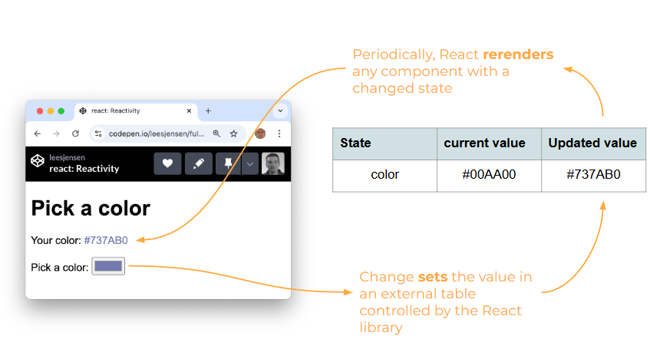

Just because you called `updateState` doesn't mean that you can access the updated state on the next line of code. Updates happen asynchronously, and so you never really know when it is going to happen, only that it will eventually happen.

The following code is for the colour picker components. If you want to experiment, you can mess with the complete [example code](https://github.com/webprogramming260/webprogramming/blob/main/instruction/webFrameworks/react/reactivity/exampleCode/implementingReact).

```JSX
const root = ReactDOM.createRoot(document.getElementById('root'));
root.render(<App />);

function App() {
  const [color, updateColor] = React.useState('#737AB0');

  return (
    <div>
      <h1>Pick a color</h1>
      <ColorDisplay color={color} />
      <ColorPicker color={color} updateColor={updateColor} />
    </div>
  );
}

function ColorDisplay({ color }) {
  return (
    <div>
      Your color: <span style={{ color: color }}>{color}</span>
    </div>
  );
}

function ColorPicker({ color, updateColor }) {
  function onChange(e) {
    updateColor(e.target.value);
  }

  return (
    <div>
      <span>Pick a color: </span>
      <input type='color' onChange={onChange} value={color} />
    </div>
  );
}
```

</details>

<details>

<summary>JSON</summary>

#### JSON

Deeper reading:
- [MDN JSON](https://developer.mozilla.org/en-US/docs/Web/JavaScript/Reference/Global_Objects/JSON)
- [Douglas Crockgord: The JSON Saga](https://www.youtube.com/watch?v=-C-JoyNuQJs)

JavaScript Object Notation (JSON) was invented by Douglas Crockford in 2001 while he worked at Yahoo!. It received official standardization in 2013 and 2017 (ECMA-404, [RFC 8259](https://datatracker.ietf.org/doc/html/rfc8259)).

JSON is a simple way to share and store data. By design, it's easy to convert JS objects to and from JSON. This makes it a convenient data format when working with web technologies. Because of its simplicity, standardization, and compatibility with JS, JSON is one of the world's most popular data formats.

##### Format

A JSON document contains one of the following data types:

| Type | Example |
| --- | --- |
| string | "crockford" |
| number | 42 |
| boolean | true |
| array | \[null,42,"crockford"]|
| object | \{"a":1,"b":"crockford"}|
| null | null |

Most commonly, a JSON document contains an object. Objects contain zero or more key value pairs. The key is always a string, and the value must be one of the valid JSON data types. Key value pairs are deliminated with commas. Curly braces delimit an object, square brackets for arrays, and strings are always with double quotes.

```JSON
{
  "class": {
    "title": "web programming",
    "description": "Amazing"
  },
  "enrollment": ["Marco", "Jana", "فَاطِمَة"],
  "start": "2025-02-01",
  "end": null
}
```

JSON is always encoded with [UTF-8](https://en.wikipedia.org/wiki/UTF-8), allowing for the representation of global data.

##### Converting to JavaScript

You can convert JSON to and from JS with the `JSON.parse` and `JSON.stringify` functions. 

```JavaScript
const obj = { a: 2, b: 'crockford', c: undefined };
const json = JSON.stringify(obj);
const objFromJson = JSON.parse(json);

console.log(obj, json, objFromJson);

// OUTPUT:
// {a: 2, b: 'crockford', c: undefined}
// {"a":2, "b":"crockford"}
// {a: 2, b: 'crockford'}
```

In this example, JSON can't represent the JS undefined object and so it's dropped when converting from JS to JSON.

</details>

<details>

<summary>Local Storage</summary>

#### Local Storage

Deeper reading: [MDN LocalStorage](https://developer.mozilla.org/en-US/docs/Web/API/Window/localStorage)

The browser's `localStorage` API gives the ability to persistantly store and retrieve data (like scores and usernames) on a user's browser across user sessions and HTML page renderings. For example, your frontend JS code could store a user's name on one HTML page, then retreive it later when a different HTML page is loaded. The name will also be available in local storage the next time the same browser is used to access the website.

Plus, `localStorage` is used as a cache for when data cannot be obtained from the server. For example, your frontend JS could store the last high scores obtained from the service, and then display those scores in the future if the service isn't avaialable.

##### How to use LocalStorage

There are four main functions.

| Function | Meaning |
| --- | --- |
| `setItem(name, value)` | sets a named item's value into local storage |
| `getItem(name)` | gets a named item's value from local storage |
| `removeItem(name)` | removes a named item from local storage |
| `clear()` | clears all items in local storage |

Values in local storage must be a `string`, `number`, or `boolean`. If you want to store a JS object or array, you have to turn it into a JSON string with `JSON.stringify()` on insertion, and parse it back to JS with `JSON.parse()` when retreived.

##### Example

Run this code in the browser's dev tools console window:

```JavaScript
let user = 'Alice';

let myObject = {
  name: 'Bob',
  info: {
    favoriteClass: 'CS 260',
    likesCS: true,
  },
};

let myArray = [1, 'One', true];

localStorage.setItem('user', user);
localStorage.setItem('object', JSON.stringify(myObject));
localStorage.setItem('array', JSON.stringify(myArray));

console.log(localStorage.getItem('user'));
console.log(JSON.parse(localStorage.getItem('object')));
console.log(JSON.parse(localStorage.getItem('array')));
```

Output:
```
Alice
{name: 'Bob', info: {favoriteClass: 'CS 260', likesCS: true}
[1, 'One', true]
```

You're able to see the round trip journey of the local storage values in the console output. If you want to see the values currently set for your app, then open the `Application` tab of the dev tools and select `Storage > Local Storage` and then your domain name. With the dev tools you can add,view, update, and delete any local storage values.

</details>

<details>

<summary>Promises</summary>

#### Promises

Deeper reading:
- [MDN Using Promises](https://developer.mozilla.org/en-US/docs/Web/JavaScript/Guide/Using_promises)
- [MDN Promise](https://developer.mozilla.org/en-US/docs/Web/JavaScript/Reference/Global_Objects/Promise)

The process of rendering your HTML executes on a single thread. That means you can't take a long time processing JS on the main rendering thread. Long running, or blocking tasks, should be executed by using the JS `Promise`. The execution of a promise allows the main rendering thread to continue while some action is done in the background. You can create a promise object constructor by passing it an executor function that runs the asynchronous operation. Executing asynchronously means that promise constructor may return before the promise executor function runs. The state of the promise execution is always in one of the three possible states.

1. **pending** - currently running asynchronously
2. **fulfilled** - completed successfully
3. **failed to complete** - failed to complete

We can demonstrate asynchronous execution by using the JS `setTimeout` function to create a delay in the execution of the code. The setTimeout function takes the number of milliseconds to wait and a function to call after that amount of time has expired. You can call the delay function in a loop in the promise executor and also in a for loop outside the promise so that both code blocks run in parallel.

```JavaScript
const delay = (msg, wait) => {
  setTimeout(() => {
    console.log(msg, wait);
  }, 1000 * wait);
};

new Promise((resolve, reject) => {
  // Code executing in the promise
  for (let i = 0; i < 3; i++) {
    delay('In promise', i);
  }
});

// Code executing after the promise
for (let i = 0; i < 3; i++) {
  delay('After promise', i);
}

// OUTPUT:
//   In promise 0
//   After promise 0
//   In promise 1
//   After promise 1
//   In promise 2
//   After promise 2
```

##### Resolving and Rejecting

Now we need to be able to set the state to `fulfilled` when things complete correctly, or to `rejected` when an error happens. The promise executor function takes two functions as parameters, `resolve` and `reject`. Calling `resolve` ets the promise to the `fulfilled` state, and calling `reject` sets the promise to the `rejected` state.

The next example, "coin toss", is a promise that waits ten seconds and then has a fifty percent change of resolving or rejecting.

```JavaScript
const coinToss = new Promise((resolve, reject) => {
  setTimeout(() => {
    if (Math.random() > 0.5) {
      resolve('success');
    } else {
      reject('error');
    }
  }, 10000);
});
```

If you log the promise object to the console immediately after calling the constructor, it will display that it's running in the `pending` state.

```JavaScript
console.log(coinToss);
// OUTPUT: Promise {<pending>}
```

If you wait ten seconds and then log the promise object again, the state will either show as `fulfilled` or `rejected` depening on how the coin landed.

```JavaScript
console.log(coinToss);
// OUTPUT: Promise {<fulfilled>}
```

##### Then, Catch, Finally

We now need a way to generically do something with the result of a promise after it resolves. We can do that in a similar way to exception handling. The promise object has three functions: `then`, `catch`, and `finally`. `Then` is called if the promise is fulfilled, `catch` is called if the promise is rejected, and `finally` is always called after the processing is completed.

Now we can rework the coin toss example to make it so 10% of the time the coin falls off the table and resolves to the rejected state. Otherwise, the promise resolves to fulfilled with a result of `heads` or `tails`.

```JavaScript
const coinToss = new Promise((resolve, reject) => {
  setTimeout(() => {
    if (Math.random() > 0.1) {
      resolve(Math.random() > 0.5 ? 'heads' : 'tails');
    } else {
      reject('fell off table');
    }
  }, 10000);
});
```

We can chain the `then`, `catch`, and `finally` functions to the coinToss object to handle each of the possible results.

```JavaScript
coinToss
  .then((result) => console.log(`Coin toss result: ${result}`))
  .catch((err) => console.log(`Error: ${err}`))
  .finally(() => console.log('Toss completed'));

// OUTPUT:
//    Coin toss result: tails
//    Toss completed
```

Here's a [CodePen](https://codepen.io/leesjensen/pen/RwJJKwj) for further experiments.

</details>

<details>

<summary>Async/Await</summary>

#### Async/Await

Deeper reading: [MDN Async Function](https://developer.mozilla.org/en-US/docs/Web/JavaScript/Reference/Statements/async_function)

JS promise objects are great for asynchronous execution, but the larger the system the more you want something more concise. This leads to the `async/await` syntax. The `await` keyword wraps the execution of a promise and removed the need to chain functions. The `await` expression blocks until the promise state moves to `fulfilled` or throws an exception if the state moves to `rejected`. For example, if we have a function that returns a coin toss promise.

```JavaScript
const coinToss = () => {
  return new Promise((resolve, reject) => {
    setTimeout(() => {
      if (Math.random() > 0.1) {
        resolve(Math.random() > 0.5 ? 'heads' : 'tails');
      } else {
        reject('fell off table');
      }
    }, 1000);
  });
};
```

We can create equivalent executions with either a promise `then/catch` chain, or an `await` with a `try/catch` block.

**then/catch chain version**

```JavaScript
coinToss()
  .then((result) => console.log(`Toss result ${result}`))
  .catch((err) => console.error(`Error: ${err}`))
  .finally(() => console.log(`Toss completed`));
```

**async, try/catch version**

```JavaScript
try {
  const result = await coinToss();
  console.log(`Toss result ${result}`);
} catch (err) {
  console.error(`Error: ${err}`);
} finally {
  console.log(`Toss completed`);
}
```

#### Async

An important restriction with `await` is that you can't call await unless it's called at the top level of JS, or is in a function that is defined with the `async` keyword. Applying the `async` keyword transforms the function so it returns a promise that will resolve to the value that was previously returned by the function. Basically this turns any function into a asynchronous function, so it can in turn make asynchronous requests.

This is demonstrated below with a function that makes animal noises. Notice that the return value is a simpel string.

```JavaScript
function cow() {
  return 'moo';
}
console.log(cow());
// OUTPUT: moo
```

If we designate the function to be asynchronous, then the return value becomes a promise that is immediately resolved and has a value that is the return value of the function.

```JavaScript
async function cow() {
  return 'moo';
}
console.log(cow());
// OUTPUT: Promise {<fulfilled>: 'moo'}
```

We can then change the cow function to explicitly create a promise instead of the automatically generated promise that the await keyword generates.

```JavaScript
async function cow() {
  return new Promise((resolve) => {
    resolve('moo');
  });
}
console.log(cow());
// OUTPUT: Promise {<pending>}
```

You can see that the promise is pending because the promise's execution function hasn't been resolved yet.

##### Await

The `async` keyword declares that a function returns a promise. The `await` keyword wraps a call to the `async` function, blocks execution until the promise has resolved, and returns the result of the promise. 

We can demonstrate `await` with the same example from before. If we log the output from invoking `cow`, then we see that the return value is a promise. However, if we prefix the call to the function with the `await` keyword, execution will stop until the promise has resolved, at which point the result of the promise is returned instead of the actual promise object. 

```JavaScript
console.log(cow());
// OUTPUT: Promise {<pending>}

console.log(await cow());
// OUTPUT: moo
```

By combining `async`, to define functions that return promises, with `await`, to wait on the promise, you can create code that is asynchronous, but still maintains the flow of the code without explicitly using callbacks.

##### Putting it all Together

You can see the benefit for `async`/`await` clearly by considering a case where multiple promises are required. For example, when calling the `fetch` API on an endpoint that returns JSON, you would need to resolve two promises. One for the network call, and one for converting the result to JSON. A promise implementation would look like this:

```JavaScript
const httpPromise = fetch('https://simon.cs260.click/api/user/me');
const jsonPromise = httpPromise.then((r) => r.json());
jsonPromise.then((j) => console.log(j));
console.log('done');

// OUTPUT: done
// OUTPUT: {email: 'bud@mail.com', authenticated: true}
```

With async/await, you can clarify the code intent by hiding the promise syntax, and also make the execution block until the promise is resolved.

```JavaScript
const httpResponse = await fetch('https://simon.cs260.click/api/user/me');
const jsonResponse = await httpResponse.json();
console.log(jsonResponse);
console.log('done');

// OUTPUT: {email: 'bud@mail.com', authenticated: true}
// OUTPUT: done
```

</details>

### Enrichment Topics

<details>

<summary>JavaScript String</summary>

#### JavaScript String

Deeper reading: [MDN String](https://developer.mozilla.org/en-US/docs/Web/JavaScript/Reference/Global_Objects/String)

Strings are a primitive type in JS. A string variable is specified by surround a sequence of characters with single quotes (`'`), double quotes (`"`), or backticks (``` ` ```). Single double quotes mean the same thing, but backticks define a string literal that may contain JS that is evaluated in place and concatenated into the string. A string literal replacement specifier is declared with a dollar sign followed by a curly brace pair. Anything inside the curly braces is evaluated as JS. You can also use backticks to create multiline strings without having to explicitly escape the newline characters using `\n`.

```JavaScript
'quoted text'; // " also works

const l = 'literal';
console.log(`string ${l + (1 + 1)} text`);
// OUTPUT: string literal2 text
```

##### Unicode Support

JS supports unicode by defining a string as a sequence of 16-bit unsigned integers that represent UTF-16-encoded characters. Unicode support allows JS to represent most languages, including those that are read from right to left.

There are a few important steps if you want to make your web app fully internationalised. This includes handling currency, time, dates. iconography, units of measure, keyboard layouts, and respecting local customs. You can read more on the [W3C website](https://www.w3.org/standards/webdesign/i18n).

##### String Functions

The string object has several interesting functions associated with it. Here are some common ones.

| Function | Meaning |
| --- | --- |
| `length` | the number of characters in the string |
| `indexOf()` | the starting index of a given substring |
| `split()` | split the string into an array on the given delimiter string |
| `startsWith()` | true if the string has a given prefix |
| `endsWith()` | true if the string has a given suffix |
| `toLowerCase()` | converts all characters to lowercase |

```JavaScript
const s = 'Example:조선글';

console.log(s.length);
// OUTPUT: 11
console.log(s.indexOf('조선글'));
// OUTPUT: 8
console.log(s.split(':'));
// OUTPUT: ['Example', '조선글']
console.log(s.startsWith('Ex'));
// OUTPUT: true
console.log(s.endsWith('조선글'));
// OUTPUT: true
console.log(s.toLowerCase());
// OUTPUT: example:조선글
```

</details>

<details>

<summary>JavaScript Type and Construct</summary>

#### JavaScript Type and Construct

Deeper reading: [MDN Data Types and Structures](https://developer.mozilla.org/en-US/docs/Web/JavaScript/Data_structures)

##### Declaring Variables

Variables are declaring using either the `let` or `const` keyword. `let` lets you change the value of the variable, and `const` will cause an error if you try to change it.

```JavaScript
let x = 1;

const y = 2;
```

Originally, JS used the keyword `var` to define variables. This causes hard-to-detect errors in the code related to variable scope. Avoid using `var` and only use `let` or `const`.

##### Type

There are several primitive types in JS.

| Type | Meaning |
| --- | --- |
| `Null` | the type of variable that has not been assigned a value |
| `Undefined` | the type of variable that has not been defined |
| `Boolean` | true or false |
| `Number` | a 64-bit signed number |
| `BigInt` | a number of arbitrary magnitude |
| `String` | a textual sequence of characters |
| `Symbol` | a unique value |

Boolean, number, and string are the types commonly thought of when creating variables. But variables can refer to the null or undefined type. Because JS doesn't enforce the declaration of a variable before it's used, it's possible for the varaible to be undefined.

JS also has several object types.

| Type | Use | Example |
| --- | --- | --- |
| `Object` | a collection of properties represented by name-value pairs. values can be of any type | `{a:3, b:'fish'}` |
| `Function` | an object that has the ability to be called | `function a() {}` |
| `Date` | calendar dates and times | `new Date('1995-12-17')` |
| `Array` | an ordered sequence of any type | `[3, 'fish']` |
| `Map` | a collection of key-value pairs that support efficient lookups | `new Map()` |
| `JSON` | a lightweight data-interchange format used to share information across programs | `{"a":3, "b":"fish"}` |

##### Common Operators

When dealing with a number variable, JS supports standing math operators like add (`+`), subtract (`-`), multiply (`*`), divide (`/`), and equality (`===`). For string variables, JS supports concatenation (`+`), equality (`===`).

##### Type Conversions

JS is a weakly types language. This means a variable always has a type, but it can change type when it's assigned a new value, or that types can be automatically converted based upon the context. Sometimes the results of automatic conversions can be surprising if you're used to strongly typed langauges. Here are some examples.

```JavaScript
2 + '3';
// OUTPUT: '23'
2 * '3';
// OUTPUT: 6
[2] + [3];
// OUTPUT: '23'
true + null;
// OUTPUT: 1
true + undefined;
// OUTPUT: NaN
```

Getting unexpected results is really common with the [equality](https://developer.mozilla.org/en-US/docs/Web/JavaScript/Equality_comparisons_and_sameness) operator.

```JavaScript
1 == '1';
// OUTPUT: true
null == undefined;
// OUTPUT: true
'' == false;
// OUTPUT: true
```

These unexpected results happen in JS because is uses [complex rules](https://developer.mozilla.org/en-US/docs/Web/JavaScript/Equality_comparisons_and_sameness#strict_equality_using) for defining equality based on the conversion of a type to a boolean value. Sometimes this will be called a [falsy](https://developer.mozilla.org/en-US/docs/Glossary/Falsy) or [truthy](https://developer.mozilla.org/en-US/docs/Glossary/Truthy) evaluations. To fix this, JS introduced the strict equality (`===`) and inequality (`!==`) operators. These skip the type conversions when computing equality.

```JavaScript
1 === '1';
// OUTPUT: false
null === undefined;
// OUTPUT: false
'' === false;
// OUTPUT: false
```

Because strict equality is more intuitive, it's the preferred method and should be used in your code.

Silly example to try in your console debugger:

```JavaScript
('b' + 'a' + +'a' + 'a').toLowerCase();
// OUTPUT: banana
```

##### Conditionals

JS supports many common programming language conditional constructs, including `if`, `else`, and `if else`. 

```JavaScript
if (a === 1) {
  //...
} else if (b === 2) {
  //...
} else {
  //...
}
```

You can also use the ternary operator, which provides a compact `if else` representation.

```JavaScript
a === 1 ? console.log(1) : console.log('not 1');
```

You can use boolean operations in the expression to create complex predicates. Common boolean operators include `&&` (and), `||` (or), and `!` (not).

```JavaScript
if (true && (!false || true)) {
  //...
}
```

###### Loops

JS supports many common programming looping constructs. This includes `for`, `for in`, `for of`, `while`, `do while`, and `switch`. Here are some examples.

**for**

Notice the introduction of the common post incremental operation (`i++`) for adding one to a number.

```JavaScript
for (let i = 0; i < 2; i++) {
  console.log(i);
}
// OUTPUT: 0 1
```

**do while**

```JavaScript
let i = 0;
do {
  console.log(i);
  i++;
} while (i < 2);
// OUTPUT: 0 1
```

**while**

```JavaScript
let i = 0;
while (i < 2) {
  console.log(i);
  i++;
}
// OUTPUT: 0 1
```

**for in**

The `for in` statement iterates over the object property's name.

```JavaScript
const obj = { a: 1, b: 'fish' };
for (const name in obj) {
  console.log(name);
}
// OUTPUT: a
// OUTPUT: b
```

For the array, the object's name is the array index.

```JavaScript
const arr = ['a', 'b'];
for (const name in arr) {
  console.log(name);
}
// OUTPUT: 0
// OUTPUT: 1
```

**for of**

The `for of` statement iterates over an iterable's (array, map, set, ...) property values.

```JavaScript
const arr = ['a', 'b'];
for (const val of arr) {
  console.log(val);
}
// OUTPUT: 'a'
// OUTPUT: 'b'
```

**Break and continue**

All the looping above allows for either a `break` or `continue` statement to abort or advance the loop.

```JavaScript
let i = 0;
while (true) {
  console.log(i);
  if (i === 0) {
    i++;
    continue;
  } else {
    break;
  }
}
// OUTPUT: 0 1
```

</details>

<details>

<summary>Document Object Model</summary>

#### Document Object Model

Deeper reading: 
- [MDN Introduction to the DOM](https://developer.mozilla.org/en-US/docs/Web/API/Document_Object_Model/Introduction)
- [W3C DOM Specification](https://www.w3.org/TR/REC-DOM-Level-1/level-one-core.html) - official spec is only for reference

The document object model (DOM) is an object representation of the HTML elements that the browser uses to render the display. The browser exposes the DOM to external code so you can write programs that dynamically manipulate the HTML.

The browser provides access to the DOM through a global varibale name `document` that points to the root element of the DOM. If you open the browser debugger console window and type the variable name `document`, you will see the DOM for the document the browser is currently reading.

```
> document

<html lang="en">
  <body>
    <p>text1 <span>text2</span></p>
    <p>text3</p>
  </body>
</html>
```

```CSS
p {
  color: red;
}
```

There is a node in the DOM for everything in the HTML document. This includes elements, attributes, text, comments, whitespace. All of these nodes form a big tree, with the document node at the top.

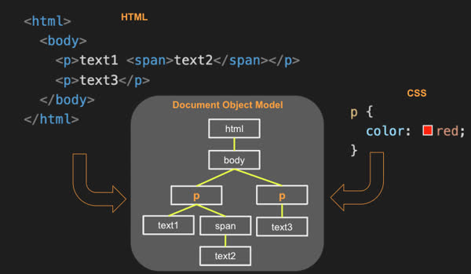

##### Accessing the DOM

Every element in an HTML document implements the DOM Element interface, which is derived from the DOM Node interface. The [DOM Element Interface](https://developer.mozilla.org/en-US/docs/Web/API/Element) provides the means for iterating child elements, accessing the parent element, and manipulating the element's attributes. From your JS code, you can start with the `document` variable and walk through every element in the tree.

```JavaScript
function displayElement(el) {
  console.log(el.tagName);
  for (const child of el.children) {
    displayElement(child);
  }
}

displayElement(document);
```

You can provide a CSS selector to the `querySelectorAll` function to select elements from the document. The `textContent` property contains all the element's text. You can access the textual representation of an element's HTML content with the `innerHTML` property.

```JavaScript
const listElements = document.querySelectorAll('p');
for (const el of listElements) {
  console.log(el.textContent);
}
```

##### Modifying the DOM

You can insert, modify, or delete the elements in the DOM. To create a new element, you first create the element on the DOM document. You can then insert the new element into the DOM tree by appending it to an existing element in the tree.

```JavaScript
function insertChild(parentSelector, text) {
  const newChild = document.createElement('div');
  newChild.textContent = text;

  const parentElement = document.querySelector(parentSelector);
  parentElement.appendChild(newChild);
}

insertChild('#courses', 'new course');
```

To delete elements, call the `removeChild` function on the parent element.

```JavaScript
function deleteElement(elementSelector) {
  const el = document.querySelector(elementSelector);
  el.parentElement.removeChild(el);
}

deleteElement('#courses div');
```

##### Injecting HTML

The DOM also lets you inject entire blocks of HTML into an element. The following code finds the first `div` element in the DOM and replaces all the HTML it contains.

```JavaScript
const el = document.querySelector('div');
el.innerHTML = '<div class="injected"><b>Hello</b>!</div>';
```

But directly injecting HTML as a block of text is a common attack from hackers. If an untrusted party can inject JS anywhere in your app, then that JS can represent itself as a user of the app. The attacker can then make requests for sensitive data, monitor activity, and steal credentials. The example below shows how the img element can be used to launch an attack as soon as the page is loaded.

```JavaScript

```

If you are injecting HTML, make sure it can't be manipulated by the user. Common injection paths include HTML input controls, URL parameters, and HTTP headers. Either santize any HTML that has variables, or use DOM manipulation fucntions instead of `innerHTML`.

##### Event Listeners

All DOM elements let you attach a function that gets called when an event occurs on the element. These functions are called [event listeners](https://developer.mozilla.org/en-US/docs/Web/API/EventTarget/addEventListener). Here's an example of one that gets called when the element is clicked.

```JavaScript
const submitDataEl = document.querySelector('#submitData');
submitDataEl.addEventListener('click', function (event) {
  console.log(event.type);
});
```

There are a lot of possible events you can add a listener to. This includes mouse, keyboard, scrolling, animation, video, audio, WebSocket, and clipboard events. You can see a full list on [MDN](https://developer.mozilla.org/en-US/docs/Web/Events). Here are some more commonly used ones.

| Event Category | Description |
| --- | --- |
| Clipboard | cut, copied, pasted |
| Focus | an element gets focus |
| Keyboard | keys are pressed |
| Mouse | click events |
| Text selection | when text is selected |

You can also add listeners directly into the HTML. For example, here is an `onClick` handler that is attached to a button.

```HTML
<button onclick='alert("clicked")'>click me</button>
```

</details>

<details>

<summary>Regular Expressions</summary>

#### Regular Expressions

Deeper reading: [MDN regular expressions](https://developer.mozilla.org/en-US/docs/Web/JavaScript/Guide/Regular_Expressions)

Regular expression support is built into JS. These are textual pattern matchers. You use a regular expression to find text in a string so you can replace it, or know that it exists.

You can create a regular expression using the class constructor or a regular expression literal.

```JavaScript
const objRegex = new RegExp('ab*', 'i');
const literalRegex = /ab*/i;
```

The `string` class has several functions that accept regular expresions, including `match`, `replace`, `search`, and `split`. For a quick test to see if tehre is a match, you can use the regular expression object's `test` function.

```JavaScript
const petRegex = /(dog)|(cat)|(bird)/gim;
const text = 'Both cats and dogs are pets, but not rocks.';

text.match(petRegex);
// RETURNS: ['cat', 'dog']

text.replace(petRegex, 'animal');
// RETURNS: Both animals and animals are pets, but not rocks.

petRegex.test(text);
// RETURNS: true
```

</details>

<details>

<summary>JavaScript Rest and Spread</summary>

#### JavaScript Rest and Spread

Deeper reading:
- [MDN Rest](https://developer.mozilla.org/en-US/docs/Web/JavaScript/Reference/Functions/rest_parameters)
- [MDN Spread](https://developer.mozilla.org/en-US/docs/Web/JavaScript/Reference/Operators/Spread_syntax)

##### Rest

Sometimes you want a function to take an unknown number of parameters. For example, if you wanted to write a function that check to see if some number in a list is equal to a given number, you could use an array.

```JavaScript
function hasNumber(test, numbers) {
  return numbers.some((i) => i === test);
}

const a = [1, 2, 3];
hasNumber(2, a);
// RETURNS: true
```

But sometimes you don't have an array. In this case you could make on right there.

```JavaScript
function hasTwo(a, b, c) {
  return hasNumber(2, [a, b, c]);
}
```

JS has the `rest` syntax to make this easier. This is a parameter that contains the `rest` of the parameters. To turn the last parameter of any function into a `rest` parameter, you prefix it with three periods (`...`). You can call it with any number of parameters and they are all automatically added into an array.

```JavaScript
function hasNumber(test, ...numbers) {
  return numbers.some((i) => i === test);
}

hasNumber(2, 1, 2, 3);
// RETURNS: true
```

You can only make the last parameter the `rest` parameter. Otherwise, JS doesn't know which parameters to combine into the array. Technically, `rest` allows JS to provide a variadic function.

##### Spread

Spread does the opposite of rest. It takes an iterable object (like an array or string) and expands, or spreads, it into a function's parameters.

```JavaScript
function person(firstName, lastName) {
  return { first: firstName, last: lastName };
}

const p = person(...['Ryan', 'Dahl']);
console.log(p);
// OUTPUT: {first: 'Ryan', last: 'Dahl'}
```

</details>

<details>

<summary>JavaScript Exceptions</summary>

#### JavaScript Exceptions

Deeper reading: [MDN try...catch](https://developer.mozilla.org/en-US/docs/Web/JavaScript/Reference/Statements/try...catch)

JS supports exception handling using the `try catch` and `throw` syntax. An exception can be triggered whenever your code generates an exception using the `throw` keyword, or whenever an exception is generated by the JS runtime (like when an undefined variable is used).

To catch a thrown exception, you wrap a code block with the `try` keyword, and follow that with a `catch` block. If an exception is thrown within the try block, then all of the code after the throw is ignored, the call stack unwound, and the catch block is called.

The basic syntax is:

```JavaScript
try {
  // normal execution code
} catch (err) {
  // exception handling code
} finally {
  // always called code
}
```

For example:

```JavaScript
function connectDatabase() {
  throw new Error('connection error');
}

try {
  connectDatabase();
  console.log('never executed');
} catch (err) {
  console.log(err);
} finally {
  console.log('always executed');
}

// OUTPUT: Error: connection error
//         always executed
```

When first using exception handling, it's tempting to use it to handle normal flows of execution. For example, throwing a `file not found` exception when it is common for users to request nonexistant files. Throwing exceptions should only happen when something exceptional happens. For example, a `file not found` exception when the file is required for your code to run. This makes your code easier to debug, and your logs more meaningful.

##### Fallbacks

The fallback pattern is commonly implemented using exception handling. To use the fallback pattern, you put the normal feature path in a try block and then provide a fallback implementation in the catch block. For example, normally you would get the high sscores for a game by making a network request, but if the network is unavailable then a locally cached version of the last available scores is used. By providing a fallback, you can always return something, even if the desired feature is unavailable.

```JavaScript
function getScores() {
  try {
    const scores = scoringService.getScores();
    // store the scores so that we can use them later if the network is not available
    window.localStorage.setItem('scores', scores);
    return scores;
  } catch {
    return window.localStorage.getItem('scores');
  }
}
```

</details>

<details>

<summary>Scope</summary>

#### Scope

Deeper reading:
- [MDN Scope](https://developer.mozilla.org/en-US/docs/Glossary/Scope)
- [MDN this](https://developer.mozilla.org/en-US/docs/Web/JavaScript/Reference/Operators/this)
- [MDN Closures](https://developer.mozilla.org/en-US/docs/Web/JavaScript/Closures)

Scope is defined as the variables that are visible in the current context of execution. JS has four different types of scope:
1. **Global** - visible to all code
2. **Module** - visible to all code running in a module
3. **Function** - visible within a function
4. **Block** - visible within a block of code delimited by curly braces

##### Var

Initially, JS used the keyward `var` to declare a variable. The problem is that unlike `const` or `let`, is that it ignores block scope. Variables declared with `var` are always logically hoisted at the top of the function. For example, the following code shows the same variable name being used within different enclosing scopes. However, because var ignores block scope the for loop is simply assigning a new value to `x` rather than declaring a new variable that has the same name.

```JavaScript
var x = 10;
console.log('start', x);

for (var x = 0; x < 1; x++) {
  console.log('middle', x);
}

console.log('end', x);

// OUTPUT: start 10
//         middle 0
//         end 1
```

Important: it rarely makes sense to use `var`. It's strongly suggested that you only use `const` and `let` unless you fully understand why you're using `var`.

##### This

The keyword `this` represents a variable that points to an object that contains the context within the scope of the currently executing line of code. The `this` variable is automatically declared and you can reference `this` anywhere in a JS program. Because the value of `this` depends upon the context in which it is referenced, there are three contexts where this can refer:

1. **Global** - when `this` is referenced outside a function or object it refers to the `globalThis` object. This object represents the context for runtime environment. For example, when running in a browser, globalThis refers to the browser's window object.
2. **Function** - when `this` is referenced in a function it refers to the object that owns the functions. That's either an object you defined or globalThis if the function is defined outside an object. Note that when running in JS strict mode, a global function's this variable is endefined instead of globalThis.
3. **Object** - when `this` is referenced in an object it refers to the object

```JavaScript
'use strict';

// global scope
console.log('global:', this);
console.log('globalThis:', globalThis);

// function scope for a global function
function globalFunc() {
  console.log('globalFunctionThis:', this);
}
globalFunc();

// object scope
class ScopeTest {
  constructor() {
    console.log('objectThis:', this);
  }

  // function scope for an object function
  objectFunc() {
    console.log('objectFunctionThis:', this);
  }
}

new ScopeTest().objectFunc();
```

Running the above code in a browser results in the following.

```
global: Window
globalThis: Window
globalFunctionThis: undefined
objectThis: ScopeTest
objectFunctionThis: ScopeTest
```

Note that if we were not using JS strict mode then GlobalFunctionThis would refer to Window.

##### Closure

A closure is defined as a function and its surrounding state. That means whatever variables are accessible when a function is created are available inside that function. This holds true even if you pass the function outside of the scope of its original creation.

Here is an example of a function that is created as a part of an object. That means the function has access to the object's `this` pointer.

```JavaScript
globalThis.x = 'global';

const obj = {
  x: 'object',
  f: function () {
    console.log(this.x);
  },
};

obj.f();
// OUTPUT: object
```

Arrow functions are a bit different because they inherit the `this` pointer of their creation context. So if we change our previous example to return an arrow function, then the `this` pointer at the time of creation will be globalThis.

```JavaScript
globalThis.x = 'global';

const obj = {
  x: 'object',
  f: () => console.log(this.x),
};

obj.f();
// OUTPUT: global
```

However, if we make the function in our object that **returns** an arrow function, then the `this` pointer will be the object's `this` pointer since that was the active context at the same time the arrow function was created.

```JavaScript
globalThis.x = 'global';

const obj = {
  x: 'object',
  make: function () {
    return () => console.log(this.x);
  },
};

const f = obj.make();
f();
// OUTPUT: object
```

</details>

## HTTP Service

<details>

<summary>Web Servers</summary>

### Web Servers

Web servers are computing devices that hosts a web service that knows how to accept incoming internet connections and speak to the HTTP application protocol.

#### Monolithic Web Servers

In the early days of web programming, you had to buy massive, complex, expensive, software programs that could serve up HTML files and then install it on a hardware device. The package of server hardware and software was considered the web server because the web service software was the only thing running on the server. Eventually, open source web servers became available that made it easy to host a website. 

Examples of web server software includes Apache HTML server, Nginx, or Microsoft IIS. However, the web server software was still a separate program from the content or application it hosted.

#### Combining Web and Application Services

Today, most modern programming languages include libraries that make it easy to serve web content. This removed the requirement to have a separate program for *hosting* your application. Instead, your app is also the web service.

For example, here is a simple HTTP service in JavaScrip that loads up HTML content from a **public** directory.

```JavaScript
const express = require('express');
const app = express();

// Serve static files from the 'public' directory
app.use(express.static('public'));

app.listen(80);
```

##### Web Service Endpoints

Being able to easily create web services means that we can completely drop the monolithic web server concept and only build web support right into the app. We canalso add web accessible methods -- endpoints -- that provide functionality beyond simply serving up static HTML files. 

For example, by adding three lines of code, we can add an endpoint that returns the current time when you add path `/time` to the browser URL.

```JavaScript
app.get('/time', (req, res) => {
  res.json({ time: new Date().toDateString() });
});
```

#### Web Service Gateways

Since it's easy to build web services, it's common to find multiple web services running on the same computing device. There is a difference between a **web server** (the physical computing device), and a **web service** (provides a web application functionality).

Every web server allows for access to multiple services by referring to a different **port number** for each service. A port is similar to a house address on a given street, and the server is the street. In our example before, the JS web service was assigned port 80. A user could then talk to the image service on port 3000 and the file service on port 3002. But this makes it difficult for the user of the services to remember what port number matches which service.

We can resolve this by introducing a service gateway (sometimes called a reverse proxy), that is a simple web service that listens on the common HTTP port 443. The gateway looks at the request URL and maps it to the other services running on different ports.

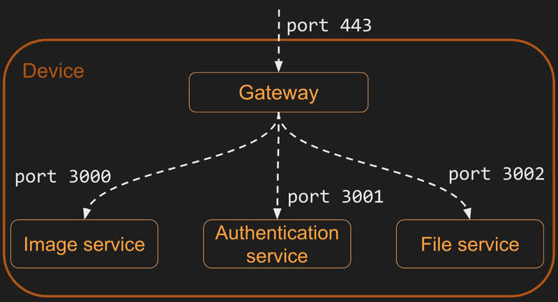

Our web server will use a web service application called `Caddy` as the gateway to our services.

#### Microservices

Microservices are web services that provide a single functional purpose. By partitioning larger functionality into small logical chunks, you can develop and manage them independently from other functionality in a larger system. They can also handle large fluctuations in user demand by running more and more stateless copies of the microservice from multiple virtual servers hosted in a dynamic cloud environment.

For example, one microservice for generating your genealogical family tree might be able to handle 1,000 users concurrently. To support 1 million users, you just deploy 1,000 instances of the service running on scalable virtual hardware.

#### Serverless

The idea of microservices evolved into the world of `serverless` functionality where the server is conceptually removed from the architecture and you just write code that represents single service endpoint. That endpoint is loaded through a gatewaythat maps a web request to the endpoint. The gateway automatically scales the hardware needed to host the serverless endpoint based on demand. This reduces what the web app developer needs to think about down to a single independent endpoint.

</details>

<details>

<summary>Web Services Introduction</summary>

### Web Services Introduction

Right now, your entire app is loaded from your web server and runs on the user's browser. It starts when the browser requests the `index.html` file from the web server. The `index.html` then referenes other HTML, CSS, JS, or image files. All the files that run on the browser make up the `frontend` of your app.

When the frontend requests the app files from the web server, it's using the HTTPS protocol. All web programming requests between devices use HTTPS to exchange data. 

We can make requests to external services running anywhere in the world from our frontend JS. This lets us get external data, like an inspirational quote, that we can then inject into the DOM for the user to read. To make a web service request, we supply the URL of the web service to the `fetch` function that is built into the browser.

The next step in building a full stack web app is to create our own web service. Our web service will provide the static frontend files along with functions to handle the `fetch` requests for things like storing data persistently, providing security, running tasks, executing application logic you don't want your user to see, and communicating with other users. The functionality provided by your web service represents the `backend` of your app.

In general, the functions provided by a web service are called `endpoints`, or sometimes APIs. You access the web service endpoints from your frontend JS with the fetch function. 

The backend web service can also use `fetch` to make requests to other web services.

</details>

<details>

<summary>URL</summary>

### URL

Deeper reading: [URL](https://developer.mozilla.org/en-US/docs/Learn/Common_questions/What_is_a_URL)

The Uniform Resource Locator (URL) represents the location of a web resource. Web resources can be anything - like a web page, font, image, video stream, database record, or JSON object. It can also be ephemeral, like a visitation counter or gaming session.

Here is an example URL representing the summary of accepted CS 260 BYU students that is accessible with secure HTTP.

```https://byu.edu:443/cs/260/student?filter=accepted#summary```

The URL syntax uses the following convention. The only parts of the URL that are required are the scheme and domain name.

```<scheme>://<domain name>:<port>/<path>?<parameters>#<anchor>```

| Part | Example | Meaning |
| --- | --- | --- |
| Scheme | https | The protocol required to ask for the resource. For web applications, this is usually HTTPS. But it could be any internet protocol such as FTP or MAILTO. |
| Domain name | byu.edu | The domain name that owns the resource represented by the URL. |
| Port | 3000 | The port specifies the numbered network port used to connect to the domain server. Lower number ports are reserved for common internet protocols, higher number ports can be used for any purpose. The default port is 80 if the scheme is HTTP, or 443 if the scheme is HTTPS. |
| Path | /school/byu/user/8014 | The path to the resource on the domain. The resource does not have to physically be located on the file system with this path. It can be a logical path representing endpoint parameters, a database table, or an object schema. |
| Parameters | filter=names&highlight=intro,summary | The parameters represent a list of key value pairs. Usually it provides additional qualifiers on the resource represented by the path. This might be a filter on the returned resource or how to highlight the resource. The parameters are also sometimes called the query string. |
| Anchor | summary | The anchor usually represents a sub-location in the resource. For HTML pages this represents a request for the browser to automatically scroll to the element with an ID that matches the anchor. The anchor is also sometimes called the hash, or fragment ID. |

Technically, you can also provide a user name and password before the domain name. This was used historically to authenticate access, but not anymore for security reasons. However, you will see this convention for URLs that represent database conncetion strings.

#### URL, URN, and URI

You'll sometimes hear people use URN or URI when talking about web resources. A Uniform Resource Name (URN) is a unique resource name that doesn't specify location information. For example, a book URN might be `urn:isbn:10,0765350386`. A Uniform Resource Identifier (URI) is a general resource identifier that could refer to either a URL or an URN. With web programming, you're almost always talking about URLs and shouldn't use the more general URI.

</details>

<details>

<summary>Ports</summary>

### Ports

When you connect to a device on the internet, you need both an IP address and a numbered port. Port numbers allow a single device to support multiple protocols (like HTTP, HTTPS, FTP, SSH) as well as different types of services (like search, document, or authentication). The ports can be exposed externally or only used internally on the device. For example, the HTTPS port (443) might let the world to connect, the SSH port (22) might only let computers at your school, and a service defined port (like 3000) may only allow access to processes running on the device.

The governing body of the internet (IANA) defines the standard usage for port numbers. Ports 0 to 1023 represent standard ports. Web services should generally avoid these ports unless it is providing the protocol represented by the standard. Ports 1024 to 49151 represent ports that have been assigned to requesting entities. It is very common for these ports to be used internally on a device, though. Ports 49152 to 65535 are considered dynamic and are used to create dynamic connections to a device. [Here](https://www.iana.org/assignments/service-names-port-numbers/service-names-port-numbers.xhtml) is the link to IANA's registry.

Here is a list of common port numbers you might come across.

| Port | Protocol |
| --- | --- |
| 20 | File Transfer Protocol (FTP) for data transfer |
| 22 | Secure Shell (SSH) for connecting to remote devices |
| 25 | Simple Mail Transfer Protocol (SMTP) for sending email |
| 53 | Domain Name System (DNS) for looking up IP addresses |
| 80 | Hypertext Transfer Protocol (HTTP) for web requests |
| 110 | Post Office Protocol (POP3) for retrieving email |
| 123 | Network Time Protocol (NTP) for managing time |
| 161 | Simple Network Management Protocol (SNMP) for managing network devices such as routers or printers |
| 194 | Internet Relay Chat (IRC) for chatting |
| 443 | HTTP Secure (HTTPS) for secure web requests |

#### Your Ports

We can use your web server as an example for how ports are used. When you built your web server, you externally exposted port 22 so you could use SSH to open a remote console on the server, port 443 for secure HTTP communication, and port 80 for unsecure HTTP communication.


Your web service, Caddy, is listening on ports 80 and 443. When Caddy gets a request on port 80, it automatically redirects the request to port 443 so that a secure connect can be used. When Caddy gets a request on 443, it examines the path provided in the HTTP request (defined in the URL) and if the path matches a static file, it reads the file off disk and returns it. If the HTTP path matches on of the definitions for a gateway service, Caddy makes a connection on that service's ports (like 3000 or 4000) and passes the request to the service.

Internally, you can have as many web services running as you want. However, you have to make sure that each one uses a different port to communicate on. Simon is run on port 3000, so you can't use that one for your startup service. Instead, you can use port 4000. It doesn't matter which high range port you choose, only that you're consistent and it's only used by one service.

</details>

<details>

<summary>HTTP</summary>

### HTTP

Deeper reading: [MDN An Overview of HTTP](https://developer.mozilla.org/en-US/docs/Web/HTTP/Overview)

Hypertext Transfer Protocol (`HTTP`) is how the web talks. When a web browser makes a request to a web server, it uses the HTTP protocol. 

When a web client (like a browser) and a web server talk, they exchange HTTP requests and responses. The browser makes an HTTP request and the server will generate an HTTP response. You can see the HTTP exchange by using the browser's debugger or by using a console tool like `curl`. For example, you can make the following request in your terminal.

```curl -v -s http://info.cern.ch/hypertext/WWW/Helping.html```

##### Request

The HTTP request for the command above looks like this.

``` 
GET /hypertext/WWW/Helping.html HTTP/1.1
Host: info.cern.ch
Accept: text/html
```

An HTTP request has this general syntax.
```
<verb> <url path, parameters, anchor> <version>
[<header key: value>]*
[

  <body>
]
```

The first line contains the `verb` of the request, followed by the path, parameters, anchor of the URL, and finally the version of HTTP being used. The following lines are optional headers that are defined by key value pairs. After the headers, you have an optional body. The body start is delimited from the headers by two new lines.

In the example above, we are asking to `GET` a resource found at the path `hypertext/WWW/Helping.html`. The version used by the request is `HTTP/1.1`. This is followed by two headers. The first specifies the request host (domain name). The second specifies what type of resource the client will accept. The resource type is always a [MIME type](https://developer.mozilla.org/en-US/docs/Web/HTTP/Basics_of_HTTP/MIME_types) as defined by IANA. In this case we are asking for HTML.

##### Response

The response to the request above looks like this.

```
HTTP/1.1 200 OK
Date: Tue, 06 Dec 2022 21:54:42 GMT
Server: Apache
Last-Modified: Thu, 29 Oct 1992 11:15:20 GMT
ETag: "5f0-28f29422b8200"
Accept-Ranges: bytes
Content-Length: 1520
Connection: close
Content-Type: text/html

<TITLE>Helping -- /WWW</TITLE>
<NEXTID 7>
<H1>How can I help?</H1>There are lots of ways you can help if you are interested in seeing
the <A NAME=4 HREF=TheProject.html>web</A> grow and be even more useful...
```

An HTTP response has the following syntax.

```
<version> <status code> <status string>
[<header key: value>]*
[

  <body>
]
```

The response syntax is similar to the request syntax. The major differene is that the first like represents the version and the status of the response.

Understanding the meaning of common HTTP verbs, status codes, and headers is important. You will use them in developing a web app.

#### Verbs

There are several verbs that describe what the HTTP request is asking for. Here are the most common ones.

| Verb | Meaning |
| --- | --- |
| GET | get the requested resource. this can represent a request to get a single resouce or a resource representing a list of resources. |
| POST | create a new resource. the body of the request contains the resource. the response should include a unique ID of the newly created resource |
| PUT | update a resource. either the URL path, HTTP header, or body must contain the unique ID of the resource being updated. The body of the request should contain the updated resource. the body of the response may contain the resulting updated resource. |
| DELETE | delete a resource. either the URL path or HTTP header must contain a unique ID of the resource to delete. |
| OPTIONS | get metadata about a resource. usually only HTTP headers are returned. the resource itself is not returned |

#### Status Codes

It's important to use the standard HTTP status codes in your HTTP responses so the client of a request knows how to interpret it. The codes are split into 5 blocks.

- 1xx - informational
- 2xx - success
- 3xx - redirect to another location, or that the previously cached resource is still valid
- 4xx - client errors. request is invalid
- 5xx - server errors. the request cannot be satisfied due to an error on the server

Within those ranges are some of the more common codes. See [MDN documentation](https://developer.mozilla.org/en-US/docs/Web/HTTP/Status) for a full list of codes.

| Code | Text | Meaning |
| --- | --- | --- |
| 100 | Continue | The service is working on the request |
| 200 | Success | The requested resource was found and returned as appropriate. |
| 201 | Created | The request was successful and a new resource was created. |
| 204 | No Content| The request was successful but no resource is returned. |
| 304 | Not Modified | The cached version of the resource is still valid. |
| 307 | Permanent Redirect | The resource is no longer at the requested location. The new location is specified in the response location header. |
| 308 | Temporary Redirect | The resource is temporarily located at a different location. The temporary location is specified in the response location header. |
| 400 | Bad request | The request was malformed or invalid. |
| 401 | Unauthorized | The request did not provide a valid authentication token. |
| 403 | Forbidden | The provided authentication token is not authorized for the resource. |
| 404 | Not found | An unknown resource was requested. |
| 408 | Request timeout | The request takes too long. |
| 409 | Conflict | The provided resource represents an out of date version of the resource. |
| 418 | [I'm a teapot](https://en.wikipedia.org/wiki/Hyper_Text_Coffee_Pot_Control_Protocol) | The service refuses to brew coffee in a teapot. |
| 429 | Too many requests | The client is making too many requests in too short of a time period. |
| 500 | Internal server error | The server failed to properly process the request. |
| 503 | Service unavailable | The server is temporarily down. The client should try again with an exponential back off. |

#### Headers

Deeper reading: [MDN HTTP Headers](https://developer.mozilla.org/en-US/docs/Web/HTTP/Headers)

HTTP headers specify metadata about a request or a response. This includes how to handle security, caching, data formats, and cookies. Some common headers include the following chart.

| Header | Example | Meaning |
| --- | --- | --- |
| Authorization | Bearer bGciOiJIUzI1NiIsI | A token that authorized the user making the request. |
| Accept | image/* | The format the client accepts. This may include wildcards. |
| Content-type | text/html; charset=utf-8 | The format of the content being sent. These are described using standard [MIME](https://developer.mozilla.org/en-US/docs/Web/HTTP/Basics_of_HTTP/MIME_types/Common_types) types. |
| Cookie | SessionID=39s8cgj34; csrftoken=9dck2 | Key value pairs that are generated by the server and stored on the client. |
| Host | info.cern.ch | The domain name of the server. This is required in all requests. |
| Origin | cs260.click | Identifies the origin that caused the request. A host may only allow requests from specific origins. |
| Access-Control-Allow-Origin | [https://cs260.click](https://cs260.click/) | Server response of what origins can make a request. This may include a wildcard. |
| Content-Length | 368 | The number of bytes contained in the response. |
| Cache-Control | public, max-age=604800 | Tells the client how it can cache the response. |
| User-Agent | Mozilla/5.0 (Macintosh) | The client application making the request. |

#### Body

The format of the body of an HTTP request/response is defined by the `Content-Type` header. For example, it may be HTML (text/html), a binary image format (image/png), JSON (application/JSON), or JavaScript (text/javascript). A client may specify what formats it accepts using the `accept` header.

#### Cookies

Deeper reading: [MDN Using HTTP Cookies](https://developer.mozilla.org/en-US/docs/Web/HTTP/Cookies)

HTTP is stateless by itself. This means that one HTTP request doesn't know anything about a previous or future request. That doesn't mean that a server or client can't track state across requests. One common method for tracking state is the `Cookie`. Cookies are generated by a server and passed to the client as an HTTP header.

```
HTTP/2 200
Set-Cookie: myAppCookie=tasty; SameSite=Strict; Secure; HttpOnly
```

The client caches the cookie and returns it as an HTTP header back to the server on subsequent requests.

```
HTTP/2 200
Cookie: myAppCookie=tasty
```

This lets the server to remember things like language preference, or the user's auth credentials. A server also uses cookies to track and share everything a user does. There is nothing inherently evil about cookies, but the issue comes from web apps using them as a means to violate user's privacy or inappropriately monetize their data.

#### HTTP Versions

HTTP continually evolves to increase performance and support new types of applications. You can read about the evolution on [MDN](https://developer.mozilla.org/en-US/docs/Web/HTTP/Basics_of_HTTP/Evolution_of_HTTP).

| Year | Version | Features |
| --- | --- | --- |
| 1990 | HTTP0.9 | one line, no versions, only get |
| 1996 | HTTP1 | get/post, header, status codes, content-type |
| 1997 | HTTP1.1 | put/patch/delete/options, persistent connection |
| 2015 | HTTP2 | multiplex, server push, binary representation |
| 2022 | HTTP3 | QUIC for transport protocol, always encrypted |

</details>

<details>

<summary>Fetch</summary>

### Fetch

Further reading: [MDN Using the Fetch API](https://developer.mozilla.org/en-US/docs/Web/API/Fetch_API/Using_Fetch)

The ability to make HTTP requests from JS is one of the main technologies that changed the web from static content pages to a web app that fully interacts with the user. Microsoft introduced the first API for making HTTP requests from JS with the [XMLHttpRequest API](https://developer.mozilla.org/en-US/docs/Web/API/XMLHttpRequest).

Today, the [fetch API](https://developer.mozilla.org/en-US/docs/Web/API/Fetch_API) is the prefered way to make HTTP requests. The `fetch` function is built into the browser's JS runtime. This means you can call it from JS code running in a browser.

The basic usage of fetch takes an URL and returns a promise. The promise `then` function takes a callback function that is asynchronously called when the requested URL content is obtained. If the returned content is of the type `application/JSON`, you can use the `json` function on the response to convert it to a JS object.

The following example makes a fetch request to get and display an inspirational quote. If the method is unspecified, it defaults to GET.

```JavaScript
fetch('https://quote.cs260.click')
  .then((response) => response.json())
  .then((jsonResponse) => {
    console.log(jsonResponse);
  });
```

**Response** 

```JavaScript
{
  author: 'Kyle Simpson',
  quote: "There's nothing more permanent than a temporary hack."
}
```

To do a POST request, you populate the options parameter with the HTTP method and headers.

```JavaScript
fetch('https://jsonplaceholder.typicode.com/posts', {
  method: 'POST',
  body: JSON.stringify({
    title: 'test title',
    body: 'test body',
    userId: 1,
  }),
  headers: {
    'Content-type': 'application/json; charset=UTF-8',
  },
})
  .then((response) => response.json())
  .then((jsonResponse) => {
    console.log(jsonResponse);
  });
```

#### Codepen

Here is a [codepen](https://codepen.io/leesjensen/pen/ExRoqPz) for more practise.

</details>

<details>

<summary>Service Design</summary>

### Service Design

Web services provide the interactive functionality of your web app. They authenticate users, track session state, provide, store, and analyse data, connect peers, and aggregate user information. Making your wbe service easy to use, performant, and extensible are factors that determine the success of your app. A good design will result in increased productivity, satisfied users, and lower processing costs.

#### Model and Sequence Diagrams

When first considering your service design, it's helpful to model the app's primary objects and the interactions of the objects. You should stay as close to the model that is in your user's mind as possible. Try not to introduce a model that focuses on programming constructs and infrastructures. For example, a chat program should model participants, conversations, and messages. It shouldn't model user devices, network connections, and data blobs.

Once you've defined your primary objects, you can create a sequence diagram that shows how the objects interact with each other. This will help clarify your model and define the necessary endpoints. You can use a simple tool like [SequenceDiagram.org](https://sequencediagram.org/index.html#initialData=C4S2BsFMAIGEAsCGxqIA5oFCcQY2APYBO0AguCLpDvsdAEIEBG25lkAtAHwDKkRAN34AuPikQDEIcIiZRMjJtz6CRY1JOmz5igDy6OHFUKLC2VDVJlzq5yPsPGRDZpa03Md5fxOjgiIhRcAgA7EwBnZBBQ6AB3MHgXFj0DIx8RWFCIqJiiSABHAFdIcJQQglAAM0ockIVmb1VTUlwqNBQ7aGCw-kjQUPqlXnTTHkQAT2gAIgAJSHBwAinoQjIKKkwnIm47YVn5xeXKogIAWySgA) to create and share diagrams.

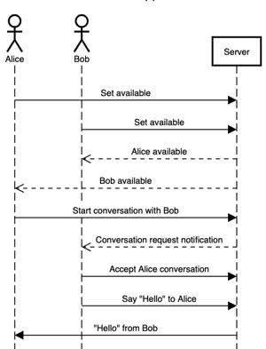

#### Leveraging HTTP

Web services are usually provided over HTTP, and so HTTP greatly influences the design of the service. The HTTP verbs like GET, POST, PUT, and DELETE often mirror the designed actions of a web service. For example, a web service for managing comments might list the comments (GET), create a comment (POST), update a comment (PUT), and delete a comment (DELETE). Likewise, MIME content types defined by IANA are a natural fit for defining the types of content that you want to provide (eg HTML, PNG, MP3, and MP4). The goal is to leverage those technologies as much as possible so you don't have to recreate the functionality they provide and instead take advantage of the networking infrastructure built around HTTP. This includes caching servers that increase your performance, edge servers that bring your content closer, and replication servers that provide redundant copies of your content and make your application more resilient to network failures.

#### Endpoints

A web server is usually divided into multiple service endpoints. Each endpoint provides a single functional purpose. All of the criteria that you would apply to creating well designed code functions also applies when exposing service endpoints.

Service endpoints are often called an Application Programming Interface (API). This is a throwback to old desktop applications and the programming interfaces they exposed. Sometimes the term API refers to the entire collection of endpoints, and sometimes it's used to refer to a single endpoint. 

Here are some things you should consider when desiging your server endpoints.

- **Grammatical** - With HTTP, everything is a resource (noun or object). You act on the resource with an HTTP verb. For example, you might have an order resource that is contained in a store resource. Then you can create, get, update, and delete order resources on the store resource.

- **Readable** - The resource you are referencing with an HTTP request should be clearly readable in the URL path. For example, an order resource might contain the path to both the order and store where the order resource resides: `/store/provo/order/28502`. This makes it easier to remember how to use the endpoint because it's human readable.

- **Discoverable** - As you expose resources that contain other resources, you can provide the endpoints for the aggregated resources. This makes it so someone using your endpoints only has to remember the top level endpoint and then they can discover everything else. For example, if you have a store endpoint that returns information about a store you can include an endpoint for working with a store in the response.

```
GET /store/provo  HTTP/2
```

```
{
  "id": "provo",
  "address": "Cougar blvd",
  "orders": "https://cs260.click/store/provo/orders",
  "employees": "https://cs260.click/store/provo/employees"
}
```

- **Compatible** - When you build your endpoints, you want to make it so you can add new functionality without breaking existing clients. This usually means that the clients of your service endpoints should ignore anything that they don't understand. Consider the two following JSON response versions.

Version 1: 

```
{
  "name": "John Taylor"
}
```

Version 2:

```
{
  "name": "John Taylor",
  "givenName": "John",
  "familyName": "Taylor"
}
```

By adding a new representation of the `name` field, you provude new functionality for clients that know how to use the new fields without harming older clients that ignore the new fields and simply use the old representation. This is all done without officially versioning the endpoint.

If you're fortunate enough to be able to control all your client code, you can mark the `name` field as deprecated and in a future version remove it once all the clients have been upgraded. Usually you want to keep compatibility with at least one previous version of the endpoint so there is enough time for all the clients to migrate before compatibility is removed.

- **Simple** - Keeping your endpoints focused on the primary resources of your app helps to avoid the temptation to add endpoints that duplicate or create parallel access to primary resources. It's very helpful to write some simple class and sequence diagrams that outline your primary resources before you begin coding. These resources should focus on the actual resources of the system you're modeling. They should not focus on the data structure or devices used to host the resources. There should only be one way to act on a resource. Endpoints should only do one thing.

- **Documented** - The [Open API Specification](https://spec.openapis.org/oas/latest.html) is a good example of tooling that helps create, use, and matinatin documentation of your service endpoints. It's suggested that you use these tools in order to provide client libraries for your endpoints and a sandbox for experimentation. Creating an initial draft of your endpoint documentation before you start coding will help you mentally clarify your design and produce a better final result. Providing access to your endppint documentation along with your production system helps with client implementations and allows easier maintenance of the service. The [Swagger Petstore](https://petstore.swagger.io/) example documation is a reasonable example to follow.

There are many models for exposing endpoints. We'll talk about three.

#### RPC

Remote Procedure Calls (RPC) expose service endpoints as simple function calls. When RPC is used over HTTP, it usually just leverages the POST HTTP verb. The actual verb and subject of a function call is represented by the function name. For example, `deleteOrder` or `updateOrder`. The name of the function is either the entire path of the URL or a parameter in the POST body.

```
POST /updateOrder HTTP/2

{"id": 2197, "date": "20220505"}
```

or 

```
POST /rpc HTTP/2

{"cmd":"updateOrder", "params":{"id": 2197, "date": "20220505"}}
```

An advantage of RPC is that it maps directly to function calls that might exist within the server. This is also a disadvantage because it directly exposes the inner workings of the device, and creates a coupling between the endpoints and the implementation.

#### REST

Representational State Transfer (REST) attempts to take advantage of the foundational principles of HTTP. The principle author of REST, Roy Fielding, was also a contributor to the HTTP specification. REST HTTP verbs always act upon a resource. Operations on a resource impact the state of the resource as it's transferred by a REST endpoint call. This allows for caching functionality of HTTP to work optimally. For example, GET will always return the same resource until a PUT is executed on the resource. When PUT is used, the cached resource is replaced with the updated resource.

With REST, the updateOrder endpoint would look like the following.

```
PUT /order/2197 HTTP/2

{"date": "20220505"}
```

Where the proper HTTP verb is used and the URL path uniquely identifies the resource. These sem like small differences, but maximizing HTTP makes it easy for HTTP infrastructure, like caching, to work properly.

There are several other pieces of [Fielding's disseration](https://www.ics.uci.edu/~fielding/pubs/dissertation/top.htm) on REST, like hypermedia, that are often quoted as being required for a truly "restful" implementation, and these are usually ignored.

#### GraphQL

GraphQL focuses on the manipulation of data instead of a function call (RPC) or a resource (REST). The heart of GraphQL is a query that specifies the desired data and how it should be joined or filtered. GraphQL was developed to address frustration concerning the massive number of REST, or RPC calls, that a web application client needed to make in order to support even a simple UI widget.

Instead of making calls for getting a store, and then a bunch of calls for getting the orders and employees, GraphQL sends a single query that requests all the information in one big JSON response. The server would examine the query, join the desired data, and then filter out anything that was unwanted.

Here's an example:

```
query {
  getOrder(id: "2197") {
    orders(filter: { date: { allofterms: "20220505" } }) {
      store
      description
      orderedBy
    }
  }
}
```

GraphQL helps remove a lot of the logic for parsing endpoints and mapping requests to specific resources. Basically, there is only one endpoint: the query.

The downside of the flexibility is that the client has significant power to consume resources on the server. There is no clear boundry on waht, how much, or how complication the aggregation of data is. It's also difficult for the server to implement authorization rights as they have to be baked into the data scheme. However, there are standards for how to define a complex schema. Common GraphQL packages provide support for scheme implementations along with database adaptors for query support.

</details>

<details>

<summary>Node Web Service</summary>

### Node Web Service

With JS, we can write code that listens on a network port (like 80, 443, 3000, 8080), receives HTTP requests, processes them, and then responds. We can use this to create a simple web service that we can execute using Node.js.

First, create your project.

```
➜ mkdir webservicetest
➜ cd webservicetest
➜ npm init -y
```

Now, open VS Code and create a file named `index.js`. Paste the following into the file and save.

```JavaScript
const http = require('http');
const server = http.createServer(function (req, res) {
  res.writeHead(200, { 'Content-Type': 'text/html' });
  res.write(`<h1>Hello Node.js! [${req.method}] ${req.url}</h1>`);
  res.end();
});

server.listen(8080, () => {
  console.log(`Web service listening on port 8080`);
});
```

This uses the Node.js built-in `http` package to create our HTTP server using the `http.createServer` function, along with a callback function that takes a request (`req`) and a response (`res`) object. That function is called whenever the server recieves an HTTP request. In our example, the callback always returns the same HTML snippet, with a status code of 200 and a Content-Type header, no matter what request is made. Basically, this is just a simple dynamically generated HTML page. A real web service would examine the HTTP path and return meaningful content based on the purpose of the endpoints.

The `server.listen` call starts listening on port 8080 and blocks until the program is terminated.

We execute the program by going back to the console window and running Node.js to execute our index.js file. If the service starts correctly, then it should look like this:

```
➜ node index.js
Web service listening on port 8080
```

Now, you can open your browser and point it to `localhost:8080` and view the result. The interaction between the JS, node, and the browser looks like this. 

Use the different URL paths in the browser and note that it will echo the HTTP method and path back in the document. You can kill the process by pressing `CTRL-C` in the console. 

You can also start up Node and execute the `index.js` code directly in VS Code. Open index.js in VS Code and press the 'F5' key. This should aks you what program you want to run. Select `node.js`. This starts up Node.js with the `index.js` file, but also attaches a debugger so you can set breakpoints and step through each line of code.

Make sure you complete the above steps! For the rest of the course, you will execute your code using Node.js to run your backend and serve up your frontend code to the browser. This means you won't use the `VS Code Live Server extention` for your frontend.

</details>

<details>

<summary>Express</summary>

### Express

Deeper reading: [MDN Express/Node Instruction](https://developer.mozilla.org/en-US/docs/Learn/Server-side/Express_Nodejs/Introduction)

To build a production-ready application, you need a framework with a bit more functionality for easily implementing a full web service. This is where the Node package `Express` comes in. 

Express provides support for:
1. Routing requests for service endpoints
2. Manipulating HTTP requests with JSON body content
3. Generating HTTP responses
4. Using `middleware` to add functionality

Express was created by TJ Holowaychuk is is maintainted by the [Open.js Foundation](https://openjsf.org/).

Everything in Express revolves around creating and using HTTP routing and middleware functions. You create an Express app by using NPM to install the Express package and then calling the `express` constructor to create the Express app and listening for the HTTP requests on a desired port.

```
➜ npm install express
```

```JavaScript
const express = require('express');
const app = express();

app.listen(8080);
```

With the `app` object, you can now add HTTP routing and middleware functions to the app.

#### Defining Routes

HTTP endpoints are implemented in Express by defining routes that call a function based on an HTTP path. The Express `app` object supports all the HTTP verbs as functions on the object. For example, if you want to have a route function that handles an HTTP GET request for the URL path `/store/provo` you would call the `get` method on the app.

```JavaScript
app.get('/store/provo', (req, res, next) => {
  res.send({ name: 'provo' });
});
```

The `get` function takes two parameters, a URL path matching pattern, and a callback function that is invoked when the pattern matches. The path matching parameter is used to match agianst the URL path of an incoming HTTP request.

The callback function has 3 parameters that represent the HTTP request object (`req`), the HTTP response object (`res`), and the `next` routing function that Express expects to be called if this routing function wants anotehr function to generate a response.

The Express `app` compares the routing function patterns in the order that they are added to the Express `app` object. So if you have two routing functions with patterns that both match, the first one that was added will be called and given the next matching function in the `next` parameter.

In the above example, we hard coded the store name to be `provo`. A real store endpoint would allow any store name to be provided as a parameter in the path. Express supports path parameters by prefixing the parameters name with a colon (`:`). Express creates a map of path parameters and populates it with the matching values found in the URL path. You can then reference the parameters using the `req.params` object. Using this pattern you can reqrite our getStore endpoint as follows.

```JavaScript
app.get('/store/:storeName', (req, res, next) => {
  res.send({ name: req.params.storeName });
});
```

If we run our JS using `node`, we can see the result when we make an HTTP request using `curl`.

```
➜ curl localhost:8080/store/orem
{"name":"orem"}
```

If you wanted an endpoint that used the POST or DELETE verb, then you use the `post` or `delete` function on the Express `app` object.

The route path can also include a limited wildcard syntax or even full regular expressions in path pattern. Here are a couple route functions using different pattern syntax.

```JavaScript
// Wildcard - matches /store/x and /star/y
app.put('/st*suffix/:storeName', (req, res) => res.send({ update: req.params.storeName, prefix: req.params.suffix }));

// Pure regular expression
app.delete(/\/store\/(.+)/, (req, res) => res.send({ delete: req.params[0] }));
```

In these examples, the `next` parameter was ommitted. Since we are not calling `next`, we do not need to include it as a parameter. However, if you do not call `next`, then no following middleware functions will be invoked for the request.

#### Using Middleware

Deeper reading: [Express Middleware](https://expressjs.com/en/resources/middleware.html)

The standard [Mediator/Middleware](https://www.patterns.dev/posts/mediator-pattern/) design pattern has two pieces: a mediator and a middleware. Middleware represents componentized pieces of functionality. The mediator loads the middleware components and determines their order of execution. When a request comes to the mediator, it then passes the request around to the middleware components. Following this pattern, Express is the mediator, and middleware functions are the middleware components.

Express comes with a standard set of middleware functions. These provide functionality like routing, authentication, CORS, sessions, serving static web files, cookies, and logging. Some middleware functions are provided by default, and others must be installed using NPM before you can use them. You can also write your own middleware functions and use them with Express.

A middleware functions looks a lot like a routing function. This is because routing functions are also middleware functions. The only difference is that routing functions are only called if the associated pattern matches. Middleware functions are always called for every HTTP request unless a preceeding middleware function doesn't call `next`. A middleware function has the following pattern:

```JavaScript
function middlewareName(req, res, next)
```

The middleware function parameters represent the HTTP request object (`req`), the HTTP response object (`res`), and the `next` middleware function to pass processing to. You should usually call the `next` function after completing processing so that the enxt middleware function can execute.

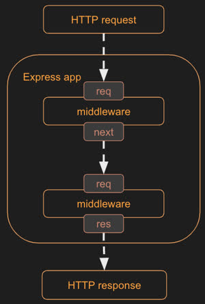

##### Creating Your Own Middleware

As an example of writing your own, you can create a function that logs out the URL of the request and passes on processing to the next middleware function.

```JavaScript
app.use((req, res, next) => {
  console.log(req.originalUrl);
  next();
});
```

Remember that the order that your add your middleware to the Express app object controls the order that the middleware functions are called. Any middleware that doesn't call the `next` function after processing stops the middleware chain from continuing.

##### Builtin Middleware

You can also use a built-in middleware function. Here is an example using the `static` middleware function. This middleware responds with static files, found in a given directory, that matches the request URL.

```JavaScript
app.use(express.static('public'));
```

Now if you create a subdirectory in your project and name it `public`, you can serve up any static content that you would like. For example, you could create an `index.html` file that is the default content for your web service. Then when you call your web service without any path, the `index.html` file will be returned.

##### Third Party Middleware

You can also use third party middleware functions by using NPM to install the package and including the package in your JS with the `requre` function. The following example uses the `cookie-parser` package to simplify the generation and access of cookies.

```
➜ npm install cookie-parser
```

```JavaScript
const cookieParser = require('cookie-parser');

app.use(cookieParser());

app.post('/cookie/:name/:value', (req, res) => {
  res.cookie(req.params.name, req.params.value);
  res.send({ cookie: `${req.params.name}:${req.params.value}` });
});

app.get('/cookie', (req, res) => {
  res.send({ cookie: req.cookies });
});
```

It's common for middleware functions to add fields and functions to the `req` and `res` objects so that other middleware can access the functionality they provide. You can see this happening when the `cookie-parser` middleware adds the `req.cookies` object for reading cookies, and also adds the `res.cookie` function in order to make it easy to add a cookie to a response.

You can use Curl to experiment with the cookie code with these commands:

```
➜ curl -c cookies.txt -X POST localhost:3000/cookie/type/chocolate
{"cookie":"type:chocolate"}

➜ curl -b cookies.txt localhost:3000/cookie
{"cookie":{"type":"chocolate"}}
```

#### Error Handling Middleware

You can also add middleware for handling errors that occur. Error middleware looks similar to other middleware functions, but it takes an additional `err` parameter that contains the error.

```JavaScript
function errorMiddlewareName(err, req, res, next)
```

If you wanted to add a simple error handler for anything that might go wrong while processing HTTP requests, you can add the following.

```JavaScript
app.use(function (err, req, res, next) {
  res.status(500).send({ type: err.name, message: err.message });
});
```

We can test if our error middleware is getting used by adding a new endpoint that generates an error.

```JavaScript
app.get('/error', (req, res, next) => {
  throw new Error('Trouble in river city');
});
```

Now if we use `curl` to call our error endpoint, we can see that the response comes from the error middleware.

```
➜ curl localhost:8080/error
{"type":"Error","message":"Trouble in river city"}
```

#### Putting it all Together

Here is a full example.

```JavaScript
const express = require('express');
const cookieParser = require('cookie-parser');
const app = express();

// Third party middleware - Cookies
app.use(cookieParser());

app.post('/cookie/:name/:value', (req, res) => {
  res.cookie(req.params.name, req.params.value);
  res.send({ cookie: `${req.params.name}:${req.params.value}` });
});

app.get('/cookie', (req, res) => {
  res.send({ cookie: req.cookies });
});

// Creating your own middleware - logging
app.use((req, res, next) => {
  console.log(req.originalUrl);
  next();
});

// Built in middleware - Static file hosting
app.use(express.static('public'));

// Routing middleware

// Get store endpoint
app.get('/store/:storeName', (req, res) => {
  res.send({ name: req.params.storeName });
});

// Update store endpoint
app.put('/st*suffix/:storeName', (req, res) => res.send({ update: req.params.storeName, prefix: req.params.suffix }));

// Delete store endpoint
app.delete(/\/store\/(.+)/, (req, res) => res.send({ delete: req.params[0] }));

// Error middleware
app.get('/error', (req, res, next) => {
  throw new Error('Trouble in river city');
});

app.use(function (err, req, res, next) {
  res.status(500).send({ type: err.name, message: err.message });
});

// Listening to a network port
const port = 8080;
app.listen(port, function () {
  console.log(`Listening on port ${port}`);
});
```

#### Debugging an Express Web Service

With the above code, you can set a breakpint inside the getStore endpoint callback and another on the `app.listen` call. The debugger should stop on the `listen` call where you can inspect the `app` variable. If you continue debugging and open the browser to `localhost:8080/store/provo`, it should hid the breakpoint on the endpoint. Here you can inspect the `req` object. You should be able to see what the HTTP method is, what parameters are provided, and what the current path is. If you continue, the browser should display the JSON object that you returned from your endpoint.

Make another request from our browser, but this time include some query parameters like `http://localhost:8080/store/orem?order=2`. Requesting that URL should cause your breakpoint to hit where you can see the URL changes in the req object.

Now, press `F11` to continue instead of `F5`, and tep into the `res.send` function. This takes you out of your code and into the Express code that sends the response. Because your installed the Express package with NPM, all of Express's source code is sitting in the `node_modules` directory. You can set breakpoints there, examine variables, and step into function. This is a good way to learn how to code. 


</details>

<details>

<summary>JavaScript Modules</summary>

### JavaScript Modules

Deeper reading: [MDN JavaScript Modules](https://developer.mozilla.org/en-US/docs/Web/JavaScript/Guide/Modules)

JS modules allow for the partitioning and sharing of code. Initially, JS had no support for modules. Node.js, a server side JS execution application, introduced modules in order to support the import of packages of JS from third party providers.

JS got full module support with ES6, and they've become the standard module representation as [browser support](https://caniuse.com/es6-module-dynamic-import) for ES modules is now almost universal.

Modules can be confusing, but they are important. Node.js modules are called CommonJS modules, and JS modules are called ES modules. The import and export syntax for ES modules is the major difference between the two formats. 

#### Common JS Modules

Modules create a file-based scope for the code they represent, so you must explicitly `export` the objects from one file and then `import` them into another file. To import a module with CommonJS you use the format:

```JavaScript
const X = require('y');
```

For example, the following imports the Express library that was installed using NPM, and an object named DB that was exported from the local file `./database.js`.

```JavaScript
const express = require('express');
const DB = require('./database.js')
```

If you want to export from your own code, then you use the `module.exports` global variable. For example, here is a simple module that exports a function that displays an alert.

```JavaScript
function alertDisplay(msg) {
  alert(msg);
}

module.exports = {
  alertDisplay,
};
```

#### ES Modules

In order to use ES Modules with Node.js, you need to specify this in your package.json like this:

```JSON
{
  "name": "service",
  "version": "1.0.0",
  "description": "This demonstrates a service for a web application.",
  "type": "module",
  "dependencies": {
    "express": "^4.18.2"
  }
}
```

To import a module with ES modules, you use the format:

```JavaScript
import X from 'y';
```

For example, the following imports use the Express package that was installed using NPM.

```JavaScript
import express from 'express';

express().listen(3000);
```

If you want to export something from your own code, then you would use the `export` keyword. For example, here is a module that exports a function that displays an alert.

**alert.js**

```JavaScript
export function alertDisplay(msg) {
  console.log(msg);
}
```

You can import the module's exported function into another module using the `import` keyword.

**main.js**

```JavaScript
import { alertDisplay } from './alert.js';

alertDisplay('called from main.js');
```

#### ES Modules in the Browser

When you use ES modules in the browser via HTML script references, things get a little complicated. The key thing to understand is that modules can only be called from other modules. You can't access JS contained in a module from the global scope that your non-module JS is executing in.

From HTML, you can specify that you're using an ES module by including a `type` attribute with the value of `module` in the `script` element. You can then import and use other modules. This is shown in the following example.

**index.html**

```HTML
<script type="module">
  import { alertDisplay } from './alert.js';
  alertDisplay('module loaded');
</script>
```

If we want to use a module in the global scope that our HTML or other non-module JS is executing in, we must leak it into the global scope. We do this either by attaching an event handler or explicitly adding a function to the global window object. In the example below, we expose the `alertDisplay` imported module function by attaching it to the global JS `window` object so that it can be called from the button `onClick` handler. We also expost the module function by attaching a `keypress` event.

**index.html**

```HTML
<html>
  <body>
    <script type="module">
      import { alertDisplay } from './alert.js';
      window.btnClick = alertDisplay;

      document.body.addEventListener('keypress', function (event) {
        alertDisplay('Key pressed');
      });
    </script>
    <button onclick="btnClick('button clicked')">Press me</button>
  </body>
</html>
```

Now if the button is pushed or a key is pressed, our ES module function will be called.

##### ES Modules with Web Frameworks

Fortunately, when you use a web framework bundler to generate your web app distribution code, you usually don't have to worry about differentiating between global scope and ES module scope. The bundler will inject all the necessary syntax to connect your HTML to your modules. Historically, this was done by removing the modules and placing all the JS in a namespaced gloabl partition. Now that ES modules are supported on most browsers, the bundler will expose the ES module directly.

</details>

<details>

<summary>Service Daemons - PM2</summary>

### Service Daemons - PM2

When you run a program from the console, the program will automatically terminate when you close the console or if the computer restarts. To keep programs running after a shutdown, you need to register it as a `daemon`. The term daemon comes from the idea of something that is always there working in the background. You only want good daemons running in the background.

We want our web services to continue running as a daemon. We would also like an easy way to start and stop our services. This is was a [Process Manager 2](https://pm2.keymetrics.io/docs/usage/quick-start/) (PM2) does.

PM2 is already installed on your production server as part of the AWS AMI that you selected when you launched your server. Additionally, the desployment scripts with the Simon projects automatically modify PM2 to register and restart your web services. This means you shouldn't need to fo anything with PM2. However, if you run into problems, there are some commands that will be helpful.

You can SSH into your server and see PM2 in action by running the following commnd.

```pm2 ls```

This should print out the two services, simon and startup, that are configured to run on your web server.

You can try other commands, but be careful. Using them incorrectly could cause your web services to stop working.

| Command | Purpose |
| --- | --- |
| **pm2 ls** | List all of the hosted node processes |
| **pm2 monit** | Visual monitor |
| **pm2 start index.js -n simon** | Add a new process with an explicit name |
| **pm2 start index.js -n startup -- 4000** | Add a new process with an explicit name and port parameter |
| **pm2 stop simon** | Stop a process |
| **pm2 restart simon** | Restart a process |
| **pm2 delete simon** | Delete a process from being hosted |
| **pm2 delete all** | Delete all processes |
| **pm2 save** | Save the current processes across reboot |
| **pm2 restart all** | Reload all of the processes |
| **pm2 restart simon --update-env** | Reload process and update the node version to the current environment definition |
| **pm2 update** | Reload pm2 |
| **pm2 start env.js --watch --ignore-watch="node_modules"** | Automatically reload service when index.js changes |
| **pm2 describe simon** | Describe detailed process information |
| **pm2 startup** | Displays the command to run to keep PM2 running after a reboot. |
| **pm2 logs simon** | Display process logs |
| **pm2 env 0** | Display environment variables for process. Use `pm2 ls` to get the process ID |

#### Registering a New Web Service

If yu want to setup another subdomain that accesses a different web service on your web server, you need to follow these steps.

1. Add the rule to the Caddyfile to tell it how to direct requests for the domain.
2. Create a directory and add the files for the web service
3. Configure PM2 to host the web service

##### Modify Caddyfile

SSH into your server.

Copy the section for the startup subdomain and alter it so that it represents the desired subdomain and give it to a different port number that's not currently used on your server.

For example:

```
tacos.cs260.click {
  reverse_proxy _ localhost:5000
  header Cache-Control none
  header -server
  header Access-Control-Allow-Origin *
}
```

This tells Caddy that when it gets a request for tacos.cs260.click, it will act as a proxy for those requests and pass them on to the web service that is listening on the same machine (localhost), on port 5000. The other settings tell Caddy to return headers that disable caching, hide the fact that caddy is the server (why tell hackers anything about  your server), and to allow any other origin server to make endpoint requests to this subdomain (basically disabling CORS). Depening on what your web service does you may want different settings.

Restart Caddy to make it load the new settings.

```
sudo service caddy restart
```

Now, Caddy will try to proxy the requests, but there is no web service listening on port 5000 so you'll get an error from Caddy if you make a request to tacos.cs260.click.

##### Create the Web Service

Copy the `~/services/startup` directory to one that represents the purpose of your service. For example:

```
cp -r ~/services/startup ~/services/tacos
```

If you list the directory, you should see an `index.js` fule that is the main JS file for your web service. It has the code to listen on the designated network port and respond to requests. The following is the JS that causes the web service to listen on a port that is provided as an argument to the command line.

```JavaScript
const port = process.argv.length > 2 ? process.argv[2] : 3000;
app.listen(port, () => {
  console.log(`Listening on port ${port}`);
});
```

There is also a directory named `public` that has static HTML/CSS/JavaScript files that your web service will response with when requested. The `index.js` file enables this with the following code:

```JavaScript
app.use(express.static('public'));
```

You can start up the web service, listening on port 5000, using Node as follows.

```
node index.js 5000
```

You can now access your web service through the browser or `curl`.

```
curl https://tacos.cs260.click
```

Caddy will receive the request and map the subdomain name, tacos.cs260.click, to a request for [http://localhost:5000](http://localhost:5000/). Your web service is listening on port 5000, so it receives the request and responds.

Stop your web service by pressing CTRL-C in the SSH console that you used to start it. Now your browser request for your subdomain should return an error again.

##### Configure PM2 to Host the Web Service

The problem with running your web service from the console with `node index.js 5000` is that as soon as you close your SSH session, it will terminate all processes you started with that session (including the web service). Instead, you need something that is always running in the background to run your web service. The daemon we use to do this is called PM2.

From your SSH console session run: `pm2 ls`.

This will list the web services that you already have registered with PM2. To run your newly created web service under PM2, make sure you are in your service directory, and run the comman similar to the following with the service name and port substituted to your desired values:

```
cd ~/services/tacos
pm2 start index.js -n tacos -- 5000
pm2 save
```

If you run `pm2 ls` again, you should see your web service listed. You can now access your subdomain in the browser and see the proper response. PM2 will keep running your service even after you exit your SSH session.

</details>

<details>

<summary>Troubleshoot a 502 Status Code</summary>

### Troubleshoot a 502 Status Code

Deeper reading: [Status Codes](https://developer.mozilla.org/en-US/docs/Web/HTTP/Status)

You may encounter a `502` status when you deploy simon or your Startup to your prod environment. This error means Caddy can't load your HTTP service. This happens when your code is missing files, crashes when it's running, or doesn't start correctly. This causes PM2 to stop running your service.

To understand a `502` code, you need to ssh into your prod environment and preform some troubleshooting. Here are some steps to get you started.

Important: before trying to debug a 502 problem, make sure you can run your code in your development environment. Then make sure you can deploy simon to your prod environment. If Simon deploys but your startup doesn't, find the difference.

#### General Steps

1. SSH into your prod environment in a bash terminal using this command:

```bash
ssh -i <path to your pem file> ubuntu@<your domain name>
```

Example:

```bash
ssh -i ~/Desktop/CS260/production.pem ubuntu@cs260.click
```

2. Navigate to the affected service directory. (Example: `cd services/<startup or simon>`)

3. List the files in the directory using `ls`. Check if all files that need to be there are there.

4. Make sure your JS file containing the code to start your node server is named `index.js` (all lowercase).

5. Check that your file structure is correct. For example, you should have a node_modules dirrectory, a public folder with frontend code, server files in project root directory, and the proper configuration files.

6. Chcek to see if the port listed in `index.js` is correct for the service. (3000 for Simon, 4000 for startup)

If you edited anything to fix the problem in your prod environment, run `pm2 restart <service>` to restart your service and check your browser. Make sure you replace `<service>` with the service you're trying to fix. For examle, `pm2 restart startup`. If your web service appears, you're finished.

#### Additional Steps

Sometimes the above steps aren't enough to fix the issue. Here are some more steps.

1. While still in your prod environment and in the affected service directory, run `node index.js`.

Example:

```bash
cd ~/services/startup
node index.js
```

2. If an error message appears in the terminal, read it carefully and fix the problem.

- If a node module is missing, you need to install the module (`npm install <module>`) in your dev environment and redeploy.
- If a file is missing or a file path is incorrect, move the file to the proper location/fix the fil path in your dev environment and redeploy.

3. If no error message appears, then you can verify that the server is reachable from your browser. If that works, press `ctrl c` to stop the node server from running. This means the problem is with how PM2 is configured to run your service. Check to see what PM2 is running with the command `pm2 describe <service>`. 

Example:

```
pm2 describe startup
 Describing process with id 1 - name startup
┌───────────────────┬──────────────────────────────────────────┐
│ status            │ errored                                  │
│ name              │ startup                                  │
│ namespace         │ default                                  │
│ version           │ N/A                                      │
│ restarts          │ 67                                       │
│ uptime            │ 7D                                       │
│ script path       │ /home/ubuntu/services/startup/index.js   │
│ script args       │ 4000 startup                             │
│ error log path    │ /home/ubuntu/.pm2/logs/startup-error.log │
│ out log path      │ /home/ubuntu/.pm2/logs/startup-out.log   │
│ pid path          │ /home/ubuntu/.pm2/pids/startup-1.pid     │
│ interpreter       │ node                                     │
│ interpreter args  │ N/A                                      │
│ script id         │ 1                                        │
│ exec cwd          │ /home/ubuntu/services/startup            │
│ exec mode         │ fork_mode                                │
│ node.js version   │ 18.16.0                                  │
│ node env          │ N/A                                      │
│ watch & reload    │ ✘                                        │
│ unstable restarts │ 0                                        │
│ created at        │ 2024-04-15T20:34:56.546Z                 │
└───────────────────┴──────────────────────────────────────────┘
```

This should give you an idea of why PM2 isn't starting your service correctly. For example, the status is `errored` and it's expecting to find the main JS file in `services/startup/index.js` running on port 4000. Check that all those assumptions are true.

After fixing the problem and redeploying, check to see if the service comes up. If it doesn't repeat the steps to find another error.

These steps should resolve most issues, but not all.

Important: fixing a problem on your prod server is only a temporary solution. You need to fix is in your project so that it deploys correctly the next time. Usually this means your backend service isn't configured correctly. For example, if you don't have a `package.json` in your **service** directory, then you need to add that to your project and redeploy.

#### Common Issues for Each Deliverable

##### Service

- Incorrect file structure
- Incorrect file/folder names
- Missing a `package.json` NPM configuration file in your project `service` directory
- Incorrect port listed in `index.js`
- Missing node modukes: express, cookie-parser

While in your dev environment, your directory structure should look similar to Simon's. Your frontend code should be in the root of your project and your backend code should be in a directory named `service`. Your frontend and backend are two different applications, so they should have their own `package.json` files that configure their dependencies.

This is the project structure your code should have in your deployment environment.

```
.
├── deployService.sh
├── index.html       // Frontend application code
├── index.jsx
├── package.json     // Frontend NPM package configuration
├── public
│   └── *            // Images and other static files your frontend uses
├── src
│   └── *            // Frontend React source code files
├── service          // Backend service code
│   ├── index.js
│   └── package.json // backend NPM package configuration
└── vite.config.js   // Configuration to route api calls to backend during development
```

This is the structure your app should have once it's bundled and deployed to your prod environment.

```
.
├── index.js       // Backend service code
├── package.json
├── node_modules   // Backend module dependencies
└── public
    ├── index.html // Frontend application
    └── assets     // Frontend bundled code
```

##### Login/DB

- Missing `dbConfig.json` file (file not imported correctly or not located with all the other server files)
- Missing connection to MongoDB due to IP rules not being set to `allow access from anywhere`
- Missing node modules: bcryptjs, uuid, mongodb, express, cookie-parser

##### Websocket

- Missing `peerProxy.js` file (if using a separate file for backend websocket)
- Incorrect path to file location of `peerProxy.js`
- Missing node modules: ws, bcrypt, uuid, mongodb, express, cookie-parser

</details>

<details>

<summary>SOP and CORS</summary>

### SOP and CORS

Deeper reading:
- [MDN Same Origin Policy](https://developer.mozilla.org/en-US/docs/Web/Security/Same-origin_policy)
- [MDN Cross Origin Resource Sharing](https://developer.mozilla.org/en-US/docs/Web/HTTP/CORS)

You should always be thinking of security when working with the web. When website architecture and browser clients were in their infancy, they allowed JS to make requests from one domain while displaying a website from a different domain, called cross-origin requests.

Consider the following example: An attacker sends out an email with a link to a hacker website (`byu.iinstructure.com`) that's similar to the real website. If the hacker website could request anything from the real website, then it can make itself appear and act like the real website. All it needs to do is request images, html, and login endpoints from the course's website and display the results on the hacker website. This gives the hacker access to everything the user did.

`Same Origin Policy` (SOP) was created to combat this. Simply stated, SOP only allows JS to make requests to a domain if it is the same domain the the user is viewing. A request from `byu.iinstructure.com` for service endpoints made to `byu.instructure.com` would fail because the domains don't match. This provides significant security, and introduces complications when building web apps. For example, if you want to build a service that any web app can use would also violate SOP and fail. In order to address this, the concept of Cross Origin Resource Sharing (CORS) was invented.

CORS lets the client (like the browser) specify the origin of a request and let the server respond with what origins are allowed. The server may say that all origins are allowed (like if they are a general purpose image provider), or only a specific origin is allowed (like if they're a bank's authentication service). If the server doesn't specify what origin is allowed, the browser assumes it has to be the same.

Returning to the original example, the HTTP request from the hacker site (`byu.iinstructure.com`) to the course's authentication service (`byu.instructure.com`) would look like this:

```
GET /api/auth/login HTTP/2
Host: byu.instructure.com
Origin: https://byu.iinstructure.com
```

In response, the course website would return:

```
HTTP/2 200 OK
Access-Control-Allow-Origin: https://byu.instructure.com
```

The browser can then see that the actual origin of the request doesn't match the allowed origin, so the browser blocks the response and generates an error.

With CORS, it's the browser that's protecting the user from accessing the course website's auth endpoint from the wrong origin. CORS is only meant to alert the user that something nefarious is being attempted. A hacker can still proxy requests through their own server to the course website and completely igore the `Access-Control-Allow-Origin` header. Therefore, the course website needs to implement its own precautions to stop a hacker.

#### Using Third Party Services

When you make requests to your own web services, you're always on the same origin so you won't violate SOP. But if you want to make requests to a different domain than the one your web app is hosted on, then you need to make sure that domain allows requests defined by the `Access-Control-Allow-Origin` header it returns. For example, if I have JS in my web app loaded from `cs260.click` that makes a fetch request for an image from the website `i.picsum.photos`, the browser will fail the request with an HTTP status code of 403 and an error message that CORS has blocked the request.

This happens because `i.picsum.photos` doesn't return an `Access-Control-Allow-Origin` header. Without a header, the browser assumes that all requests have to be from the same origin. 

If your web app instead makes a service request to `icanhazdadjoke.com` to get a joke, that request will succeed because it will return an `Access-Control-Allow-Origin` header with a value of `*`, meaning that any origin can make requests to this service.

```
HTTP/2 200
access-control-allow-origin: *

Did you hear about the bread factory burning down? They say the business is toast.
```

This would've also succeeded if the HTTP header explicitly listed your web app domain. For example, if you make your request from the origin `cs260.click`, the following response would also satisfy CORS.

```
HTTP/2 200
access-control-allow-origin: https://cs260.click

I’ll tell you something about German sausages, they’re the wurst
```

This all means that you need to test services you want to use before you include them in your app. Make sure they response with `*` or your calling origin. If they don't you won't be able to use them.

</details>

<details>

<summary>Authorization Services</summary>

### Authorization Services

If your app is going to remember a user's data, then it needs a way to uniquely associate the data with a particular credential. This usually means you `authenticate` a user by asking for information, like an email address and password. You then remember, for a period of time, that the user is authenticated by storing an `authentication token` on the user's device. That's often stored as a [cookie]() that's passed back to your web service on each request. The service can now associate data that the user supplies with a unique identifier that corresponds to their auth token.

It's important to define what a user is `authorized` to do on your web app. You might have different roles in your app like administrators, editors, and customers. Once you have the ability to authenticate a user and store info about them, you can also store the authorization for the user. A simple app might just have a single field that represents the role. The service code would use that role to allow, limit, or prevent what a service endpoint does. A complex app will usually have very powerful authorization representation that controls the user's access to every part of the app. For example, an editor role might have authorization only to work on content that they created or were invited to.

Authentication and authorization can get really complex really fast. It's also a primary target for a hacker. If they can bypass the authentication or escalate what they are authorized to do, then they can gain control of your app. Additionally, constantly forcing users to authenticate in a secure way causes to users to not want to use an app. This creates opposing priorities: keep the system secure or make it easy to use.

Many service providers and package developers have created solutions to remove complexity. Assuming you are using a trusted, well-tested service, this is a good option because it removes the cost of building, testing, and managing that critical infrastructure yourself.

Authorization services often use standard protocols for authenticating and authorizing. These include standards like [OAuth](https://en.wikipedia.org/wiki/OAuth), [SAML](https://en.wikipedia.org/wiki/Security_Assertion_Markup_Language), and [OIDC](https://en.wikipedia.org/wiki/OpenID). Additionally, they usually support things like `Single Sign On` (SSO) and Federated Login. Single sign on allows a user to use the same credentials for multiple web apps. For example, you can log in to GitHub using your google credentials. Federated logins allow a user to log in once, and then the authentication token is reused automatically to log the user in to multiple websites. For example, logging in to Gmail allows you to use Google Docs and YouTube without logging in again.

You can experiment with different authorization services like [AWS Cognito](https://aws.amazon.com/cognito/) or [Google Firebase](https://firebase.google.com/docs/auth).

</details>

<details>

<summary>Account Creation and Login</summary>

### Account Creation and Login

You can support secure authentication in a web app by first providing a way for users to uniquely identify themselves. This usually uss three service endpoints. One to `register`, one to `login`, and a third to `logout`. Once a user is authenticated, we can control access to other authorized endpoints like getting user data or making purchases.

#### Endpoint Design

We can define each of our endpoints with simple Curl commands. We can also use these commands to test the endpoints when we're done.

| Endpoint | Purpose |
| --- | --- |
| Registration | create account (create user and auth) |
| Login | log into account (create auth) |
| Logout | logout of account (delete auth) |
| Get Me | returns info about the authenticated user |

**Registration Endpoint**

Given an email and password, return a cookie contianing the authentication token. If the email already exists, return 409 (conflict)

```http
POST /api/auth HTTP/2
Content-Type: application/json
{
  "email":"marta@id.com",
  "password":"toomanysecrets"
}

HTTP/2 200 OK
Content-Type: application/json
Set-Cookie: auth=tokenHere
{
  "email":"marta@id.com"
}
```

**Login Authentication Endpoint**

Given an email and password, return a cookie containing the authentication token. If the email doesn't exist or the password is bad, return 401 (unauthorized).

```http
PUT /api/auth HTTP/2
Content-Type: application/json
{
  "email":"marta@id.com",
  "password":"toomanysecrets"
}

HTTP/2 200 OK
Content-Type: application/json
Set-Cookie: auth=tokenHere
{
  "email":"marta@id.com"
}
```

**Logout Authentication Endpoint**

Given a cookie containing an authentication token, mark the token as invalid for future use. Always return 200 (ok).

```http
DELETE /api/auth HTTP/2
Cookie: auth=tokenHere

HTTP/2 200 OK
Content-Type: application/json
{
}
```

**Get Me Endpoint**

Given a cookie containing an authentication token, return the authenticated user. If the token is invalid, or the user doesn't exist, return 401 (unauthorized).

```http
GET /api/user HTTP/2
Cookie: auth=tokenHere

HTTP/2 200 OK
Content-Type: application/json
{
  "email":"marta@id.com"
}
```

#### Web Service

With our service endpoints defined, we can start building our web service by stubbing out each endpoint.

1. Create a directory called `login` for the project.

``` sh
mkdir login && cd login
```

2. Create a subdirectory called `service` and change to that directory.

```sh
mkdir service && cd service
```

3. Initialize the directory as an NPM package and install all the packages we are going to use.

```sh
npm init -y
npm install express cookie-parser uuid bcryptjs
```

4. Save the following code to a file called `service.js`. This is our starting web service.

**service.js**

```JavaScript
const express = require('express');
const app = express();

// registration
app.post('/api/auth', async (req, res) => {
  res.send({ email: 'marta@id.com' });
});

// login
app.put('/api/auth', async (req, res) => {
  res.send({ email: 'marta@id.com' });
});

// logout
app.delete('/api/auth', async (req, res) => {
  res.send({});
});

// getMe
app.get('/api/user', async (req, res) => {
  res.send({ email: 'marta@id.com' });
});

const port = 3000;
app.listen(port, function () {
  console.log(`Listening on port ${port}`);
});
```

5. Run `node --watch service.js` or press `F5` in VS Code to start up the web service.

6. Validate that everything is working by opening a console window and use `curl` to try one of the endpoints.

```sh
curl -X POST localhost:3000/api/auth -d '{"email":"test@id.com", "password":"a"}'

{"email":"marta@id.com"}
```

#### Handling Requests

With the services stubbed out, we can now begin filling in the registration endpoint. The first step is to read the credentials from the body of the HTTP request. Since the body is designed to hold JSON, we need to tell Express to automatically parse any HTTP requests that have a content type of `application/json` into a JS object. We do this by installing the `express.json` middleware and reading the JSON object from the `req.body`.

For now, we demonstrate that the JSON parsing is working by echoing the request body back in the response.

```JavaScript
app.use(express.json());

app.post('/api/auth', (req, res) => {
  res.send(req.body);
});
```

Test it's working with a `curl` command.

```sh
curl -X POST localhost:3000/api/auth -H "Content-Type: application/json" -d '{"email":"test@id.com", "password":"a"}'

{"email":"test@id.com","password":"a"}
```

##### Storing Users and Hashing Passwords

Now we want to create a function that will actually create the user and store it in memory. We also want to manange passwords by storing a cryptographically hashed version of the original password. Hashing the password protects the user in case the database is compromised.

To hash our passwords, we use the `bcryptjs` package. This creates a secure one-way hash of the password. If you are curious about how [bcrypt](https://en.wikipedia.org/wiki/Bcrypt) works, it's worth learning. Here is the resulting code.

```JavaScript
const bcrypt = require('bcryptjs');

const users = [];

async function createUser(email, password) {
  const passwordHash = await bcrypt.hash(password, 10);

  const user = {
    email: email,
    password: passwordHash,
  };

  users.push(user);

  return user;
}

function getUser(field, value) {
  if (value) {
    return users.find((user) => user[field] === value);
  }
  return null;
}
```

##### Simple Registration Endpoint

We can now implement the registration endpoint by first checking to see if we already have a user with that email. If the user already exists, then we immediately return 409 (conflict). Otherwise, we create a new user and only return the user's email.

```JavaScript
app.post('/api/auth', async (req, res) => {
  if (await getUser('email', req.body.email)) {
    res.status(409).send({ msg: 'Existing user' });
  } else {
    const user = await createUser(req.body.email, req.body.password);
    res.send({ email: user.email });
  }
});
```

#### Secure Registration Endpoint

To complete the registration endpoint, we need to generate and authorization token and store it on the browser using an HTTP cookie.

##### Generating Authentication Tokens

To generate a random authentication token, we use the `uuid` NPM package. [UUID](https://en.wikipedia.org/wiki/Universally_unique_identifier) stands for Universally Unique Identifier, and it does a really good job creating a hard to guess, random, unique ID.

```JavaScript
const uuid = require('uuid');

token: uuid.v4();
```

##### Generating Cookies

When a user successfully registers or logs in, we generate and store the authentication token and send a cookie containing the token as part of the HTTP response.

To generate an HTTP cookie, we use the `cookie-parser` NPM package. Cookie parser does all the work of sending a cookie to the browser and parsing it when a request is made. 

We want to make it as secure as possible, so we use the cookie `httpOnly`, `secure`, and `sameSite` options.

- `httpOnly` tells the browser to not allow JS running on the browser to read the cookie
- `secure` requires HTTPS to be used when sending the cookie back to the server
- `sameSite` will only return the cookie to the domain that generated it

```JavaScript
const cookieParser = require('cookie-parser');
app.use(cookieParser());

// Create a token for the user and send a cookie containing the token
function setAuthCookie(res, user) {
  user.token = uuid.v4();

  res.cookie('token', user.token, {
    secure: true,
    httpOnly: true,
    sameSite: 'strict',
  });
}
```

##### Complete Registration Code

The following shows all the code necessary to generate a token and then store it on the browser in an HTTP cookie. This is done by calling the `setAuthCookie` function from the registration and login endpoints.

```JavaScript
const cookieParser = require('cookie-parser');
const uuid = require('uuid');

app.use(cookieParser());

function setAuthCookie(res, user) {
  user.token = uuid.v4();

  res.cookie('token', user.token, {
    secure: true,
    httpOnly: true,
    sameSite: 'strict',
  });
}

// Registration endpoint
app.post('/api/auth', async (req, res) => {
  if (await getUser('email', req.body.email)) {
    res.status(409).send({ msg: 'Existing user' });
  } else {
    const user = await createUser(req.body.email, req.body.password);

    setAuthCookie(res, user);

    res.send({ email: user.email });
  }
});
```

#### Login Endpoint

The login endpoint needs to get the hashed password that was stored for the user, compare it to the provided password using `bcrypt.compare`, and if successful, set the authentication token in the cookie. If the password doesn't match or there is no user with the given email, the endpoint returns 401 (unauthorized).

```JavaScript
app.put('/api/auth', async (req, res) => {
  const user = await getUser('email', req.body.email);
  if (user && (await bcrypt.compare(req.body.password, user.password))) {
    setAuthCookie(res, user);

    res.send({ email: user.email });
  } else {
    res.status(401).send({ msg: 'Unauthorized' });
  }
});
```

#### Logout Endpoint

If the provided token represents an actual authenticated user, then the token and cookie are deleted. If tehre is no user for the token, then the request it ignored.

```JavaScript
app.delete('/api/auth', async (req, res) => {
  const token = req.cookies['token'];
  const user = await getUser('token', token);
  if (user) {
    clearAuthCookie(res, user);
  }

  res.send({});
});

function clearAuthCookie(res, user) {
  delete user.token;
  res.clearCookie('token');
}
```

#### Get Me Endpoint

With everything in place to register and login with credentials, we can now implement the secure `getMe` endpoint. To implement this we get the user object from the database by querying on the authentication token.

If there is no authentication token, or there is no user with that token, return status 401 (unauthorized).

```JavaScript
app.get('/api/user/me', async (req, res) => {
  const token = req.cookies['token'];
  const user = await getUser('token', token);
  if (user) {
    res.send({ email: user.email });
  } else {
    res.status(401).send({ msg: 'Unauthorized' });
  }
});
```

#### The Final Login Backend Code

Here is the full example.

```JavaScript
const express = require('express');
const app = express();
const cookieParser = require('cookie-parser');
const uuid = require('uuid');
const bcrypt = require('bcryptjs');

app.use(express.json());
app.use(cookieParser());

app.post('/api/auth', async (req, res) => {
  if (await getUser('email', req.body.email)) {
    res.status(409).send({ msg: 'Existing user' });
  } else {
    const user = await createUser(req.body.email, req.body.password);
    setAuthCookie(res, user);

    res.send({ email: user.email });
  }
});

app.put('/api/auth', async (req, res) => {
  const user = await getUser('email', req.body.email);
  if (user && (await bcrypt.compare(req.body.password, user.password))) {
    setAuthCookie(res, user);

    res.send({ email: user.email });
  } else {
    res.status(401).send({ msg: 'Unauthorized' });
  }
});

app.delete('/api/auth', async (req, res) => {
  const token = req.cookies['token'];
  const user = await getUser('token', token);
  if (user) {
    clearAuthCookie(res, user);
  }

  res.send({});
});

app.get('/api/user/me', async (req, res) => {
  const token = req.cookies['token'];
  const user = await getUser('token', token);
  if (user) {
    res.send({ email: user.email });
  } else {
    res.status(401).send({ msg: 'Unauthorized' });
  }
});

const users = [];

async function createUser(email, password) {
  const passwordHash = await bcrypt.hash(password, 10);

  const user = {
    email: email,
    password: passwordHash,
  };

  users.push(user);

  return user;
}

async function getUser(field, value) {
  if (value) {
    return users.find((user) => user[field] === value);
  }
  return null;
}

function setAuthCookie(res, user) {
  user.token = uuid.v4();

  res.cookie('token', user.token, {
    secure: true,
    httpOnly: true,
    sameSite: 'strict',
  });
}

function clearAuthCookie(res, user) {
  delete user.token;
  res.clearCookie('token');
}

const port = 3000;
app.listen(port, function () {
  console.log(`Listening on port ${port}`);
});
```

#### Experiment

With everything implements, you can use `curl` to test it out. First start up the web service from VS Code by pressing `F5` and selecting `node.js` as the debugger. You can set breakpoints on all the endpoints to see what they do and inspect variables. Then open a console window and run the following `curl` commands. You should see results similar to what's below. Note that the `-c` and `-b` parameters tell curl to store and use cookies with the given file.

```sh
curl -X POST localhost:3000/api/auth -H 'Content-Type:application/json' -d '{"email":"지안@id.com", "password":"toomanysecrets"}'

{"email":"지안@id.com"}
```

```sh
curl -c cookie.txt -X PUT localhost:3000/api/auth -H 'Content-Type:application/json' -d '{"email":"지안@id.com", "password":"toomanysecrets"}'

{"email":"지안@id.com"}
```

```sh
curl -b cookie.txt localhost:3000/api/user/me

{"email":"지안@id.com"}
```

#### Login Frontend Code

With the backend service in place, we can create a simple React app that demonstrates the use of the auth endpoints.

Start with the same basic setup in the [Hello World React](https://github.com/webprogramming260/webprogramming/blob/main/instruction/webFrameworks/react/introduction/introduction.md#react-hello-world) app from previous lessons.

1. Change back to the root of the `login` project directory

```sh
cd ..
```

2. Create an NPM project, install Vite, install React

```sh
npm init -y
npm install vite@latest -D
npm install react react-dom react-router-dom
```

3. Change the `package.json` file to include a script to run vite

```JSON
"scripts": {
 "dev": "vite"
}
```

4. Create `vite.config.js` to configure Vite to proxy API requests throug to the backend when debugging

```JavaScript
import { defineConfig } from 'vite';

export default defineConfig({
  server: {
    proxy: {
      '/api': 'http://localhost:3000',
    },
  },
});
```

5. Create a basic `index.html` file that loads your React app

```HTML
<!DOCTYPE html>
<html lang="en">
  <head>
    <title>React Demo</title>
  </head>
  <body>
    <noscript>You need to enable JavaScript to run this app.</noscript>
    <div id="root"></div>
    <script type="module" src="/index.jsx"></script>
  </body>
</html>
```

6. Create a basic CSS definition in `main.css`

```CSS
* {
  font-family: sans-serif;
}
button {
  margin: 10px;
}
label {
  display: block;
  margin-top: 10px;
}
```

7. Create your React app in `index.jsx`

##### The Authentication Components

In the `index.jsx` file, we will set up some simple routing between a **login** component and a user **profile** component.

```JavaScript
import React from 'react';
import ReactDOM from 'react-dom/client';
import { BrowserRouter, Routes, Route, useNavigate } from 'react-router-dom';
import './main.css';

function App() {
  return (
    <BrowserRouter>
      <main>
        <Routes>
          <Route path="/" element={<Login />} exact />
          <Route path="/profile" element={<Profile />} />
        </Routes>
      </main>
    </BrowserRouter>
  );
}

const root = ReactDOM.createRoot(document.getElementById('root'));
root.render(<App />);
```

Add a **Login component** to `index.jsx` that will handle the authentication to call the backend.

```JavaScript
function Login() {
  const navigate = useNavigate();
  const [email, setEmail] = React.useState('');
  const [password, setPassword] = React.useState('');

  function handleLogin() {
    createAuth('PUT');
  }

  function handleRegister() {
    createAuth('POST');
  }

  async function createAuth(method) {
    const res = await fetch('api/auth', {
      method: method,
      headers: { 'Content-Type': 'application/json' },
      body: JSON.stringify({ email, password }),
    });
    await res.json();
    if (res.ok) {
      navigate('/profile');
    } else {
      alert('Authentication failed');
    }
  }

  return (
    <div>
      <h1>Login</h1>
      <div>
        <label>Email:</label>
        <input type="text" onChange={(e) => setEmail(e.target.value)} required />
      </div>
      <div>
        <label>Password:</label>
        <input type="password" onChange={(e) => setPassword(e.target.value)} required />
      </div>
      <button type="submit" disabled={!(email && password)} onClick={handleLogin}>
        Login
      </button>
      <button type="button" disabled={!(email && password)} onClick={handleRegister}>
        Register
      </button>
    </div>
  );
}
```

Add a **Profile component** to `index.jsx` that will display the current user and provide the ability to logout.

```JavaScript
function Profile() {
  const navigate = useNavigate();
  const [userInfo, setUserInfo] = React.useState('');

  React.useEffect(() => {
    (async () => {
      const res = await fetch('api/user/me');
      const data = await res.json();
      setUserInfo(data);
    })();
  }, []);

  function handleLogout() {
    fetch('api/auth', {
      method: 'DELETE',
    });
    navigate('/');
  }

  return (
    <div>
      <h1>Profile</h1>
      <div>Logged in as: {userInfo.email}</div>
      <button type="button" onClick={handleLogout}>
        Logout
      </button>
    </div>
  );
}
```

#### Experiment

Make sure your backend is running on port 3000 by running `node service.js` in the **service** directory. Start the frontend by running `npm run dev` in the project root directory. Set breakpoints in bot hthe front and backend code and see how they interact. Change the code to experiment with functionality.

If it's not quite working, [here](https://github.com/webprogramming260/webprogramming/blob/main/instruction/webServices/login/exampleCode/login) is a full example.

</details>

## Data & Authentication Services

<details>

<summary>Deployment</summary>

### Deployment

It's important to separate where you develop your app from where the producrion release of your app is made publically available. There are usually more environments than this, like staging, internal testing, and external testing environments. If your company wants 3rd party security certification like SOC2 compliance, they require that these environments are all separated from each other. A developer won't have access to the production environment to prevent them from manipulating an entire company asset. Instead, automated integration processess (continuous integration (`CI`) processes) can checkout the code, [lint it](https://www.freecodecamp.org/news/what-is-linting-and-how-can-it-save-you-time/), test it, stage it, test some more, and if everything works, **deploy** the app to the production environment and notify the different departments that it's been released.


In this course, we use and manage both the development environment (personal computer) and the production environment (AWS server). Never consider your production environment as a place to develop or experiment with your app. You can shel into the production environment to configure your server or to debug, but the deployment of your app should be done using an automated CI process. Here we use a simple console shell script.

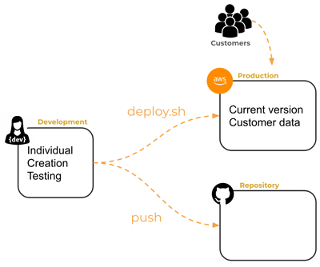

#### Automating Your Deployment

Automated deployment processes are reproducible. You can't accidentally delete a file or misconfigure something. Also, having an automated script lets you iterate quickly because it's much easier to deploy your code. You can add a small feature, deploy it to production, and get feedback within seconds.

Our scripts change with each new technology we deploy. Initially, they just copied a directory of HTML files, but soon they include the ability to modify the configuragtion of your web server, run transpiler tools, and bundle your code into a deployable package.

You can run a deployment script from a console window in your dev environment with a command like this.

```sh
./deployService.sh -k ~/prod.pem -h yourdomain.click -s simon
```

The `-k` parameter provides the credential file necessary to access your prod environment. The `-h` parameter is the domain name of your prod environment. The `-s` parameter represents the name of the application you're deploying (in this case `simon` or `startup`).

You can view the [entire file here](https://github.com/webprogramming260/simon-service/blob/main/deployService.sh), but below will have each step explained. The better you understand the script, the easier it is to track down and fix problems that arise.

```sh
while getopts k:h:s: flag
do
    case "${flag}" in
        k) key=${OPTARG};;
        h) hostname=${OPTARG};;
        s) service=${OPTARG};;
    esac
done

if [[ -z "$key" || -z "$hostname" || -z "$service" ]]; then
    printf "\nMissing required parameter.\n"
    printf "  syntax: deployService.sh -k <pem key file> -h <hostname> -s <service>\n\n"
    exit 1
fi

printf "\n----> Deploying $service to $hostname with $key\n"
```

Next, the script copies all the applicable source files into a distribution directory (`dist`) in preparation for copying that directory to your prod server.

```sh
# Step 1
printf "\n----> Build the distribution package\n"
rm -rf dist
mkdir dist
cp -r application dist
cp *.js dist
cp package* dist
```

The target directory on your prod enviroment is deleted so that a new one can replace it. This is done by executing commands remotely using the secure shell program (`ssh`).

```sh
# Step 2
printf "\n----> Clearing out previous distribution on the target\n"
ssh -i $key ubuntu@$hostname << ENDSSH
rm -rf services/${service}
mkdir -p services/${service}
ENDSSH
```

The distribution directory is then copied to the prod environment using the secure copy program (`scp`).

```sh
# Step 3
printf "\n----> Copy the distribution package to the target\n"
scp -r -i $key dist/* ubuntu@$hostname:services/$service
```

Then, we use `ssh` again to execute some commands on the prod environment. This installs the node packages with `npm install` and restarts the service daemon (`PM2`) that runs our web app in the prod environment.

```sh
# Step 4
printf "\n----> Deploy the service on the target\n"
ssh -i $key ubuntu@$hostname << ENDSSH
cd services/${service}
npm install
pm2 restart ${service}
ENDSSH
```

Finally, we clean up our dev environment by deleting the distribution package.

```sh
# Step 5
printf "\n----> Removing local copy of the distribution package\n"
rm -rf dist
```

Doing this by hand everytime you had to deploy would be a huge pain, and you'd probably make a bunch of mistakes.

You can learn more about shell scripting [with this tutorial](https://ryanstutorials.net/bash-scripting-tutorial/bash-script.php). Shell scripting is a powerful tool for automating common dev tasks and is worth adding to your bucket of skills.

</details>

<details>

<summary>Storage Services</summary>

### Storage Services

Web apps commonly need to store files associated with the app or the users of the app. This includes files like images, user uploads, documents, and movies. Files usually have an ID, some metadata, and the bytes representing the file itself. These can be stored using a database service, but that is usually overkill and a simpler solution can be cheaper.

Storing files directly on your server is a bad idea for multiple reasons.

1. Your server has limited drive space. If your server runs out of drive space, your entire app will fail.

2. You should consider your server as being ephemeral, or temporary. It can be thrown away and replaced by a copy at any point. If you start storing files on your server, then your server has state that can't be easily replaced.

3. You need backup copies of app and user files. If you only have one copy of your files on your server, then they will disappear when your server disappears, and you should always assume your server will disappear.

Here is a table of major cloud storage providors that offer programmatic access, including links to their docs, info about their free tiers, and the amount of storage included.

| Provider | Documentation | Free Tier | Free Storage Included |
| --- | --- | --- | --- |
| Amazon S3 | [Documentation](https://docs.aws.amazon.com/s3/index.html) | Yes | 5 GB for 12 months |
| Google Cloud Storage | [Documentation](https://cloud.google.com/storage/docs) | Yes | 5 GB |
| Microsoft Azure Storage | [Documentation](https://docs.microsoft.com/en-us/azure/storage/) | Yes | 5 GB for 12 months |
| IBM Cloud Object Storage | [Documentation](https://cloud.ibm.com/docs/cloud-object-storage) | Yes | Lite plan with 25 GB |
| MinIO | [Documentation](https://min.io/docs/) | No | N/A |
| OpenStack Swift | [Documentation](https://docs.openstack.org/swift/latest/) | No | N/A |

#### AWS S3

We already use AWS for our server, so we'll look closer at [AWS S3](https://aws.amazon.com/s3/). S3 has the following advantages.

1. Unlimited capacity
2. Only pay for the storage you use
3. Optimized for global access
4. Keeps multiple redundant copies of every file
5. You can version the files
6. Performant
7. Supports metadata tags
8. Make your files publically available directly from S3
9. Keep your files private and only accessible from your app

We won't be using any storage service for the Simon project. If you wat to use S3 as a storage service for your startup, then you need to learn how to use the Amazon SDK. The [AWS website](https://docs.aws.amazon.com/sdk-for-javascript/v2/developer-guide/getting-started-nodejs.html) has detailed info on using AWS S3 with Node.js. The steps you need to take generally include:

1. Creating a S3 bucket to store your data in
2. Getting credentials so your app can access the bucket
3. [Using](https://docs.aws.amazon.com/sdk-for-javascript/v3/developer-guide/setting-credentials-node.html) the credentials in your app
4. Using the [SDK](https://docs.aws.amazon.com/sdk-for-javascript/v3/developer-guide/javascript_s3_code_examples.html) to write, list, read, and delete files from the bucket

Important: don't use your credentials in your code. If you check your credentials into your GitHub repo, they will be stolen and used by hackers to take over your AWS account. This can result in significant monetary damage to you.

##### Example S3 Usage

As a simple example that uses S3, you first need to install the AWS packages.

```sh
npm install @aws-sdk/client-s3 @aws-sdk/credential-providers
```

**Getting Credentials**

Next you need to obtain your AWS credentials that lets you access S3. When you are running in your prod environment, you can change the role that your S3 server is running to allow S3 access. In your dev environment, you need to obtain AWS access keys and store them in the `~/.aws/credentials` file. You can write values to the credential file using the AWS CLI with the following command:

```sh
aws configure
```

Whatever method you use, the AWS SDK will attempt to find the credentials by looking for them in all of the standard places when you call `fromIni()`. You then pass the credentials to the service you want to use. In the case below, we create an `S3Client`.

```JavaScript
const s3 = new S3Client({
  credentials: fromIni(),
});
```

**Writing and Reading a File**

Once you've authenticated with AWS, you're ready to make any request that your AMI role allows. In the example below, we execute the `PutObject` and `GetObject` commands. The parameters of each of these calls specify the bucket and the file that we want to use. When we read the object data from S3, we use the `transformToString` function to convert the object data back into the actual file.

```JavaScript
import { S3Client, PutObjectCommand, GetObjectCommand } from '@aws-sdk/client-s3';
import { fromIni } from '@aws-sdk/credential-providers';

const s3 = new S3Client({
  credentials: fromIni(),
});

const bucketName = 'your-bucket-name-here';

async function uploadFile(fileName, fileContent) {
  const command = new PutObjectCommand({
    Bucket: bucketName,
    Key: fileName,
    Body: fileContent,
  });
  return s3.send(command);
}

async function readFile(fileName) {
  const command = new GetObjectCommand({
    Bucket: bucketName,
    Key: fileName,
  });
  const { Body } = await s3.send(command);
  return Body.transformToString();
}

await uploadFile('test.txt', 'Hello S3!');
const data = await readFile('test.txt');

console.log(data);
```

Now you can run the code and see the result.

```sh
node service.js
Hello S3!
```

</details>

<details>

<summary>Uploading Files</summary>

### Uploading Files

Web apps often need to upload one or more files from the frontend app running in the browser to the backend service. We can do this by using the  HTML `input` element of type `file` on the front end, and the `Multer` npm package on the backend.

#### Frontend Code

The following frontend code registers an event handler for when the selected file changes and only accepts file types of `.png`, `.jpeg`, or `.jpg`. We also create an `img` placeholder element that will display the uploaded image once it's been stored on the server.

```HTML
<html lang="en">
  <body>
    <h1>Upload an image</h1>
    <input type="file" id="fileInput" name="file" accept=".png, .jpeg, .jpg" onchange="uploadFile(this)" />
    <div>
      
    </div>
    <script defer src="frontend.js"></script>
  </body>
</html>
```

The frontent JS handles the uploading of the file to the server and uses the filename returned from the server to set the `src` attribute of the image element in the DOM. If an error happens, an alert is displayed to the user.

```JavaScript
async function uploadFile(fileInput) {
  const file = fileInput.files[0];
  if (file) {
    const formData = new FormData();
    formData.append('file', file);

    const response = await fetch('/upload', {
      method: 'POST',
      body: formData,
    });

    const data = await response.json();
    if (response.ok) {
      document.querySelector('#upload').src = `/${data.file}`;
    } else {
      alert(data.message);
    }
  }
}
```

#### Backend Code

In order to build storage support into our server, we first install the `Multer` NPM package to our project. There are other NPM packages that you can choose from, but Multer is commonly used. From your project directory, run this command.

```sh
npm install express multer
```

Multer handles reading the file from the HTTP request, enforcing the size limit of the upload, and storing the file in the `public` directory. Additionally, our service code does the following.

- Handle requests for static files so we can serve up our frontend code
- Handles errors like when the 64k file limit is violated
- Generates a filename that prevents the user from altering the servers file system based upon an uploaded filename
- Provides access to the uploads using the `express.static` middleware

```JavaScript
const express = require('express');
const multer = require('multer');

const app = express();

app.use(express.static('public'));

const upload = multer({
  storage: multer.diskStorage({
    destination: 'public/',
    filename: (req, file, cb) => {
      const filetype = file.originalname.split('.').pop();
      const id = Math.round(Math.random() * 1e9);
      const filename = `${id}.${filetype}`;
      cb(null, filename);
    },
  }),
  limits: { fileSize: 64000 },
});

app.post('/upload', upload.single('file'), (req, res) => {
  if (req.file) {
    res.send({
      message: 'Uploaded succeeded',
      file: req.file.filename,
    });
  } else {
    res.status(400).send({ message: 'Upload failed' });
  }
});

app.use((err, req, res, next) => {
  if (err instanceof multer.MulterError) {
    res.status(413).send({ message: err.message });
  } else {
    res.status(500).send({ message: err.message });
  }
});

app.listen(3000, () => {
  console.log('Server is running on port 3000');
});
```

#### Where you Store Your Files

You should think seriously about where to store your files. Putting files on your server is not a very good prod level solution for the following reasons.

1. You only have so much available space. Your server has 8GB by default. Once you use all your space, your server will fail to operate correctly and you might need to rebuild it.

2. In a prod system, servers are transient and are often replaced as new versions are releasde of capacity requirements change. This means you will lose any state that you store on your server.

3. The server storage isn't usually backed up. If the server fails for any reason, you lose all your customer's data.

4. If you have multiple app servers, then you can't assume that the server you uploaded the data to is going to be the one you request a download from.

Instead, you want to use a dedicated storage service that has durability guarantees, is not tied to your compute capacity, and can be accessed by multiple application servers.

</details>

<details>

<summary> Data Services</summary>

### Data Services

[MongoDB Atlas Setup](https://youtu.be/f75muk9W-Jc)

Web apps need to store application and user data persistently. This can mean many things, but it's usually a representation of complex interrelated objects. This includes user profile, organizational structure, game play info, usage history, billing info, peer relationship, library catalogue, etc.

Historically, SQL databases served as the general purpose data service solution. Starting around 2010, specialty data services that better support document, graph, JSON, time, sequence, and key-value pair data began to take significant roles in apps from major companies. These data services are often called NoSQL solutions, since they don't use the general purpose relational database paradigms popularized by SQL databases. However, they all have different underlying data structures, strengths, and weaknesses. This means you should not simply split all of the possible data services into two narrowly defined boxes of SQL and NoSQL, when you're considering which service to use for your app.

Here is a list of some popular data services.

| Service | Specialty |
| --- | --- |
| MySQL | relational queries |
| Redis | memory cached objects |
| ElasticSearch | ranked free test |
| MongoDB | JSON objects |
| DynamoDB | key value pairs |
| Neo4J | graph based data |
| InfluxDB | time series data |

#### MongoDB

For this project, we'll use `MongoDB`. Mongo increases developer productivity by using JSON objects as its core data model. This makes it easy to have an app that uses JSON from the top to the bottom of the tech stack. A mongo database is made of one or more collections that each contain JSON documents. You can think of a collection as a large array of JS objects, each with a unique ID. The following is a sample collection of houses for rent.

```JavaScript
[
  {
    _id: '62300f5316f7f58839c811de',
    name: 'Lovely Loft',
    summary: 'A charming loft in Paris',
    beds: 1,
    last_review: {
      $date: '2022-03-15T04:06:17.766Z',
    },
    price: 3000,
  },
  {
    _id: '623010b97f1fed0a2df311f8',
    name: 'Infinite Views',
    summary: 'Modern home with infinite views from the infinity pool',
    property_type: 'House',
    beds: 5,
    price: 250,
  },
];
```

Unlike with relational databases that require a rigid table definition where each column is strictly typed and defined before hand, Mongo has no strict scheme requirements. Each document in the collection usually follows a similar schema, but each document my have specialised fields that are present and common fields that are missing. This lets the schema of a collection morph organically as the data model of the app evolves. To add a new field to a Mongo collection, you insert the field into the documents as desired. If the field isn't present, or has a different type in some documents, then the document doesn't match the query criteria when the field is referenced.

The query syntax for Mongo follows a JS. Consider the following queries on the houses collection above.

```JavaScript
// find all houses
db.house.find();

// find houses with two or more bedrooms
db.house.find({ beds: { $gte: 2 } });

// find houses that are available with less than three beds
db.house.find({ status: 'available', beds: { $lt: 3 } });

// find houses with either less than three beds or less than $1000 a night
db.house.find({ $or: [(beds: { $lt: 3 }), (price: { $lt: 1000 })] });

// find houses with the text 'modern' or 'beach' in the summary
db.house.find({ summary: /(modern|beach)/i });
```

#### MongoDB Atlas

All major cloud providors offer multiple data services. For this class, we will use the data service from MongoDB called [Atlas](https://www.mongodb.com/atlas/database). No credit card of payment is needed to set up, as long as you stick to the shared cluster environment.

[MongoDB Atlas Sign Up](https://www.mongodb.com/atlas/database)

Important: This [video tutorial]() will walk you through the process of creating your account and seeting up your database. Some of the Atlas interface may be slightly different, but the basic concepts shoul all be there. The main steps needs are:

1. Create your account.
2. Create a database cluster.
3. Create your root database user credentials. Remember these for later
4. Set network access to your database to be available from anywhere.
5. Copy the connection string and use the info in your code.
6. Save the connection and credential info in your production and development environments as instructed above.

You can always find the connection string to your Atlas cluster by pressing the `Connect` button from your Database -> DataServices view.

#### Keeping Your Keys Out of Your Code

You need to protect your credentials for connecting to your Mongo database. One common mistake is to check them into your code and then post to a public GitHub repo. Instead, you can load you credentials when the app executes. One common way to do that is to have a JSON configuration file that ontains the credentials that you dynamically load into the JS that makes the database connection. You then use the configuration file in your development environment and deploy it to your prod environment, but NEVER commit it to GitHub.

#### Using MongoDB in Your App

Deeper reading: [MongoDB Tutorial](https://www.mongodb.com/developer/languages/javascript/node-crud-tutorial/)

The first step is to install the `mongodb` package using NPM.

```sh
mkdir testMongo && cd testMongo
npm init -y
npm install mongodb
```

Store your configuration info in the project.

1. Create a file named `dbConfig.json`.
2. Insert your MongoDB credentials (that you got from the connection string when you created your Mongo instance) into the `dbConfig.json` file in JSON format using this example:

```JSON
{
  "hostname": "cs260.abcdefg.mongodb.net",
  "userName": "myMongoUserName",
  "password": "toomanysecrets"
}
```

Note: make sure you include `dbConfig.json` in your `.gitignore` file so it doens't get pushed to GitHub.

Now you can make a file named `database.js`. In the file, you import your databas credentials and use the `MongoClient` object to make a client connection to the database server. This requires a username, password, and the hostname of the database server. With the client connection, you can get a database object and from that a collection object. The collection object allows you to insert, and query for, documents.

```JavaScript
const { MongoClient } = require('mongodb');
const config = require('./dbConfig.json');

const url = `mongodb+srv://${config.userName}:${config.password}@${config.hostname}`;

const client = new MongoClient(url);
const db = client.db('rental');
const collection = db.collection('house');

async function main() {
  try {
    // add all the following database code here
    
  } finally {
    client.close();
  }
}

main();
```

##### Insert

You don't jave to do anything special to insert a JS object as a Mongo document. You just call the `insertOne` function on the collection object and pass it the JS object. When you insert a document, Mongo will automatically create them for you if the database or collection doesn't exist. When the document is inserted into the collection, it will automatically be assigned a unique ID.

```JavaScript
const house = {
  name: 'Beachfront views',
  summary: 'From your bedroom to the beach, no shoes required',
  property_type: 'Condo',
  beds: 1,
};
const insertResult = await collection.insertOne(house);
```

##### Query

To query documents, you use the `find` function on the collection object. Note that the find function is asynchronous and so we use the `await` keyword to wait for the promise to resolve before we write them out to the console.

```JavaScript
const cursor = collection.find();
const rentals = await cursor.toArray();
rentals.forEach((i) => console.log(i));
```

If you don't supply any parameters to the `find` function, it will return all documents in the collection. In this case, we will only get back the single fdocument that we previously inserted. Notice that the automatically generated ID is returned with the document.

##### Output

```JavaScript
[
  {
    _id: new ObjectId('639a96398f8de594e198fc13'),
    name: 'Beachfront views',
    summary: 'From your bedroom to the beach, no shoes required',
    property_type: 'Condo',
    beds: 1,
  },
];
```

You can provide a query and options to the `find` function. In the example below, we query for a `property_type` of Condo that has less than tw obedrooms. We also specify the options to sort by desecnding **name**, and limit our results to the first 10 documents.

```JavaScript
const query = { property_type: 'Condo', beds: { $lt: 2 } };
const options = {
  sort: { name: -1 },
  limit: 10,
};

const cursor = collection.find(query, options);
const rentals = await cursor.toArray();
rentals.forEach((i) => console.log(i));
```

The query matches the document that we previously inserted and so we get the same result as before.

##### Updated

You can update any record by providing a query and the fields you want to update. The `updateMany` function will update everything that matches the query. `updateOne` will only update the first matching document.

```JavaScript
const query = { property_type: 'Condo', beds: { $lt: 2 } };
await collection.updateMany(query, { $set: { beds: 2 } });
```

##### Delete

You can delete documents the same way you update them.

```JavaScript
const query = { property_type: 'Condo', beds: { $lt: 2 } };
await collection.deleteMany(query);
```

You can also delete a single document with `deleteOne` and providing the document's ID as the query.

```JavaScript
const insertResult = await collection.insertOne(house);

const deleteQuery = { _id: insertResult.insertedId };
await collection.deleteOne(deleteQuery);
```

There is a lot more functionality that MongoDB provides, but this is enough to get started. There are tutorials on their [website](https://www.mongodb.com/docs/).

##### Testing the Connection on Startup

It's nice to know that your connection string is correct before your app tries to access any data. We can do that when the app starts by making an asynchronous request to ping the database. If that fails, then either the connection string is incorrect, the credentials are invalid, or the network isn't working. The following is an example of testing the connection.

```JavaScript
try {
  await db.command({ ping: 1 });
  console.log(`DB connected to ${config.hostname}`);
} catch (ex) {
  console.log(`Error with ${url} because ${ex.message}`);
  process.exit(1);
}
```

If you server isn't starting, check your logs to see if an exception was thrown.

#### Complete Example

```JavaScript
const { MongoClient } = require('mongodb');
const config = require('./dbConfig.json');

const url = `mongodb+srv://${config.userName}:${config.password}@${config.hostname}`;

// Connect to the database cluster
const client = new MongoClient(url);
const db = client.db('rental');
const collection = db.collection('house');

async function main() {
  try {
    // Test that you can connect to the database
    await db.command({ ping: 1 });
    console.log(`DB connected to ${config.hostname}`);
  } catch (ex) {
    console.log(`Connection failed to ${url} because ${ex.message}`);
    process.exit(1);
  }

  try {
    // Insert a document
    const house = {
      name: 'Beachfront views',
      summary: 'From your bedroom to the beach, no shoes required',
      property_type: 'Condo',
      beds: 1,
    };
    await collection.insertOne(house);

    // Query the documents
    const query = { property_type: 'Condo', beds: { $lt: 2 } };
    const options = {
      sort: { name: -1 },
      limit: 10,
    };
    const cursor = collection.find(query, options);
    const rentals = await cursor.toArray();
    rentals.forEach((i) => console.log(i));

    // Delete documents
    await collection.deleteMany(query);
  } catch (ex) {
    console.log(`Database (${url}) error: ${ex.message}`);
  } finally {
    await client.close();
  }
}

main();
```

Running the above example should return something like the following if everything is working correctly.

```JavaScript
DB connected to cs260.3452434.mongodb.net
{
_id: new ObjectId("639b51b74ef1e953b884ca5b"),
name: 'Beachfront views',
summary: 'From your bedroom to the beach, no shoes required',
property_type: 'Condo',
beds: 1
}
```

</details>

<details>

<summary>Backend Testing</summary>

### Backend Testing

Unit test driven development (TDD) for testing service endpoints is a common industry practise. Testing services is usually easier than writing UI tests because it doesn't require a browser. However, it still takes effort to learn how to write tests that are effective and efficient. Making this a standard part of your dev process will give you a significant advantage as you progress in your professional career.

There are a lot of good testing packages that work with Express driven services, as shown by the [State of JS](https://2021.stateofjs.com/en-US/libraries/testing/) survey. We're going to use the reigning champion [Jest](https://jestjs.io/).

#### Getting a Service to Test

To get started with Jest, we need a simple web server. We can reuse the **Login** app that we built when discussing auth services. This is a simple React app that provides register, login, logout, and a single **getMe** secure endpoint. Copy the code from the [Login instruction](https://github.com/webprogramming260/webprogramming/blob/main/instruction/webServices/login/exampleCode/login/service) and run NPM isntall. The code should have two files: `package.json` and `service.js`.

```
├── package.json
└── service.js
```

#### Reconfiguring the Service for Test

To let Jest start up the HTTP server when running tests, we initialize the app a bit differently than before. Normally, we would have just started listening on the Express `app` object after we defined our endpoints. Instead, we **export** the Express `app` object from our `server.js` file and then import the app object in the `index.js` file that is used to run the service.

**service.js**

```JavaScript
const express = require('express');
const app = express();

// ... service code

module.exports = app;
```

**index.js**

```JavaScript
const app = require('./service');

const port = 3000;
app.listen(port, function () {
  console.log(`Listening on port ${port}`);
});
```

Breaking up the definition of the service from the starting of the service lets us start the service both when we run normally, but also when using our testing framework.

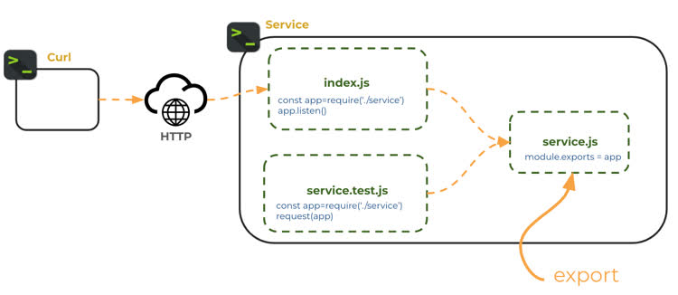

You can verify the service is working by running the service in the VS Code debugger and pressing F5 while viewing the `index.js` file. Then open a browser and go to `http://localhost:3000/api/user/me`. This should return that you're unauthorized. Stop the debugging session once you have demonstrated the service is working correctly.

#### Creating the First Test

Jest looks for any tests in any file with the suffix `.test.js`. Let's make a file named `service.test.js` and create a basic Jest `test` function. Note that your don't need to include a `require` statement to import Jest functions into your code. Jest will automatically import itself when it discovers a test file.

```JavaScript
test('that equal values are equal', () => {
  expect(false).toBe(true);
});
```

The `test` function takes a description as the first parameter. The description is meant to be human readable. In this case, it's "test that equal values are equal". The second parameter is the function to call. Our function calls the Jest `expect` function and chains it to the `toBe` funciton. You can read this as "expect false to be true", which is not true, but we want to see our first test fail the first time we run it. We'll fix this later so we can show what happens when a test succeeds.

To run the test, we need to install the Jest package using NPM. From the console, install the package. The `-D` parameter tells NPM to install Jest as a development package. This keeps it from being included when we do production release builds.

```sh
npm install jest -D
```

Now, replace the `scripts` section of the `package.json` file with a new command that will run our tests with Jest.

```JSON
"scripts": {
  "test": "jest"
},
```

Now we can run the `test` command and our test will execute. Notice that Jest shows exactly where the test failed and what expected values were not received.

```sh
➜ npm run test

 FAIL  ./service.test.js
  ✕ that unequal values are not equal (1 ms)

  ● that unequal values are not equal

    expect(received).toBe(expected) // Object.is equality

    Expected: true
    Received: false

      3 |
      4 | test('that unequal values are not equal', () => {
    > 5 |   expect(false).toBe(true);
        |                 ^
      6 | });
      7 |
      8 | // describe('endpoints', () => {

      at Object.toBe (service.test.js:5:17)

Tests:       1 failed, 1 total
```

We can fix our test by rewriting it so that the expevted value matches the provided value.

**service.test.js**

```JavaScript
test('that equal values are equal', () => {
  expect(true).toBe(true);
});
```

This time the test will pass.

```sh
➜  npm run test

 PASS  ./service.test.js
  ✓ that equal values are equal (1 ms)

Tests:       1 passed, 1 total
```

This example didn't actually test any of our code, but it demonstrates how easy it is to write tests. A real test function would call code in your program.

#### Testing Endpoints

To test our endpoints, we need another NPM package so we can make HTTP requests without sending them over the network. This is done with the `supertest` NPM package. Install this as a development dependency.

```sh
npm install supertest -D
```

Now we can alter `services.test.js` to import the login service and `supertest` so we can mock out HTTP requests.

To make an HTTP request, you pass the service `app` to the supertest `request` function and chain on the HTTP verb function you want to call, along with the endpoint path. Then you can chain on as many `expect` functions as you want. In the next example, we call the `register` endpoint and expect to get back and HTTP status of code 200 (ok) along with the correct headers and body.

**service.test.js**

```JavaScript
const request = require('supertest');
const app = require('./service');

test('register simple', async () => {
  const email = 'test@email.com';
  const password = 'toomanysecrets';
  const register = await request(app).post('/api/auth').send({ email, password });

  expect(register.headers['content-type']).toMatch('application/json; charset=utf-8');
  expect(register.body).toMatchObject({ email });
});
```

When we run this test it passes without error.

```sh
➜  npm run test

 PASS  ./service.test.js
  ✓ register simple returns the desired store (16 ms)

Test Suites: 1 passed, 1 total
Tests:       1 passed, 1 total
Snapshots:   0 total
Time:        0.237 s, estimated 1 s
```

#### Basic Testing Methodology

Testing code is no different from application code. When you are writing tests, you're simply write a program whose purpose is to test another program. Because of this, you should practise the same craftsmanship with your testing code. It should be well designed, performant, and maintainable. Here are some charactaristics of good tests:

- Test only one thing
- Don't repeat tests that are covered elsewhere
- Naturally supported by the application code
- Tests are readable
- Tests can run in any order
- Tests can run concurrently

#### Creating Testing Utility Functions

As your tests get more complex, you'll want to create utility functions so you don't repeatedly assert the same thing or copy the code necessary to setup a test. Let's rewrite the `register` test so we can reuse the registration function when we test other endpoints like login or logout.

```JavaScript
function getRandomName(prefix) {
  return `${prefix}_${Math.random().toString(36).substring(2, 15)}`;
}

async function registerUser() {
  const email = getRandomName('email');
  const password = 'toomanysecrets';
  const response = await request(app).post('/api/auth').send({ email, password });

  return [response, email, password];
}

test('register', async () => {
  const [register, email] = await registerUser();

  expect(register.headers['content-type']).toMatch('application/json; charset=utf-8');
  expect(register.body).toMatchObject({ email });
});
```

This code is generalized so we can use different user email addresses for each test and simplifies it down to just the lines necessary to clearly represent the register test.

Now we can reuse the utility functions to write a test that tries to register the same user twice, and also write a login test.

```JavaScript
test('register existing', async () => {
  const [, email, password] = await registerUser();

  const response = await request(app).post('/api/auth').send({ email, password });
  expect(response.status).toBe(409);
});

test('login', async () => {
  const [, email, password] = await registerUser();

  const login = await request(app).put('/api/auth').send({ email, password });
  validateAuth(login);

  expect(login.headers['content-type']).toMatch('application/json; charset=utf-8');
  expect(login.body).toMatchObject({ email });
});
```

#### Testing with Cookies

Our register test is missing a critical validation. It doesn't assert that the endpoint returned a cookie that contains the authentication token. We can fix it by creating a `validateAuth` utility function and calling it from the test.

```JavaScript
function validateAuth(response) {
  expect(response).toBeDefined();
  expect(response.status).toBe(200);
  const cookie = response.headers['set-cookie'];
  expect(cookie).toBeDefined();
  const uuidRegex = /^token=[0-9a-f]{8}-[0-9a-f]{4}-[0-9a-f]{4}-[0-9a-f]{4}-[0-9a-f]{12}.*$/i;
  const token = cookie.find((c) => c.match(uuidRegex));
  expect(token).toBeDefined();
}

test('register', async () => {
  const [register, email] = await registerUser();
  validateAuth(register);

  expect(register.headers['content-type']).toMatch('application/json; charset=utf-8');
  expect(register.body).toMatchObject({ email });
});
```

We can also test an endpoint that requires authentication by first regiersting a user and then passing the cookie along with the call to the `getMe` endpoint.

```JavaScript
test('get me', async () => {
  const [register, email] = await registerUser();

  const cookie = register.headers['set-cookie'];
  const getMe = await request(app).get('/api/user/me').set('Cookie', cookie);
  expect(getMe.status).toBe(200);
  expect(getMe.headers['content-type']).toMatch('application/json; charset=utf-8');
  expect(getMe.body).toMatchObject({ email });
});
```

#### Coverage

Determining how many lines of your application code are called by your testing code is called coverage. Generally, you want enough coverage to give you confidence that your code does what you think it does without having to manually test everything every time you change the code.

You enable coverage with Jest by creating a file named `jest.config.json` with the following content.

```JSON
{
  "collectCoverage": true,
  "coverageThreshold": {
    "global": {
      "lines": 80
    }
  }
}
```

Now when you run the tests we've created so far, you'll get a coverage report. The report tells us which lines are not covered and the total coverage percentage. Because we specified at leatt 80% of the lines must be covered, we get an error that we only cover 68.18%.

```sh
npm run test

 PASS  ./service.test.js
  ✓ register (72 ms)
  ✓ register existing (54 ms)
  ✓ get me (54 ms)

------------|---------|----------|---------|---------|-------------------------
File        | % Stmts | % Branch | % Funcs | % Lines | Uncovered Line #s
------------|---------|----------|---------|---------|-------------------------
All files   |   68.88 |    33.33 |   66.66 |   68.18 |
 service.js |   68.88 |    33.33 |   66.66 |   68.18 | 22-28,33-39,48,71,85-86
------------|---------|----------|---------|---------|-------------------------
Jest: "global" coverage threshold for lines (80%) not met: 68.18%
```

You can practise with Jest by continuing to write tests until you reach the desired target. Here's a [solution](https://github.com/webprogramming260/webprogramming/blob/main/instruction/webServices/backendTesting/exampleCode) with 100% coverage.

#### VS Code Jest Extenstion

You can use the VS Code Jest extension to visualise what tests are passing, automatically run tests when your code changes, and get inline feedback about failing tests.

#### Test Driven Development

The great thing about test driven development (TDD) is that you write tests first and then write your code based on the design represented by the tests. When your tests pass, you know your code is complete. Additionally, when you make later modifications to your code you can just run your tests again. If they pass, you can be confident that your code is still working wthout manually testing everything yourself. With systems that have hundreds of endpoints and hundreds of thousands of lines of code, TDD becomes a super important part of the development process.

</details>

<details>

<summary>Frontend Testing</summary>

### Frontend Testing

[Test driven development](https://www.freecodecamp.org/news/test-driven-development-what-it-is-and-what-it-is-not-41fa6bca02a2/) (TDD) is a proven method for accelerating applicaion creation, protecting agianst regression bugs, and demonstrating correctness. TDD for console based apps and server based cose is pretty straight forward. Web app frontend code is significantly more complex to test, and using automated tests to drive your UI development is even harder.

The browser is required to execute UI code. This means you have to actually test the app in the browser. Additionally, every one of the major browsers behaves slightly differently, viewport sizes makes a big difference, all the code executes asynchronously, network disruptions are common, and there is a human factor. A human will interact with the browser in very unexpected ways. Clicking where they shouldn't, clicking rapidly, randomly refreshing, flushing cache, not flushing cache, leaving the app up for days on end, switching between tabs, opening the app multiple times, logging in on different tabs, logging out of one tab and using it on the other, etc. That doesn't even mention running all the different browsers on all the possible devices.

You can't just not test your code. That means you have to manually test everything every time you change something, or let your users test everything. That's not good for long term success.

People have been working on this problem for decades now. Solutions aren't perfect, but they are getting better. We have two solutions here, one for executing automated tests in the browser and one for testing on different browsers and devices.

#### Automating the Browser - Playwright

Deepe reading: [Playwright and VS Code](https://playwright.dev/docs/getting-started-VSCode)

Companies that build web browsers understand the difficultly of testing applications in a browser better than anyone. They have to test every possible use of HTML, CSS, and JS that a user could think of. There is no way manual testing is going to work, so they started putting hooks in their browsers that let them be driven from automated external processes. [Selenium](https://www.selenium.dev/) was introduced in 2004 as the first popular tool to automate the browser. However, it's generally considered flaky and slow. Flakiness means a test fails in unpredicable, unreproducable ways. When you need thousands of tests to pass before you can deploy a new feature, even a little flakiness causes huge problems. If those tests take hours, you have even bigger problems.

The market has a lot of alternatives to choose from when considering which automated browser framework to use. [State of JS](https://stateofjs.com/) includes stats on how popular these frameworks are. With frameworks coming and going all the time, on telling stat is the ability to retain users.

#### Demonstration Application

We're going to use [Playwright](https://playwright.dev/) for instruction purposes. Playwright has some major advantages: it's backed by Microsoft, integrates really well with VS Code, and runs as a Node.js process. It's also considered one of the least flaky frameworks.

To show how it works, we'll use the [Login application](https://github.com/webprogramming260/webprogramming/blob/main/instruction/webServices/login/exampleCode/login) we used for the backend testing. The JSX for the app allows for the ability to provide an email and password for login or registration.

```JSX
<div>
  <h1>Login</h1>
  <div>
    <label>Email:</label>
    <input type='text' onChange={(e) => setEmail(e.target.value)} required />
  </div>
  <div>
    <label>Password:</label>
    <input type='password' onChange={(e) => setPassword(e.target.value)} required />
  </div>
  <button type='submit' disabled={!(email && password)} onClick={handleLogin}>
    Login
  </button>
  <button type='button' disabled={!(email && password)} onClick={handleRegister}>
    Register
  </button>
</div>
```

#### Installing Playwright

When going through the installation steps, choose TypeScript, `tests` for the test directory, ignore the GitHub Actions workflow for now, and don't install any Playwright browsers.

```sh
npm init playwright@latest
```

This will update `package.json` with the `playwright` package, create a `playwright.config.ts` file, and create some sample tests in the `test` and `tests-examples` directoryies. This will also update your `.gitignore` file so you don't accidentally check in test coverage or report info.

##### Install a Testing Browser

Now replace the contents of the Playwright configuration file `playwright.config.ts` with the following:

```JavaScript
import { defineConfig, devices } from '@playwright/test';

export default defineConfig({
  testDir: './tests',
  fullyParallel: true,
  forbidOnly: !!process.env.CI,
  retries: process.env.CI ? 2 : 0,
  workers: process.env.CI ? 1 : undefined,
  reporter: 'html',
  timeout: 5000,
  use: {
    baseURL: 'http://localhost:5173',
    trace: 'on-first-retry',
  },

  /* Configure projects for major browsers */
  projects: [
    {
      name: 'chromium',
      use: { ...devices['Desktop Chrome'], viewport: { width: 800, height: 600 } },
    },
  ],

  /* Run your local dev server before starting the tests */
  webServer: {
    command: 'npm run dev',
    url: 'http://localhost:5173',
    reuseExistingServer: !process.env.CI,
    timeout: 5000,
  },
});
```

This simplifies the configuration to only use the Chromium browser driver and launches the Login application when the tests run.

Next, you need to install the Playwright Chromium driver with the following command:

```sh
npx playwright install --with-deps chromium
```

Finally, modify `package.json` to include a script for running Playwright for your tests.

```JSON
"scripts": {
  "dev": "vite",
  "test": "playwright test"
},
```

#### Running Your First Test

The easiest way to run your first test is to start with the examples that came with the Playwright installation.

```
└── tests
    └── example.spec.ts
```

Playwright will run any test found in the testing directory as defined by the `testDir` property in `playwright.config.ts`. You chose `tests` to be the testing directory during installation. Playwright follows the common convention of including `.spec.` in test names. You can also use `.test.` if you want to be consistent with your Jest tests.

After reviewing the provided tests, replace the tests in `tests/example.spec.ts` with the following.

```JavaScript
import { test, expect } from '@playwright/test';

test('has title', async ({ page }) => {
  await page.goto('http://localhost:5173');
  await expect(page.getByRole('heading')).toContainText('Login');
});
```

This test navigates to the Login website and checks to make sure the resulting page has the title `Login`. You can run tests from your project directory with the following console command.

```sh
npm test

Running 1 test using 1 worker
  1 passed (1.4s)
```

You can validate the test is working by changing the expected text to 'Bad' instead of 'Login' and running the tests again, which should fail this time.

#### Complete Test

Now we can make a test that goes through the whole register/logout/login flow. Don't forget to start your backend running (by running `node service.js` in the `service` directory) so the endpoint calls from the frontend will work; otherwise, your tests will fail even if your frontend is perfect.

```JavaScript
import { test, expect } from '@playwright/test';

function getRandomName(prefix) {
  return `${prefix}_${Math.random().toString(36).substring(2, 15)}`;
}

test('complete flow', async ({ page }) => {
  await page.goto('http://localhost:5173');
  await expect(page.getByRole('heading')).toContainText('Login');

  const userName = getRandomName('user');

  // Register
  await page.locator('input[type="text"]').fill(userName);
  await page.locator('input[type="password"]').fill('toomanysecrets');
  await page.getByRole('button', { name: 'Register' }).click();

  await expect(page.getByRole('heading')).toContainText('Profile');
  await expect(page.getByRole('main')).toContainText(`Logged in as: ${userName}`);

  // Logout
  await page.getByRole('button', { name: 'Logout' }).click();
  await expect(page.getByRole('heading')).toContainText('Login');

  // Duplicate registration
  await page.locator('input[type="text"]').fill(userName);
  await page.locator('input[type="password"]').fill('toomanysecrets');

  page.once('dialog', async (dialog) => {
    await expect(dialog.message()).toContain('Authentication failed');
    dialog.dismiss().catch(() => {});
  });
  await page.getByRole('button', { name: 'Register' }).click();

  // Login
  await page.getByRole('button', { name: 'Login' }).click();

  await expect(page.getByRole('heading')).toContainText('Profile');
  await expect(page.getByRole('main')).toContainText(`Logged in as: ${userName}`);
});
```

This is a simple example of the powerful functionality of Playwright. Explore its functionality and add more tests to your projects. Once you've gained some competency, you'll find you can write code faster and feel more confident when changing things around.

#### VS Code Playwright Extension

You can use the VS Code Playwright extension to record tests using the browser, visualize what tests are passing, automatically run tests whenever your code changes, and debug a test with a single click.

#### Testing Various Devices - BrowserStack

With the ability to run automated UI tests, we can now focus on testing on the multitude of various devices. There are several services that help with this. One is [BrowserStack](https://www.browserstack.com/), which lets you pick from a long list of physical devices that you can run interactively, or use when driving automated tests with Selenium.

When you launch a device, it connects the browser interface to a physical device hosted in a data center. Then you can use the device to reproduce user reported problems, or validate that your implementation works on that specific device.

BrowserStack offers free trials.

</details>

## WebSocket

<details>

<summary>WebSocket</summary>

### WebSocket

HTTP is based on a client-server architecture. A client always initiates the request and the server responds. This is great if you're building a global document library connected by hyperlinks, but for a lot of other use cases it doesn't work. Applications for notifications, distributed task processing, peer-to-peer communication, or asynchronous events need communication that is initiated by two or more connected devices.

For years, web developers created hacsk to work around the limitation of the client/server model. This included solutions like having the client frequently pinging the server to see if the server had anything to say, or keeping client-initiated connections open for a long time as the client waited for some event to happen on the server.


In 2011, the communication protocol of WebSocket was created to solve this problem. The core feature of WebSocket is that it's fully duplexed. This means that after the initial connection is made from a client, using vanilla HTTP, and then upgraded by the server to a WebSocket connection, the relationship changes from a peer-to-peer connection where either party can efficiently send data at any time.


This lets the server send notifications to the client, or for the client and server to have an asynchronous exchange of information.

WebSocket connections are still only between two parties. If you want to facilitate a conversation between a group of users, the server must act as the intermediary. Each peer connects to the server, and then the server forwards messages amongst the peers.

#### Creating a WebSocket Conversation

JS running on a browser can initiate a WebSocket connection with the browser's WebSocket API. Assuming the browser is addressing an appropriate host and port (eg localhost:9900), first you create a WebSocket object: the first line below queries the browser to determine which protocol is being used (http or https) and selects the appropriate WebSocket upgrade (unsecure or secure); the second line creates the WebSocket object, using the selected protocol and the hostname and port currently being used by the browser.

```JavaScript
const protocol = window.location.protocol === 'http:' ? 'ws' : 'wss';
const socket = new WebSocket(`${protocol}://${window.location.host}`);
```

You can then register a callback using the `onmessage` function to specify how to handle incoming messages (does this look like an event listener?):

```JavaScript
socket.onmessage = (event) => {
  console.log('received: ', event.data);
};
```

and, you can send messages using the `send` function:

```JavaScript
socket.send('I am listening');
```

The server uses the `ws` pacakge to create a WebSocketServer that is listening on the same port the browser is using. By specifying a port when you create the WebSocketServer, you're telling the server to listen for HTTP connections on that port and to automatically upgrade them to a WebSocket connection if the request has a `connection: Upgrade` header.

When a connection is detected, it calls the server's `on connection` callback. The server can then send messages with the `send` function, and register a callback using the `on message` function to receive messages.

```JavaScript
const { WebSocketServer } = require('ws');

const wss = new WebSocketServer({ port: 3000 });

wss.on('connection', (ws) => {
  ws.on('message', (data) => {
    const msg = String.fromCharCode(...data);
    console.log('received: %s', msg);

    ws.send(`I heard you say "${msg}"`);
  });

  ws.send('Hello webSocket');
});
```

</details>

<details>

<summary>Debugging WebSocket</summary>

### Debugging WebSocket

You can debug both sides of the WebSocket communication with VS Code to debug the server, and Chrome to debug the client. When you do this, you will notice that Chrome's debugger has support for specifically working with WebSocket communication.

#### Debugging the Server

1. Create a directory named `testWebSocket` and change to that directory.

2. Run `npm init -y`.

3. Run `npm install ws`.

4. Open VS Code and create a file named `main.js`. Paste the following code:

```JavaScript
const { WebSocketServer } = require('ws');

const wss = new WebSocketServer({ port: 3000 });

wss.on('connection', (ws) => {
  ws.on('message', (data) => {
    const msg = String.fromCharCode(...data);
    console.log('received: %s', msg);

    ws.send(`I heard you say "${msg}"`);
  });

  ws.send('Hello webSocket');
});
```

5. Set breakpoints on the `ws.send` lines so you can inspect the code executing.

6. Start debugging by pressing `F5`. The first time you may need to choose `Node.js` as the debugger.

#### Debugging the Client

1. Open a Chrome browser, point it at `localhost:3000` and open the debugger by pressing `F12`.

2. Paste this code into the debugger console window and pess enter to run it. Running this code will immediately hit the server breakpoint. Take a look at what's happening and remove the server breakpoint.

```JavaScript
const protocol = window.location.protocol === 'http:' ? 'ws' : 'wss';
const socket = new WebSocket(`${protocol}://${window.location.host}`);

socket.onmessage = (event) => {
  console.log('received: ', event.data);
};
```

3. Select the `Network` tab and select the HTTP message that was generated by the above client code.

4. With the HTTP message selected, click the `Messages` tab to view the WebSocket messages.

5. Send a message to the server by executing the following in the debugger console window. This will cause the second server breakpoint to hit. Explore and remove the breakpoint from the server.

```JavaScript
socket.send('I am listening');
```

6. You should see the messages in the `Messages` debugger window.

7. Send some more messages and observe the communication back and forth without stopping on the breakpoints.

<details>

<summary>WebSocket Chat</summary>

### WebSocket Chat

We can use WebSocket to build a basic chat application.

In this example, we will create a React frontend that uses WebSocket and displays chats between multiple users. The React code will be organized like Simon or your Startup. A backend Express server will forward the WebScoket communication from the different clients.

#### Setting Up the Project

Before we begin writing code, we need to set up the Project. We can follow the basic React setup that we used in the [Hello World React](https://github.com/webprogramming260/webprogramming/blob/main/instruction/webFrameworks/react/introduction/introduction.md#react-hello-world) app from previous instruction. This includes:

1. Creating an NPM project, installing Vite, React, and the WebSocket pacakge.

```sh
mkdir chatDemo && cd chatDemo
npm init -y
npm install vite@latest -D
npm install react react-dom
```

2. Configuring NPM to run Vite.

```JSON
"scripts": {
  "dev": "vite"
},
```

3. Configuring Vite to proxy WebSocket requests to the backend when debugging.

4. Creating a basic `index.html` file that loads your React app.

5. Creating your React app in `index.jsx`.

6. Creating your backend service in `service/service.js` and installing the `express` and `ws` packages.

```sh
mkdir service && cd service
npm init -y
npm install express ws
```

#### Frontend React

In the root of the project, create all of the files representing the frontend code.

This consists of our main `index.html`, `main.css`, and an `index.jsx` file that contains all the React components.

**index.html**

```HTML
<!DOCTYPE html>
<html lang="en">
  <head>
    <title>Chat React</title>
    <meta name="viewport" content="width=device-width, initial-scale=1" />
    <link rel="stylesheet" href="main.css" />
  </head>
  <body>
    <noscript>You need to enable JavaScript to run this app.</noscript>
    <div id="root"></div>
    <script type="module" src="/index.jsx"></script>
  </body>
</html>
```

**main.css**

```CSS
body {
  font-family: Arial, Helvetica, sans-serif;
  background: #fff8d8;
}
#chat-text {
  padding: 1em 0;
}
.received {
  color: rgb(153, 87, 148);
  margin-left: 0.5em;
}
.sent {
  color: rgb(87, 153, 117);
}
.system {
  color: rgb(225, 103, 10);
}
.name {
  padding: 1em 0;
}
```

**index.jsx**

```JavaScript
import React from 'react';
import ReactDOM from 'react-dom/client';
```

Next, we add all the React components to the `index.jsx` file.

##### Chat Component

The `Chat` component introduces a state variable for the user's name and injects three sub-components: `Name`, `Message`, and `Conversation`. The **Name** component allows the user to specify what name they want to associate with their messages. the **Message** component allows the user to create and send a message. The **Conversation** component displays the chat messages. Using component properties, we can share the ability to access the name and webSocket communication object.

```JavaScript
function Chat({ webSocket }) {
  const [name, setName] = React.useState('');

  return (
    <main>
      <Name updateName={setName} />
      <Message name={name} webSocket={webSocket} />
      <Conversation webSocket={webSocket} />
    </main>
  );
}
```

##### Name Component

The `Name` component implements a simple input element that uses the updateName function to change the name used by the entire app.

```JavaScript
function Name({ updateName }) {
  return (
    <main>
      <div className='name'>
        <fieldset id='name-controls'>
          <legend>My Name</legend>
          <input onChange={(e) => updateName(e.target.value)} id='my-name' type='text' />
        </fieldset>
      </div>
    </main>
  );
}
```

##### Message Component

The `Message` component provides an input element for chat text as well as a button for sending the message. Notice that if `disabled` evaluates to true, then the chat box and button are disabled. The `doneMessage` function provides alternative message sending capability that is initiated when the `return` key is pressed. The `sendMsg` function calls the `sendMessage` method on the `webSocket` object to send the message to other users, and also calls the `setMessage` function to allow other components to process what the user has input.

```JavaScript
function Message({ name, webSocket }) {
  const [message, setMessage] = React.useState('');

  function doneMessage(e) {
    if (e.key === 'Enter') {
      sendMsg();
    }
  }

  function sendMsg() {
    webSocket.sendMessage(name, message);
    setMessage('');
  }

  const disabled = name === '' || !webSocket.connected;
  return (
    <main>
      <fieldset id='chat-controls'>
        <legend>Chat</legend>
        <input disabled={disabled} onKeyDown={(e) => doneMessage(e)} value={message} onChange={(e) => setMessage(e.target.value)} type='text' />
        <button disabled={disabled || !message} onClick={sendMsg}>
          Send
        </button>
      </fieldset>
    </main>
  );
}
```

##### Conversation Component

The `Conversation` component provides a place for chat messages to be displayed. It maintains a list of all chats in the `chats` state variable and dynamically creates JSX to render the conversation.

```JavaScript
function Conversation({ webSocket }) {
  const [chats, setChats] = React.useState([]);
  React.useEffect(() => {
    webSocket.addObserver((chat) => {
      setChats((prevMessages) => [...prevMessages, chat]);
    });
  }, [webSocket]);

  const chatEls = chats.map((chat, index) => (
    <div key={index}>
      <span className={chat.event}>{chat.from}</span> {chat.msg}
    </div>
  ));

  return (
    <main>
      <div id='chat-text'>{chatEls}</div>
    </main>
  );
}
```

#### ChatClient

Finally, we add the `ChatClient` class. The `ChatClient` class manages the WebSocket in order to connect, send, and receive WebSocket messages.

In order to properly handle both secure and insecure WebSocket connections. the ChatClient examines what protocol is currently being used for HTTP communication as represented by the browser's `window.location.protocol` variable. If it is non-secure HTTP, then we set our WebSocket protocol to be non-secure WebSocket (`ws`). Otherwise, we use secure WebSocket (`wss`). With the  correct protocol in hand, we then connect the WebSocket to the same location that we loaded the HTML from by referencing the `window.location.host` variable.

```JavaScript
const protocol = window.location.protocol === 'http:' ? 'ws' : 'wss';
this.socket = new WebSocket(`${protocol}://${window.location.host}/ws`);
```

We then register several listeners on the WebSocket connection. This includes the `onopen`, `onmessage`, and `onclose` events. The ChatClient interacts with the React components by allowing them to register as observers for when Chat messages are received. The nwhen the WebSocket events are triggered, the ChatClient can notify the observers of the events.

```JavaScript
class ChatClient {
  observers = [];
  connected = false;

  constructor() {
    // Adjust the webSocket protocol to what is being used for HTTP
    const protocol = window.location.protocol === 'http:' ? 'ws' : 'wss';
    this.socket = new WebSocket(`${protocol}://${window.location.host}/ws`);

    // Display that we have opened the webSocket
    this.socket.onopen = (event) => {
      this.notifyObservers('system', 'websocket', 'connected');
      this.connected = true;
    };

    // Display messages we receive from our friends
    this.socket.onmessage = async (event) => {
      const text = await event.data.text();
      const chat = JSON.parse(text);
      this.notifyObservers('received', chat.name, chat.msg);
    };

    // If the webSocket is closed then disable the interface
    this.socket.onclose = (event) => {
      this.notifyObservers('system', 'websocket', 'disconnected');
      this.connected = false;
    };
  }

  // Send a message over the webSocket
  sendMessage(name, msg) {
    this.notifyObservers('sent', 'me', msg);
    this.socket.send(JSON.stringify({ name, msg }));
  }

  addObserver(observer) {
    this.observers.push(observer);
  }

  notifyObservers(event, from, msg) {
    this.observers.forEach((h) => h({ event, from, msg }));
  }
}
```

##### Load the App Component

You complete the frontend code by loading the `Chat` component into the DOM and pass it a WebSocket `ChatClient`.

```JavaScript
const root = ReactDOM.createRoot(document.getElementById('root'));
root.render(<Chat webSocket={new ChatClient()} />);
```

#### Backend Chat Server

The chat server runs the web service, serves up the client code, manages the WebSocket connection, and forwards messages from the peers.

To get started with the backend code, create a file named `service.js` in the `service` directory.

##### Web and WebSocket Service

The web service HTTP communication is facilitated by using a simple Express configuration. When we create our WebSocket object, we simply provide our Express HTTP server object in the constructor. This allows the WebSocket code to intercept WebSocket upgrade requests and process future WebSocket messages.

```JavaScript
const { WebSocketServer } = require('ws');
const express = require('express');
const app = express();

// Serve up the chat frontend
app.use(express.static('./public'));

const port = process.argv.length > 2 ? process.argv[2] : 3000;
server = app.listen(port, () => {
  console.log(`Listening on ${port}`);
});

// Create a websocket object
const socketServer = new WebSocketServer({ server });
```

##### Forwarding Messages

With the WebSocket object in place, we can use the on `connection`, `message`, and `pong` events to receive and send data between peers. We use the WebSocket object's built in connection list to determine who we forward messages to, and to decide if the connections are still open.

So that we can test if a connection has closed, we use the ping/pong protocol that is built into WebSocket. At a given interval, we send a ping message to the frontend. The frontend then responds with a pong message. When the backend receives the pong message, it updates that the socket is still alive. Any connection that didn't respond will remain in the not alive state, and get terminated in the next pass.

```JavaScript
socketServer.on('connection', (socket) => {
  socket.isAlive = true;

  // Forward messages to everyone except the sender
  socket.on('message', function message(data) {
    socketServer.clients.forEach(function each(client) {
      if (client !== socket && client.readyState === WebSocket.OPEN) {
        client.send(data);
      }
    });
  });

  // Respond to pong messages by marking the connection alive
  socket.on('pong', () => {
    socket.isAlive = true;
  });
});

// Periodically send out a ping message to make sure clients are alive
setInterval(() => {
  socketServer.clients.forEach(function each(client) {
    if (client.isAlive === false) return client.terminate();

    client.isAlive = false;
    client.ping();
  });
}, 10000);
```

#### Vite.config.js

When debugging, the `vite.config.js` file in the root directory is configured to route WebSocket traffic from port 5137 (where Vite is serving the frontend) to port 3000 (where the backend is listening for chat traffic). We have seen something similar before when we used Vite to reroute our service endpoints while debugging in our dev environment. This configuration is only for debugging during development and isn't used in our prod environment. Since we use the insecure WebSocket protocol (ws) when debugging, we only proxy that protocol in this configuration.

```JavaScript
import { defineConfig } from 'vite';

export default defineConfig({
  server: {
    proxy: {
      '/ws': {
        target: 'ws://localhost:3000',
        ws: true,
      },
    },
  },
});
```

</details>

## Security

<details>

<summary>Security Overview</summary>

### Security Overview

Deeper reading:

- [Database of publicized software vulnerabilities](https://cve.mitre.org/)
- [SQL Injection](https://cve.mitre.org/)

The internet lets us socially connect, conduct financial transactions, and provide access to sensitive individual, corporate, and government data. It's also accessible from every corner of the planet. This makes the internet a tool that can make the world a better place, but it also makes a very attractive target for those who seek to do harm. Preventing the potential for harm needs to be in the forefront of your mind whenever you create or use a web app.

You can see bad actors at work on your very own server by using `ssh` to open a console to your server and reviewing the authorization log. The authorization log captures all the attempts to create a session on your server.

```sh
sudo less +G /var/log/auth.log
```

The last entry in the log will be from your connection to the server.

```
Feb 23 16:26:54 sshd[319071]: pam_unix(sshd:session): session opened for user ubuntu(uid=1000) by (uid=0)
Feb 23 16:26:54 systemd-logind[480]: New session 1350 of user ubuntu.
Feb 23 16:26:54 systemd: pam_unix(systemd-user:session): session opened for user ubuntu(uid=1000) by (uid=0)
```

You'll also see lots of other attempts with specific usernames associated with common exploits. These should all be failing to connect, but if your server isn't configured properly then an unauthorized access is possible. The sample of attempts below show the IP addresses of the attacker, as well as the username they used. Using the `whois` utility, we can see that the attacks are originating from servers at DLive.kr in Korea, and DigitalOcean.com in the USA.

```
Feb 19 02:34:28 sshd[298185]: Invalid user developer from 27.1.253.142
Feb 19 02:37:12 sshd[298193]: Invalid user minecraft1 from 27.1.253.142
Feb 23 14:26:19 sshd[318868]: Invalid user siteadmin 174.138.72.191
Feb 23 14:22:18 sshd[318845]: Invalid user tester 174.138.72.191
```

To experiment, the TAs created a test server with a user named `admin` with password `password`. Within 15 minutes, and attacker logged in, bypassed all the restrictions that were in place, and started using the server to attack other servrs on the internet.

Even if you don't think your server is valuable enough to need security, you need to consider that you might be creating a security problem for your users on other systems. For example, think about a simple game app where a user is required to provide a username and password to play the game. If the app's data is compromised, then an attacker could use the password from the game app, to gain access to other websites where the user might have used the same password. Like social media accounts, work accounts, or financial institutions.

#### Security Terminology

Web app security, sometimes called AppSec, is a subset of cybersecurity that specifically focuses on preventing security vilnerabilities wihtin end-user apps. Web app security involces securing the frontend code running on the user's device and also the backend code running on the web server. 

Here is a list of common phrases used by the security community that you should be familiar with.

| Term | Definition |
| --- | --- | 
| Hacking | The process of making a system do something it's not supposed to |
| Exploit | Code or input that takes advantage of a programming or configuration flaw |
| Attack Vector | The method that a hacker employs to penetrate and exploit a system |
| Attack Surface | The exposed parts of a system that an attacker can access. For example, open ports (22, 443, 80), service endpoints, or user accounts |
| Attack Payload | The actual code, or data, that a hacker delivers to a system in order to exploit it |
| Input Sanitization | "Cleaning" any input of potentially malicious data |
| Black Box Testing | Testing an application without knowledge of the internals of the application |
| White Box Testing | Testing an application by with knowledge of the source code and internal infrastructure |
| Penetration Testing | Attempting to gain access to, or exploit, a system in ways that are not anticipated by the developers |
| Mitigation | The action taken to remove, or reduce, a threat |

#### Motivation for Attackers

The following lists some common motivations that drive a system attack.

- **Disruption** - By overloading a system, encrypting essential data, or deleting critical infrastructure, an attacker can destroy normal business operations. This may be an attempt at extortion, or simply be an attempt to punish a business that an attack doesn't agree with.
- **Data Exfiltration** - By privately extracting, or publicly explosing, a system's data, an attacker can embarrass the company, exploit insider information, sell the information to competitors, or leverage the information for additional attacks.
- **Resource Consumption** - By taking control of a company's computing resources, an attacker can use it for other purposes like mining cryptocurrency, gathering customer information, or attacking other systems.

#### Examples of Security Failures

Security should always be a primary objective of any application. Building a web app that looks good and performs well is a lot less important than building an app that is secure.

Here are a few examples where companies failed to properly prevent attacks to their systems.

- [$100 million dollars stolen through insider trading using SQL injection vulnerability](https://www.theverge.com/2018/8/22/17716622/sec-business-wire-hack-stolen-press-release-fraud-ukraine)
- [Log4Shell remote code execution vulnerability, 93% of cloud vulnerable at time of discovery, dubbed "the most severe vulnerability ever"](https://en.wikipedia.org/wiki/Log4Shell)
- [Russian hackers install backdoor on 18,000 government and Fortune 500 computers](https://www.npr.org/2021/04/16/985439655/a-worst-nightmare-cyberattack-the-untold-story-of-the-solarwinds-hack)
- [Hackers Hold Computers of 23 Texas Towns For Ransom](https://www.usnews.com/news/national-news/articles/2019-08-20/hackers-hold-computers-of-23-texas-towns-for-ransom)

#### Common Hacking Techniques

These are a few common exploitation techniques that you should be aware of.

- **Injection** - When an app interacts with a database on the backend, a programmer will often take user input and concatenate it directly into a search query. This allows a hacker to use a specially crafted query to make the database reveal hidden info or even delete the database.
- **Cross-Site Scripting (XSS)** - A category of attacks where an attacker can make malicious code execute on a different user's browser. If successful, an attacker can turn a website that a user trusts into one that can steal passwords and hijack a user's account.
- **Denial of Service** - This includes any attack where the main goal is to render any service inaccessible. This can be done by deleting a database using an SQL injection, by sending unexpeected data to a service endpoint that causes the program to crash, or by simply making more requests than the server can handle.
- **Credential Stuffing** - People have a tendency to reuse passwords or variations of passwords on different websites. If a hacker has a user's credentials from a previous website attack, then there is a good change that they can successfully use those credentials on a different website. A hacker can also try to brute force attack a system by trying every possible combination of a password.

- **Social Engineering** - Appealing to a human's desire to help, in order to gain unauthorized access or information.

#### What Can I Do About It?

Taking the time to learn the techniques a hacker uses to attack a system is the first step in preventing them from exploiting your systems. From there, develop a security mindset, where you always assume any attack surface will be used against you. Make security a consistent part of your app design and feature discussions. 

Here is a list of common security practices you should include in your app.

- **Sanitize input data** - Always assume that any data you receive from outside your system will be used to exploit your system. Consider if the input data can be turned into an executable function, or can overload computing, bandwidth, or storage resources.
- **Logging** - It's not possible to think of every way that your system can be exploited, but you can create an immutable log of requests that will expose when a system is being exploited. You can then trigger alerts, and periodically review the logs for unexpected activity.
- **Traps** - Create what appears to be valuable information and then trigger alarms when the data is accessed.
- **Educate** - Teach yourself, your peers, and everyone you work with, to be security minded. Anyone who has access to your system should understand how to prevent physical, social, and software attacks.
- **Reduce attack surfaces** - Do not open access anymore than is necessary to properly provide your app. This includes what network ports are open, what account privelages are allowed, where you can access the system from, and what endpoints are available.
- **Layered security** - Don't assume that one safeguard is enough. Create multiple layers of security that each take different approaches. For example, secure your physical environment, secure your network, secure your server, secure your public network traffic, secure your private network traffice, encrypt your storage, separate your prod systems from your dev systems, put your payment info in a separate environment from your app environment. Don't allow data from one layer to move to other layers. For example, don't let an employee take data out of the prod system.
- **Least required access policy** - Don't give any one user all the credentials necessary to control the entire system. Only give a user what access they need to do the work they are required to do.
- **Safeguard credentials** - Don't store credentials in accessible locations such as a public GitHub repo or a sticky note taped to a monitor. Automatically rotate credentials in order to limit the impact of an exposure. Only award credentials that are necessary to do a specific task.
- **Public review** - Don't rely on obscurity to keep your system safe. Assume instead that an attacker already knows everything about your system and then make it difficult for anyone to exploit it. If you can attack your system, a hacker can too. By soliciting the public review and the work of external penetration testers, you will be able to discover and remove potential exploits.

</details>

<details>

<summary>OWASP</summary>

### OWASP

Deeper reading: [OWASP 2021](https://owasp.org/www-project-top-ten/)

The Open Web Application Security Project (OWASP) is a non-profit research entity that manages the Top Ten list of the most important web app security risks. Understanding, and periodically reviewing, the list will help you keep your web apps secure. 

Here is a discussion of the entries in the list, with examples and suggested mitigations.

#### A01 - Broken Access Control

Deeper reading: [synk Learn broken access control](https://learn.snyk.io/lessons/broken-access-control/javascript/)

Broken access control happens when the app doesn't properly enforce permissions on users. This could mean that a non-admin user can do things that only an admin user should be able to do, or admin accounts are improperly secured. While browser app code can restrict access by disabling UI for navigating to sensitive functionality, the ultimate responsibility for enforcing access control rests upon the app service.

As an example, consider an app where the UI only provides navigation to the administrator application settings if the user is an administrator. However, the attacker can simply dchange the URL to point to the app settings URL and gain access. Plus, unless the service endpoints reject requests to obtain and update the app settings, any restrictions that the UI provides are meaningless.

Mitigations include:

- Strict access enforcement at service level
- Clearly defined roles and elevation paths

#### A02 - Cryptographic Failures

Cryptographic failures happen when sensitive data is accessible either without encryption, with weak encryption protocols, or when cryptographic protections are ignored.

Sending any unencrypted data over a public network connections lets an attacker capture the data. Even private, internal, network connections, or data that is stored without encryption, is susceptible to exploitation once an attacker gains access to the internal system.

Examples of ineffective cryptographic methods include hashing algorithms like MD5 or SHA-1 that are trivial to crack with modern hardware and tools.

Another cryptographic failure happens when apps don't validate the provided web certificate when establishing a network connection. This is a case of falsely assuming that if the protocol is secure than the entity represented by the protocol is acceptable.

Mitigations include:

- Use strong encryption for ALL data. Includes external, internal, in transit, and rest data
- Updating encryption algorithms as older algorithms become compromised
- Properly using cryptographic safeguards

#### A03 - Injection

Deeper reading: [Snyk Learn SQL Injection](https://learn.snyk.io/lessons/sql-injection/javascript/)

Injection exploits happen when an attacker is allowed to supply data that is then injected into a context where it violates the expected use of the user input. For example, consider an input field that is only expected to contain a user's password. Instead, the attacker provides a SQL database command in the password input.

**Supplies password**

```SQL
`p@ssword!` DROP TABLE db; --;
```

The application then uses a template SQL query to validate the user's password.

**Template query**

```SQL
SELECT user FROM db WHERE password='${password}' LIMIT 1;
```

When the supplied input is injectd into the template an unintended query results. Notice that this query will delete the entire database table.

**Resulting query**

```SQL
SELECT user FROM db WHERE password='p@ssword!'; DROP TABLE db; -- ` LIMIT 1
```

Mitigations include:

- Santizing input
- Use database prepared statements
- Restricting execution rights
- Limit output

#### A04 - Insecure Design

Deeper reading: [Snyk Learn Insecure Design](https://learn.snyk.io/lessons/insecure-design/javascript/)

Insecure design broadly refers to architectural flaws that are unique for individual systems, rather than implementation errors. This happens when the app team doesn't focus on security when designing a system, or doesn't continuously reevaluate the app's security.

Insecure design exploits are based on unexpected uses of the business logic that controls the functionality of the app. For example, if the app allows for trial accounts to be easily created, then an attacker could create a denial of service attack by creating millions of accounts and utilizing the maximum allowable usage.

Mitigations include:

- Integration testing
- Strict access control
- Security education
- Security design pattern usages
- Scenario reviews

#### A05 - Security Misconfiguration

Security misconfiguration attacks exploit the configuration of the app. Some examples include using default passwords, not updating software, exposing configuration settings, or enable unsecured remote configuration.

For example, some third party utilities (like logging systems) will expose a public administration interface that has a default user name and password. Unless that configuration is changed, an attacker will be able to access all the critical logging info for your app.

Mitigations include:

- Configuration review
- Setting defaults to disable all access
- Automated configuration audits
- Requiring multiple layers of access for remote configuration

#### A06 - Vulnerable and Outdated Components

Deeper reading: [Snyk Learn Vulnerable and Outdated Components](https://learn.snyk.io/lessons/vulnerable-and-outdated-components/javascript/)

The longer an app is deployed, the more likely it is that the attack surface and corresponding exploits will increase. This is primarily due to the cost of maintaining an app and keeping it up do date to mitigate newly discovered exploits.

Outdated components often accumulate as third party packages are used by the app. Over time, the packages are updated in order to address security concerns. Sometimes the packages stop being supported. When this happens, your app becomes vulnerable. Consider what happens when a request to install NPM packages displays the following warning:

```sh
➜  npm install

up to date, audited 1421 packages in 3s

7 high severity vulnerabilities

To address all issues (including breaking changes), run:
  npm audit fix --force

Run `npm audit` for details.
```

The app developer is warned that the components are vulnerable, but when faced with the choie of taking the time to update packages, and potentially break the app, or meeting deliverable deadlines, the developer is tempted to ignore the warning and continue without addressing the possible problem.

Mitigations include:

- Keeping a manifest of your software stack, including versions
- Reviewing security bulletins
- Regularly updated software
- Require components to be up to date
- Replacing unsupported software

#### A07 - Indentification and Authentication Failures

Identification and authentication failures include any situation where a user's identity can be impersonated or assumed by an attacker. For example, if an attacker can repeatedly attempt to guess a user's password, then eventually they will succeed. Additionally, if passwords are exposed outside the app, or are stored inside the app with weak cryptographic protection, they are susceptible to attack.

Another example of an identification failure would be a weak password recovery process that doesn't properly verify the user. Common practises such as asking for well known security questions (like mother's maiden name) from a user fall into this category.

Mitigations include:

- Rate limiting requests
- Properly managing credentials
- Multifactor authentication
- Authentication recovery

#### A08 - Software and Data Integrity Failure

Software and data integrity failures represent attacks that allow external software, processes, or data to compromise your app. Modern web apps extensively use open source and commercially produced packages to provide key functionality. Using these packages without conducting a security autid, gives them an unknown amount of control over your app. Likewise, using a third party processing workflow, or blindly accessing external data, opens you up to attacks.

Consider the use of a third party continuous delivery (CD) pipeline for deploying your app to a cloud provider. If the CD providor is penetrated by an attacker, then they also gain access to your production cloud environment.

Another example is the use of an NPM package that is controlled by an attacker. Once the package has gained general acceptance, the attacker can subtly change the package to capture and deliver sensitive information.

Mitigations include:

- Only using trusted package repositories
- Using your own private vetted repository
- Audit all updates to third party packages and data sources

#### A09 - Security Logging and Monitoring Failures

Deeper reading: [Snyk Learn Logging Vulnerabilities](https://learn.snyk.io/lessons/logging-vulnerabilities/javascript/)

Proper systems monitoring, loggin, and alerting is critical to increasing security. One of the first things an attacker will do after penetrating your app is to delete or alter any logs that might reveal the attacker's presence. A secure system will store logs that are accessible, immutable, and contain adequate information to detect an intrusion, and conduct post-mortem analysis.

An attacker might also try to create a smoke screen in the monitoring system to hide the true attack. This might consist of a barrage of periodic ineffective attacks that hide the insertion of a slightly different effective one.

Mitigations include:

- Real time log processing
- Automated alerts for metric threshold violations
- Periodic log reviews
- Visual dashboards for key indicators

#### A10 - Server Side Request Forgery (SSRF)

Deeper reading: [Snyk Learn SSRF](https://learn.snyk.io/lessons/ssrf-server-side-request-forgery/javascript/)

This category of attack causes the app service to make unintended internal requests that utilize the service's elevated privelages to expose internal data or services.

For example, if your service exposed an endpoint that let a user retrieve an external profile image based on a supplied URL, an attacker could change the URL to point to a location that is normally only available to the service internally.

The following command would theoretically return the internal AWS service metadata that includes the administrative access token.

```sh
curl https://yourdomain.click/user/image?imgUrl=http://169.254.169.254/latest/meta-data/iam/security-credentials/Admin-Role
```

Mitigations include:

- Santizing returned data
- Not returning data
- Whitelisting accessible domains
- Rejecting HTTP redirects

</details>

## Assorted Topics

<details>

<summary>TypeScript</summary>

### TypeScript

Deeper reading: [TypeScript in 5 minutes](https://www.typescriptlang.org/docs/handbook/typescript-in-5-minutes.html)

TypeScript adds static type checking to JS. This provides type checking while you are writing the code to prevent mistakes like using a string when a number is expected. Consider the following simple JS code example.

```JavaScript
function increment(value) {
  return value + 1;
}

let count = 'one';
console.log(increment(count));
```

When this code executes, the console will log `one1` because the count variable was accidentally initialized with a string instead of a number.

#### Possible Types

The following table defines the most common types. If you don't explicitly provide a type, it defaults to `any`. This means that it can represent any possible type. Usually you want to avoid using `any` because it defeats one of the main purposes for using TypeScript.

| Type | Description |
| --- | --- |
| `string` | represents textual data |
| `number` | represent numerical values, including integers and floating-point numbers |
| `boolean` | represents `true` or `false` |
| `bigint` | represents large integers beyond the `number` type limit |
| `null` | represents an explicitly empty value |
| `undefined` | represents a variable that has been declared but not defined a value |
| `any` | a dynamic type that disables type checking |

#### Using Types

With TS, you explicitly define the types, and as JS is transpiled (with something like Babel) an error will generate long before the code is seen by the user. To provice type safety to our increment function above, it would look like this:

```ts
function increment(value: number): number {
  return value + 1;
}

let count: number = 'one';
console.log(increment(count));
```

With TS enabled, VS Code will analyize the code and give you an error about the invalid type conversion.

In addition to defining types for function parameters, you can define the types of objects. For example, when defining a *Bid* class, you can define object types with the `type` keyword, or by implicitly creating an object property.

```ts
type Product = {
  imageUrl: string;
  name: string;
};

export class Bid {
  product: Product;
  state: {
    quote: string;
    price: number;
  };

  constructor(product: Product) {
    this.product = product;
    this.state = {
      quote: 'loading...',
      price: 0,
    };
  }
}
```

You can also specify the type of a React function style component's properties with an inline object definition.

```ts
function Clicker(props: { initialCount: number }) {
  const [count, updateCount] = React.useState(props.initialCount);

  return <div onClick={() => updateCount(1 + count)}>Click count: {count}</div>;
}
```

#### Interfaces

Because it's so common to define object property types, TS introduced the first use of the `interface` keyword to define a collection of parameters and types that an object must have to satisfy the interface type. For example, a Book interface might look like this:

```ts
interface Book {
  title: string;
  id: number;
}
```

You can then create an object and pass it to a function that requires the interface.

```ts
function catalog(book: Book) {
  console.log(`Cataloging ${book.title} with ID ${book.id}`);
}

const myBook = { title: 'Essentials', id: 2938 };
catalog(myBook);
```

#### Beyond Type Checking

TS also provides other benefits, like warning you of potential uses of an uninitialized variable. Here's an example of when a function may return null, but the code fails to check if that's the case.

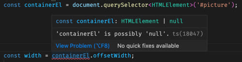

You can correct the issue with a simple `if` block.

```ts
const containerEl = document.querySelector<HTMLElement>('#picture');
if (containerEl) {
  const width = containerEl.offsetWidth;
}
```

Notice that the return type is coerced for the `querySelector` call. This is required because the assumed return type for that function is the base call `Element`, but we know that our query will return the subclass `HTMLElement` so we need to cast that to the subclass with the `querySelector<HTMLElement>()` syntax.

##### Unions

TS introduces the ability to define the possible values for a new type. This is useful for things like defining an enumerable or possible types.

With plain JS, you might create an enumerable with a class.

```JavaScript
export class AuthState {
  static Unknown = new AuthState('unknown');
  static Authenticated = new AuthState('authenticated');
  static Unauthenticated = new AuthState('unauthenticated');

  constructor(name) {
    this.name = name;
  }
}
```

With TS, you can define this by declaring a new type and defining what its possible values are.

```ts
type AuthState = 'unknown' | 'authenticated' | 'unauthenticated';

let auth: AuthState = 'authenticated';
```

You can also use unions to specify all the possible types that a variable can represent.

```ts
function square(n: number | string) {
  if (typeof n === 'string') {
    console.log(`{$n}^2`);
  } else {
    console.log(n * n);
  }
}
```

##### Enum

TS also supports enumerations. This adds the benefit of using symbols instead of strings for values.

```ts
enum AuthState {
  Authenticated = 'authenticated',
  Unauthenticated = 'unauthenticated',
}

let auth: AuthState = AuthState.Authenticated;
```

#### Using TypeScript

##### Experimenting

If you want to experiment with TS, you can easily use [CodePen](https://codepen.io/) or the official [TypeScript Playground](https://www.typescriptlang.org/play). The TS playground has the advantage of showing you inline errors what the resulting JS will be.

##### TypeScript with Vite

Vite automatically supports the use of TS. This means you can simply write your components with TS.

**app.tsx**

```tsx
import React, { JSX } from 'react';
import ReactDOM from 'react-dom/client';

interface Props {
  greeting: string;
  count?: number;
}

function App({ greeting, count = 3 }: Props): JSX.Element {
  return (
    <div>
      {Array.from({ length: count }).map((_, index: number) => (
        <h1 key={index}>{greeting}, World!</h1>
      ))}
    </div>
  );
}

const root = ReactDOM.createRoot(document.getElementById('root'));
root.render(<App greeting='hello' />);
```

##### TypeScript with Node.js

Node LTS version 22 introduced experimental use of TS with the expectation of it being enabled by default in future versions.

**index.ts**

```ts
function add(a: number, b: number | string): number {
  if (typeof b === 'string') {
    b = parseInt(b, 10);
  }
  return a + b;
}

const x: number = 3;
const result: number = add(x, '3');

console.log(result);
```

The following will run the above code with Node.js but it will display several warning messages.

```sh
node --experimental-transform-types index.ts

6
```

Node LTS verion 24 handles TS right out of the box.

```sh
node index.ts

6
```

##### Installing Type Bundles

Some NPM packages put their type info in different packages. For example, to install the Node and React types you would run the following:

```sh
npm install -D @types/node
npm install -D @types/react
```

##### TypeScript with an Existing App

If you want to convert an existing application, then install the NPM `typescrupt` pacakge to your dev dependencies.

```sh
npm install -D typescript
```

This will only include the TS package when you are developing and won't distribute it with a production bundle.

</details>

``` HTML
<details>

<summary></summary>

</details>
```

```JavaScript

```